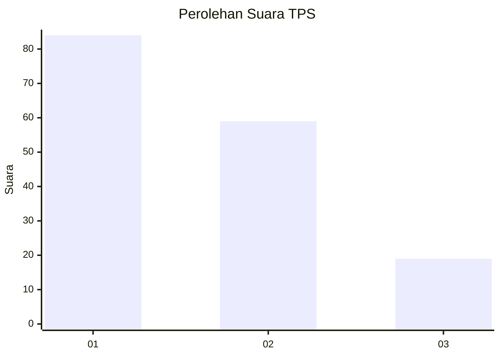
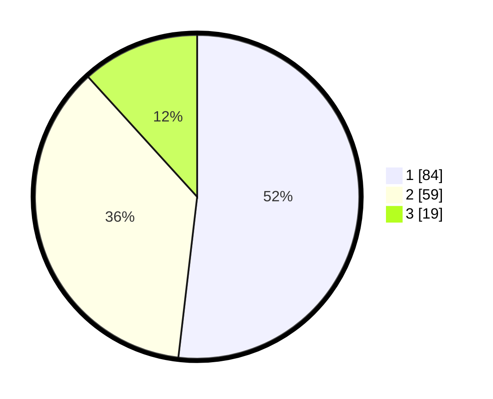

# Hasil

## Grafik

## Tabel

| No. | Nama Paslon    | Suara | Suara (raw) | Persentase |
|:--- |:-------------- | -----:| -----------:| ----------:|
| 1   | ANIES MUHAIMIN | 84    | [84][p-1]   | 51,85      |
| 2   | PRABOWO GIBRAN | 59    | [59][p-2]   | 36,42      |
| 3   | GANJAR MAHFUD  | 19    | [19][p-3]   | 11,73      |

[p-1]: https://github.com/gigit-pemilu/pemilu-2024-12-sumatera-utara/blob/main/pilpres/hitung-suara/sub/12-sumatera-utara/sub/07-deli-serdang/sub/25-labuhan-deli/sub/2001-helvetia/sub/039-tps/sub/paslon-1.txt
[p-2]: https://github.com/gigit-pemilu/pemilu-2024-12-sumatera-utara/blob/main/pilpres/hitung-suara/sub/12-sumatera-utara/sub/07-deli-serdang/sub/25-labuhan-deli/sub/2001-helvetia/sub/039-tps/sub/paslon-2.txt
[p-3]: https://github.com/gigit-pemilu/pemilu-2024-12-sumatera-utara/blob/main/pilpres/hitung-suara/sub/12-sumatera-utara/sub/07-deli-serdang/sub/25-labuhan-deli/sub/2001-helvetia/sub/039-tps/sub/paslon-3.txt

## Foto C Plano

https://sirekap-obj-formc.kpu.go.id/cda6/pemilu/ppwp/12/07/25/20/01/1207252001039-20240214-155800--56fe50f9-e0d2-4b36-8621-6046fdb0e21e.jpg

https://sirekap-obj-formc.kpu.go.id/cda6/pemilu/ppwp/12/07/25/20/01/1207252001039-20240214-155553--a02be07a-1893-4c4d-8370-fde97a37e9ae.jpg

https://sirekap-obj-formc.kpu.go.id/cda6/pemilu/ppwp/12/07/25/20/01/1207252001039-20240214-155632--102a34fe-2919-4426-bc05-ae8ab060bbee.jpg

## Metadata

| Key        | Value               |
| ---------- | ------------------- |
| Time Stamp | 2024-02-25 15:00:00 |

