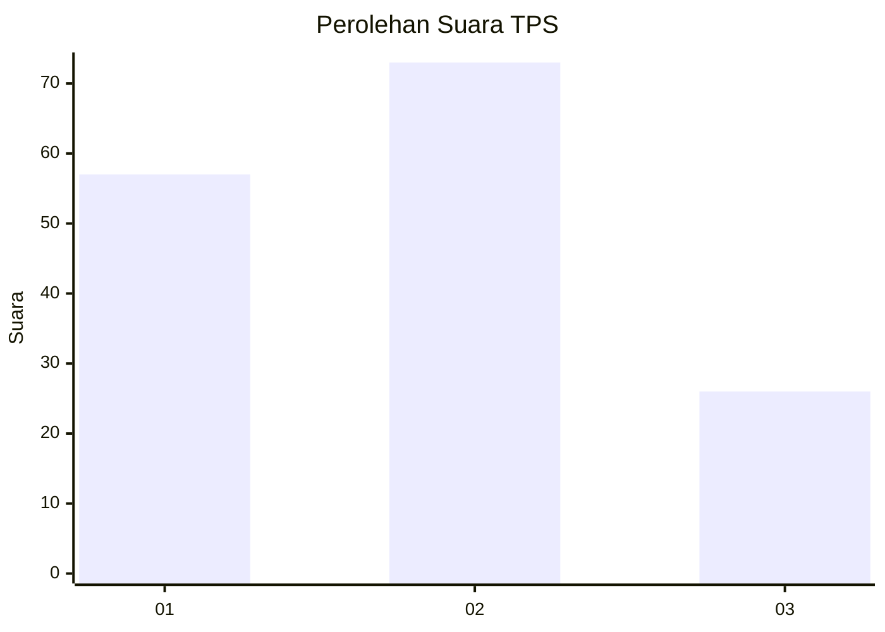
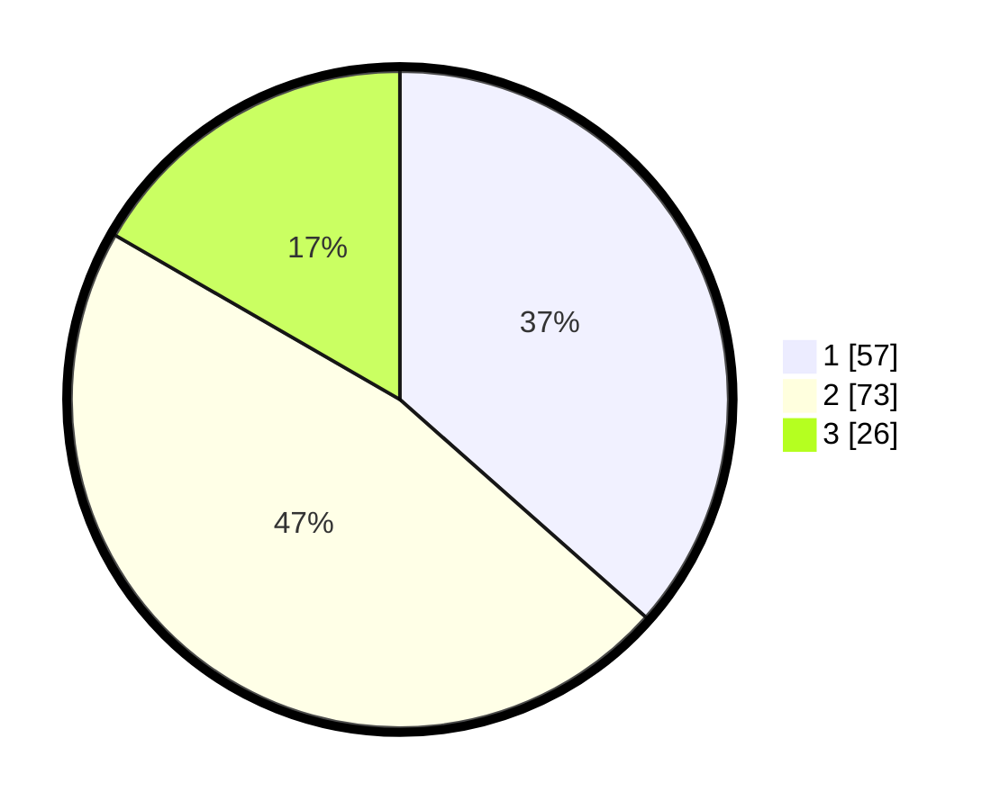

# Hasil

## Grafik

## Tabel

| No. | Nama Paslon    | Suara | Suara (raw) | Persentase |
|:--- |:-------------- | -----:| -----------:| ----------:|
| 1   | ANIES MUHAIMIN | 57    | [57][p-1]   | 36,54      |
| 2   | PRABOWO GIBRAN | 73    | [73][p-2]   | 46,79      |
| 3   | GANJAR MAHFUD  | 26    | [26][p-3]   | 16,67      |

[p-1]: https://github.com/gigit-pemilu/pemilu-2024/blob/main/pilpres/hitung-suara/sub/12-sumatera-utara/sub/07-deli-serdang/sub/26-percut-sei-tuan/sub/1019-kenangan/sub/002-tps/sub/paslon-1.txt
[p-2]: https://github.com/gigit-pemilu/pemilu-2024/blob/main/pilpres/hitung-suara/sub/12-sumatera-utara/sub/07-deli-serdang/sub/26-percut-sei-tuan/sub/1019-kenangan/sub/002-tps/sub/paslon-2.txt
[p-3]: https://github.com/gigit-pemilu/pemilu-2024/blob/main/pilpres/hitung-suara/sub/12-sumatera-utara/sub/07-deli-serdang/sub/26-percut-sei-tuan/sub/1019-kenangan/sub/002-tps/sub/paslon-3.txt

## Foto C Plano

https://sirekap-obj-formc.kpu.go.id/b3bf/pemilu/ppwp/12/07/26/10/19/1207261019002-20240214-234856--05520476-3e12-4c47-974d-bc08f0db7bb9.jpg

https://sirekap-obj-formc.kpu.go.id/b3bf/pemilu/ppwp/12/07/26/10/19/1207261019002-20240214-235432--dc9b9503-0319-449a-a694-9056f7c030bd.jpg

https://sirekap-obj-formc.kpu.go.id/b3bf/pemilu/ppwp/12/07/26/10/19/1207261019002-20240215-000639--1a0f0101-5444-41a6-9ac4-a61082037e42.jpg

## Metadata

| Key        | Value               |
| ---------- | ------------------- |
| Time Stamp | 2024-02-16 02:30:27 |

