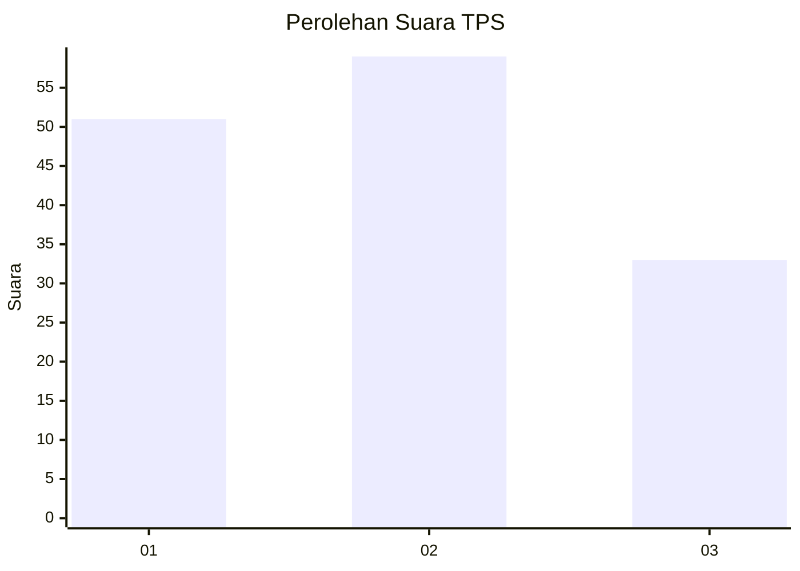
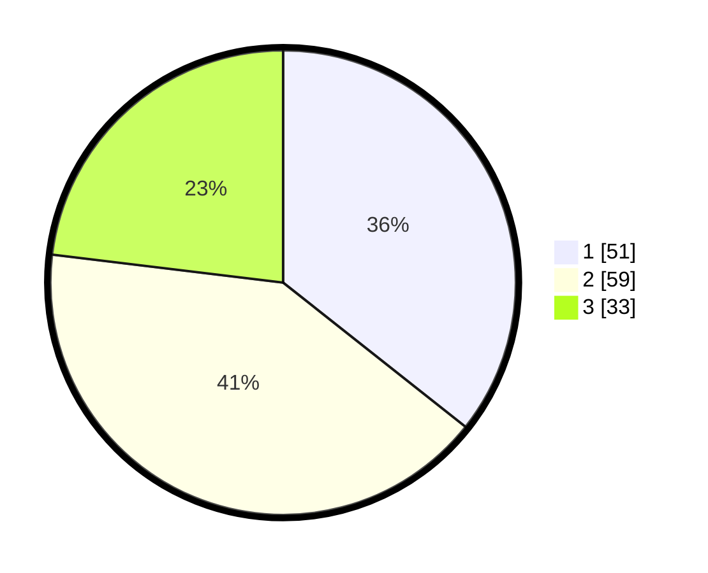

# Hasil

## Grafik

## Tabel

| No. | Nama Paslon    | Suara | Suara (raw) | Persentase |
|:--- |:-------------- | -----:| -----------:| ----------:|
| 1   | ANIES MUHAIMIN | 51    | [51][p-1]   | 35,66      |
| 2   | PRABOWO GIBRAN | 59    | [59][p-2]   | 41,26      |
| 3   | GANJAR MAHFUD  | 33    | [33][p-3]   | 23,08      |

[p-1]: https://github.com/gigit-pemilu/pemilu-2024-12-sumatera-utara/blob/main/pilpres/hitung-suara/sub/12-sumatera-utara/sub/07-deli-serdang/sub/26-percut-sei-tuan/sub/1019-kenangan/sub/003-tps/sub/paslon-1.txt
[p-2]: https://github.com/gigit-pemilu/pemilu-2024-12-sumatera-utara/blob/main/pilpres/hitung-suara/sub/12-sumatera-utara/sub/07-deli-serdang/sub/26-percut-sei-tuan/sub/1019-kenangan/sub/003-tps/sub/paslon-2.txt
[p-3]: https://github.com/gigit-pemilu/pemilu-2024-12-sumatera-utara/blob/main/pilpres/hitung-suara/sub/12-sumatera-utara/sub/07-deli-serdang/sub/26-percut-sei-tuan/sub/1019-kenangan/sub/003-tps/sub/paslon-3.txt

## Foto C Plano

https://sirekap-obj-formc.kpu.go.id/c259/pemilu/ppwp/12/07/26/10/19/1207261019003-20240215-041203--f6facbd6-a1da-4578-9181-fd20a0c4f7fb.jpg

https://sirekap-obj-formc.kpu.go.id/c259/pemilu/ppwp/12/07/26/10/19/1207261019003-20240215-041332--55420196-0e5f-4e19-92b6-d4214d0ac583.jpg

https://sirekap-obj-formc.kpu.go.id/c259/pemilu/ppwp/12/07/26/10/19/1207261019003-20240215-041451--b67847bc-ec29-42b9-b621-62eda154d4a6.jpg

## Metadata

| Key        | Value               |
| ---------- | ------------------- |
| Time Stamp | 2024-02-25 18:00:00 |

