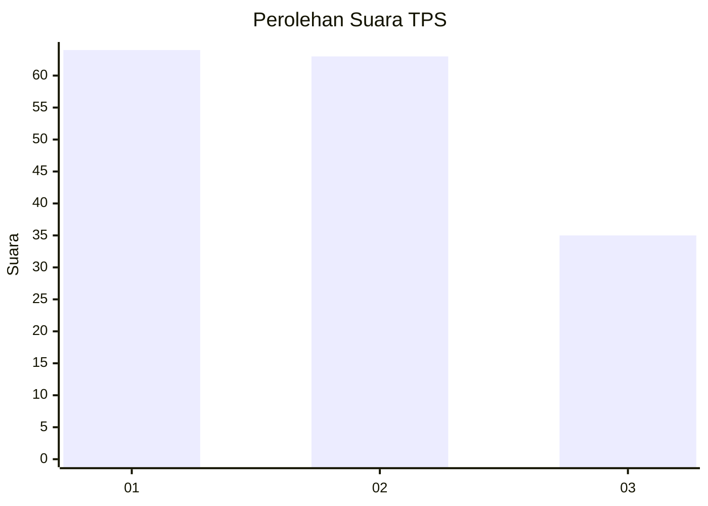
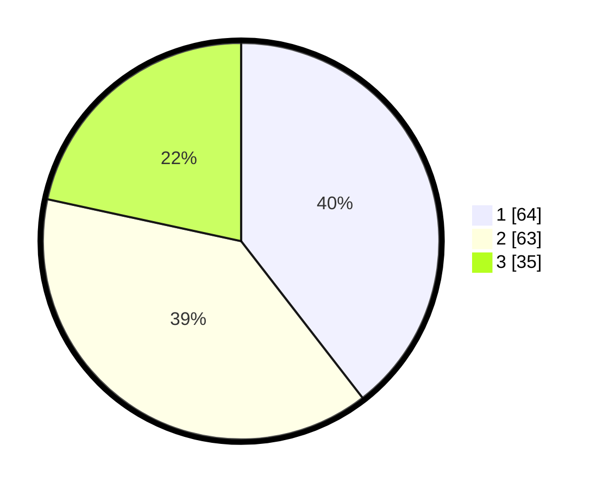

# Hasil

## Grafik

## Tabel

| No. | Nama Paslon    | Suara | Suara (raw) | Persentase |
|:--- |:-------------- | -----:| -----------:| ----------:|
| 1   | ANIES MUHAIMIN | 64    | [64][p-1]   | 39,51      |
| 2   | PRABOWO GIBRAN | 63    | [63][p-2]   | 38,89      |
| 3   | GANJAR MAHFUD  | 35    | [35][p-3]   | 21,60      |

[p-1]: https://github.com/gigit-pemilu/pemilu-2024/blob/main/pilpres/hitung-suara/sub/12-sumatera-utara/sub/07-deli-serdang/sub/26-percut-sei-tuan/sub/1019-kenangan/sub/006-tps/sub/paslon-1.txt
[p-2]: https://github.com/gigit-pemilu/pemilu-2024/blob/main/pilpres/hitung-suara/sub/12-sumatera-utara/sub/07-deli-serdang/sub/26-percut-sei-tuan/sub/1019-kenangan/sub/006-tps/sub/paslon-2.txt
[p-3]: https://github.com/gigit-pemilu/pemilu-2024/blob/main/pilpres/hitung-suara/sub/12-sumatera-utara/sub/07-deli-serdang/sub/26-percut-sei-tuan/sub/1019-kenangan/sub/006-tps/sub/paslon-3.txt

## Foto C Plano

https://sirekap-obj-formc.kpu.go.id/3ce2/pemilu/ppwp/12/07/26/10/19/1207261019006-20240214-230549--56af6b15-1995-41eb-8e16-b80371733617.jpg

https://sirekap-obj-formc.kpu.go.id/3ce2/pemilu/ppwp/12/07/26/10/19/1207261019006-20240214-224657--8f2a89f7-9f17-4b70-9ed4-6b5b44723ed2.jpg

https://sirekap-obj-formc.kpu.go.id/3ce2/pemilu/ppwp/12/07/26/10/19/1207261019006-20240214-224706--f2cc7235-4a85-4cfb-b6e9-0c1700043b02.jpg

## Metadata

| Key        | Value               |
| ---------- | ------------------- |
| Time Stamp | 2024-02-24 22:31:28 |

