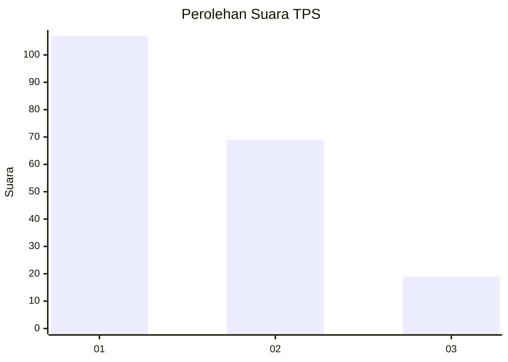
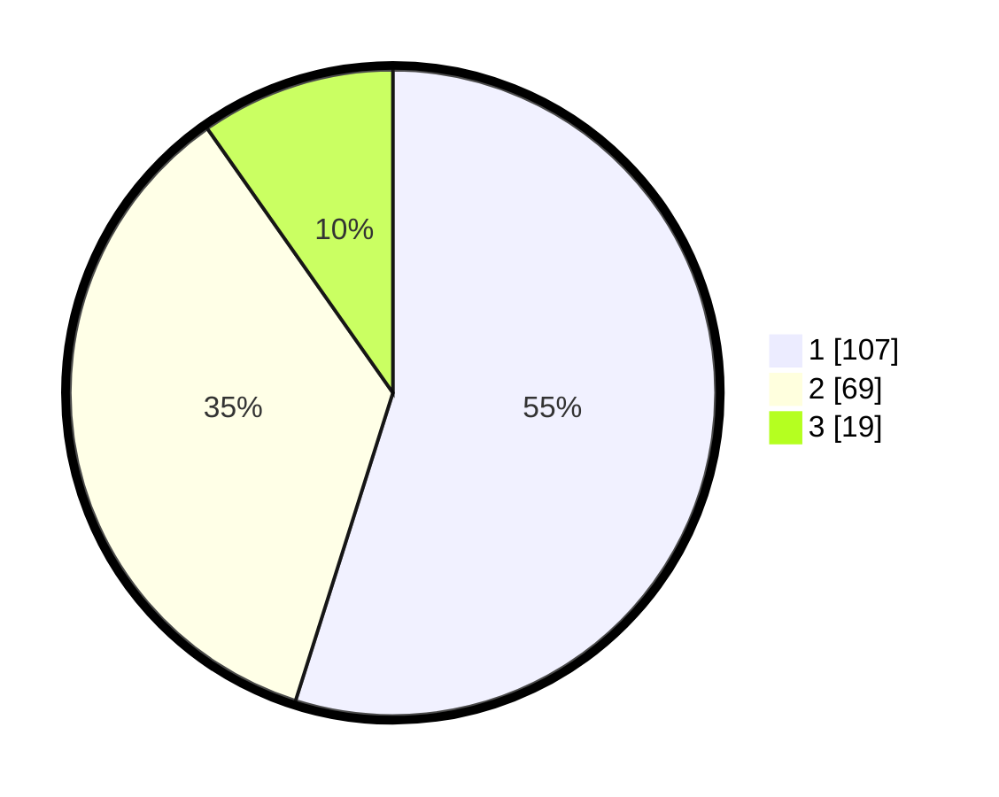

# Hasil

## Grafik

## Tabel

| No. | Nama Paslon    | Suara | Suara (raw) | Persentase |
|:--- |:-------------- | -----:| -----------:| ----------:|
| 1   | ANIES MUHAIMIN | 107   | [107][p-1]  | 54,87      |
| 2   | PRABOWO GIBRAN | 69    | [69][p-2]   | 35,38      |
| 3   | GANJAR MAHFUD  | 19    | [19][p-3]   | 9,74       |

[p-1]: https://github.com/gigit-pemilu/pemilu-2024-12-sumatera-utara/blob/main/pilpres/hitung-suara/sub/12-sumatera-utara/sub/07-deli-serdang/sub/26-percut-sei-tuan/sub/1019-kenangan/sub/009-tps/sub/paslon-1.txt
[p-2]: https://github.com/gigit-pemilu/pemilu-2024-12-sumatera-utara/blob/main/pilpres/hitung-suara/sub/12-sumatera-utara/sub/07-deli-serdang/sub/26-percut-sei-tuan/sub/1019-kenangan/sub/009-tps/sub/paslon-2.txt
[p-3]: https://github.com/gigit-pemilu/pemilu-2024-12-sumatera-utara/blob/main/pilpres/hitung-suara/sub/12-sumatera-utara/sub/07-deli-serdang/sub/26-percut-sei-tuan/sub/1019-kenangan/sub/009-tps/sub/paslon-3.txt

## Foto C Plano

https://sirekap-obj-formc.kpu.go.id/d6a2/pemilu/ppwp/12/07/26/10/19/1207261019009-20240215-022530--294f98b6-88f3-4689-a361-791468b0dc5e.jpg

https://sirekap-obj-formc.kpu.go.id/d6a2/pemilu/ppwp/12/07/26/10/19/1207261019009-20240215-040401--f1d02fd8-e865-4afa-9cc1-e94aa1fd9b15.jpg

https://sirekap-obj-formc.kpu.go.id/d6a2/pemilu/ppwp/12/07/26/10/19/1207261019009-20240215-040524--6ed76d2e-d26d-4934-9e98-5f82185b86c5.jpg

## Metadata

| Key        | Value               |
| ---------- | ------------------- |
| Time Stamp | 2024-02-24 22:31:28 |

