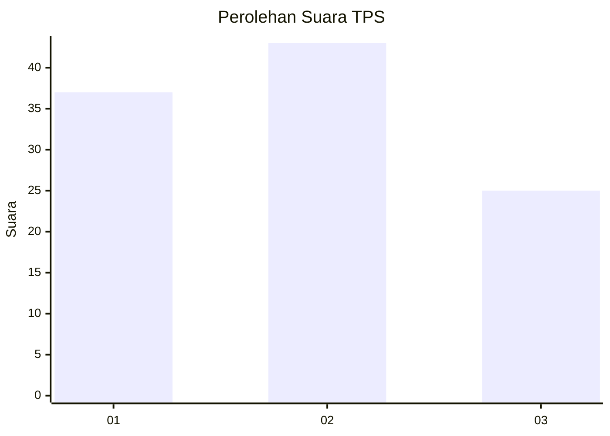
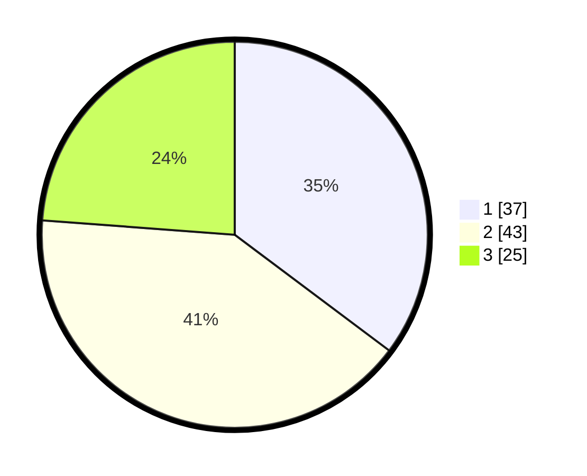

# Hasil

## Grafik

## Tabel

| No. | Nama Paslon    | Suara | Suara (raw) | Persentase |
|:--- |:-------------- | -----:| -----------:| ----------:|
| 1   | ANIES MUHAIMIN | 37    | [37][p-1]   | 35,24      |
| 2   | PRABOWO GIBRAN | 43    | [43][p-2]   | 40,95      |
| 3   | GANJAR MAHFUD  | 25    | [25][p-3]   | 23,81      |

[p-1]: https://github.com/gigit-pemilu/pemilu-2024/blob/main/pilpres/hitung-suara/sub/12-sumatera-utara/sub/07-deli-serdang/sub/26-percut-sei-tuan/sub/1020-kenangan-baru/sub/010-tps/sub/paslon-1.txt
[p-2]: https://github.com/gigit-pemilu/pemilu-2024/blob/main/pilpres/hitung-suara/sub/12-sumatera-utara/sub/07-deli-serdang/sub/26-percut-sei-tuan/sub/1020-kenangan-baru/sub/010-tps/sub/paslon-2.txt
[p-3]: https://github.com/gigit-pemilu/pemilu-2024/blob/main/pilpres/hitung-suara/sub/12-sumatera-utara/sub/07-deli-serdang/sub/26-percut-sei-tuan/sub/1020-kenangan-baru/sub/010-tps/sub/paslon-3.txt

## Foto C Plano

https://sirekap-obj-formc.kpu.go.id/f4b6/pemilu/ppwp/12/07/26/10/20/1207261020010-20240214-225349--ccc4997c-ffc6-40e2-83f9-188cceb7b22e.jpg

https://sirekap-obj-formc.kpu.go.id/f4b6/pemilu/ppwp/12/07/26/10/20/1207261020010-20240214-225629--ed57c73e-8de5-4bc7-ad20-e1749e7baa98.jpg

https://sirekap-obj-formc.kpu.go.id/f4b6/pemilu/ppwp/12/07/26/10/20/1207261020010-20240214-225805--c731c359-2df2-41d0-86a6-02c0c24248d4.jpg

## Metadata

| Key        | Value               |
| ---------- | ------------------- |
| Time Stamp | 2024-02-26 17:00:04 |

