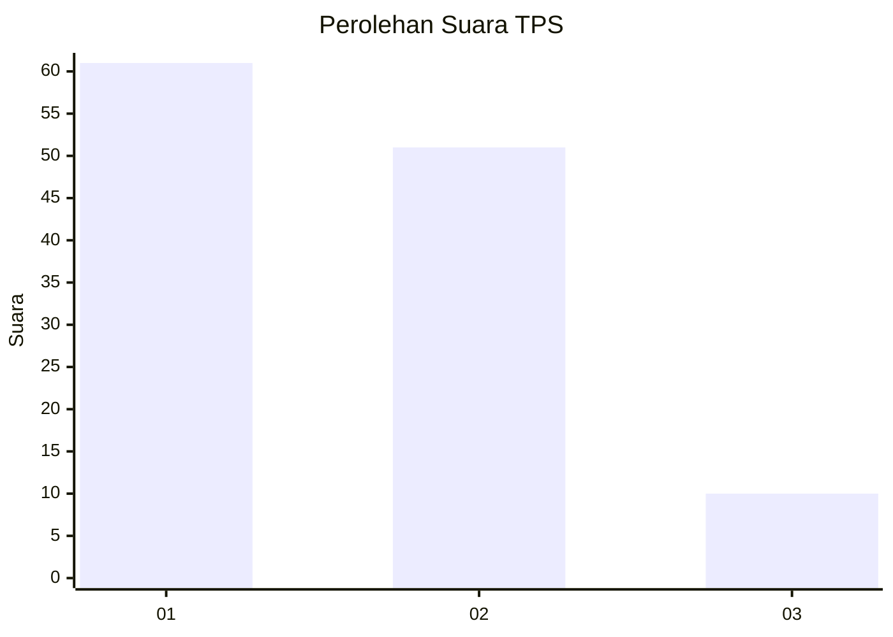
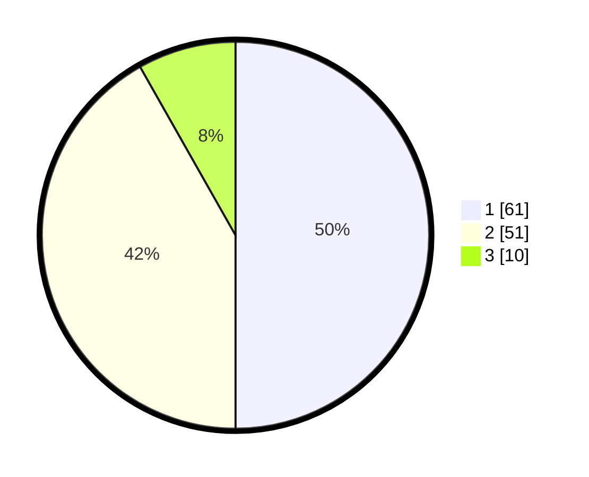

# Hasil

## Grafik

## Tabel

| No. | Nama Paslon    | Suara | Suara (raw) | Persentase |
|:--- |:-------------- | -----:| -----------:| ----------:|
| 1   | ANIES MUHAIMIN | 61    | [61][p-1]   | 50,00      |
| 2   | PRABOWO GIBRAN | 51    | [51][p-2]   | 41,80      |
| 3   | GANJAR MAHFUD  | 10    | [10][p-3]   | 8,20       |

[p-1]: https://github.com/gigit-pemilu/pemilu-2024/blob/main/pilpres/hitung-suara/sub/12-sumatera-utara/sub/07-deli-serdang/sub/26-percut-sei-tuan/sub/1020-kenangan-baru/sub/028-tps/sub/paslon-1.txt
[p-2]: https://github.com/gigit-pemilu/pemilu-2024/blob/main/pilpres/hitung-suara/sub/12-sumatera-utara/sub/07-deli-serdang/sub/26-percut-sei-tuan/sub/1020-kenangan-baru/sub/028-tps/sub/paslon-2.txt
[p-3]: https://github.com/gigit-pemilu/pemilu-2024/blob/main/pilpres/hitung-suara/sub/12-sumatera-utara/sub/07-deli-serdang/sub/26-percut-sei-tuan/sub/1020-kenangan-baru/sub/028-tps/sub/paslon-3.txt

## Foto C Plano

https://sirekap-obj-formc.kpu.go.id/ed65/pemilu/ppwp/12/07/26/10/20/1207261020028-20240214-155637--fe483779-f3d5-4771-8a9f-41a3fb40943c.jpg

https://sirekap-obj-formc.kpu.go.id/ed65/pemilu/ppwp/12/07/26/10/20/1207261020028-20240214-160118--867544c8-2a1e-44d5-8067-744acc818f70.jpg

https://sirekap-obj-formc.kpu.go.id/ed65/pemilu/ppwp/12/07/26/10/20/1207261020028-20240214-160133--ce133e4e-dd1f-40f9-ade4-0f4dfd4b94d8.jpg

## Metadata

| Key        | Value               |
| ---------- | ------------------- |
| Time Stamp | 2024-02-24 22:31:28 |

