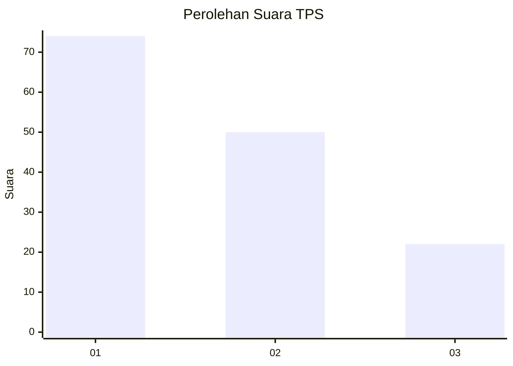
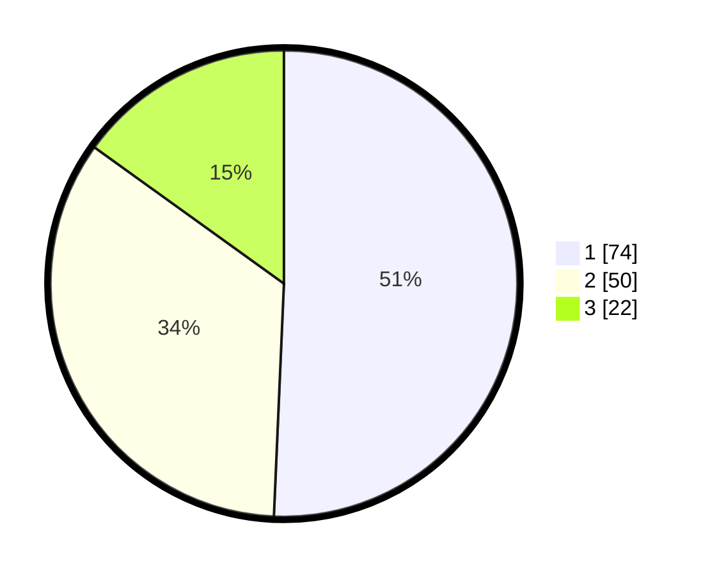

# Hasil

## Grafik

## Tabel

| No. | Nama Paslon    | Suara | Suara (raw) | Persentase |
|:--- |:-------------- | -----:| -----------:| ----------:|
| 1   | ANIES MUHAIMIN | 74    | [74][p-1]   | 50,68      |
| 2   | PRABOWO GIBRAN | 50    | [50][p-2]   | 34,25      |
| 3   | GANJAR MAHFUD  | 22    | [22][p-3]   | 15,07      |

[p-1]: https://github.com/gigit-pemilu/pemilu-2024-12-sumatera-utara/blob/main/pilpres/hitung-suara/sub/12-sumatera-utara/sub/07-deli-serdang/sub/26-percut-sei-tuan/sub/1020-kenangan-baru/sub/034-tps/sub/paslon-1.txt
[p-2]: https://github.com/gigit-pemilu/pemilu-2024-12-sumatera-utara/blob/main/pilpres/hitung-suara/sub/12-sumatera-utara/sub/07-deli-serdang/sub/26-percut-sei-tuan/sub/1020-kenangan-baru/sub/034-tps/sub/paslon-2.txt
[p-3]: https://github.com/gigit-pemilu/pemilu-2024-12-sumatera-utara/blob/main/pilpres/hitung-suara/sub/12-sumatera-utara/sub/07-deli-serdang/sub/26-percut-sei-tuan/sub/1020-kenangan-baru/sub/034-tps/sub/paslon-3.txt

## Foto C Plano

https://sirekap-obj-formc.kpu.go.id/500d/pemilu/ppwp/12/07/26/10/20/1207261020034-20240215-004712--8a281a96-c314-4528-a55c-5809764ffb52.jpg

https://sirekap-obj-formc.kpu.go.id/500d/pemilu/ppwp/12/07/26/10/20/1207261020034-20240215-004810--d305a5a1-2ef2-4c50-8e2c-9a9ca15bd215.jpg

https://sirekap-obj-formc.kpu.go.id/500d/pemilu/ppwp/12/07/26/10/20/1207261020034-20240215-004914--acca9da1-5c00-40f7-8d12-18a0ae493a9b.jpg

## Metadata

| Key        | Value               |
| ---------- | ------------------- |
| Time Stamp | 2024-02-25 12:00:00 |

