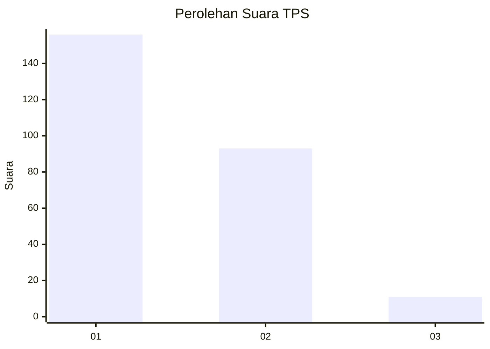
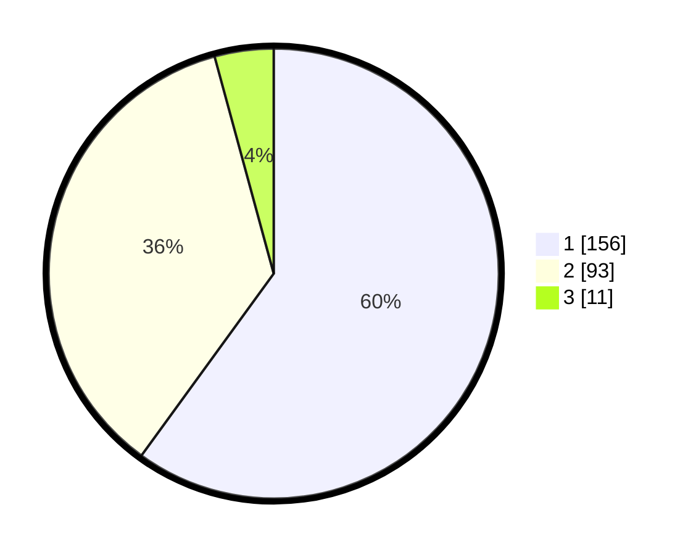

# Hasil

## Grafik

## Tabel

| No. | Nama Paslon    | Suara | Suara (raw) | Persentase |
|:--- |:-------------- | -----:| -----------:| ----------:|
| 1   | ANIES MUHAIMIN | 156   | [156][p-1]  | 60,00      |
| 2   | PRABOWO GIBRAN | 93    | [93][p-2]   | 35,77      |
| 3   | GANJAR MAHFUD  | 11    | [11][p-3]   | 4,23       |

[p-1]: https://github.com/gigit-pemilu/pemilu-2024-12-sumatera-utara/blob/main/pilpres/hitung-suara/sub/12-sumatera-utara/sub/07-deli-serdang/sub/26-percut-sei-tuan/sub/2005-laut-dendang/sub/003-tps/sub/paslon-1.txt
[p-2]: https://github.com/gigit-pemilu/pemilu-2024-12-sumatera-utara/blob/main/pilpres/hitung-suara/sub/12-sumatera-utara/sub/07-deli-serdang/sub/26-percut-sei-tuan/sub/2005-laut-dendang/sub/003-tps/sub/paslon-2.txt
[p-3]: https://github.com/gigit-pemilu/pemilu-2024-12-sumatera-utara/blob/main/pilpres/hitung-suara/sub/12-sumatera-utara/sub/07-deli-serdang/sub/26-percut-sei-tuan/sub/2005-laut-dendang/sub/003-tps/sub/paslon-3.txt

## Foto C Plano

https://sirekap-obj-formc.kpu.go.id/4c0e/pemilu/ppwp/12/07/26/20/05/1207262005003-20240214-205906--8e308368-9b44-459c-8511-1148089cc129.jpg

https://sirekap-obj-formc.kpu.go.id/4c0e/pemilu/ppwp/12/07/26/20/05/1207262005003-20240214-210051--7f5a2128-765f-414a-9ee2-12819253fe05.jpg

https://sirekap-obj-formc.kpu.go.id/4c0e/pemilu/ppwp/12/07/26/20/05/1207262005003-20240214-155751--bbdfb8d8-9878-4bf7-9918-7202c351932a.jpg

## Metadata

| Key        | Value               |
| ---------- | ------------------- |
| Time Stamp | 2024-02-15 00:41:44 |

