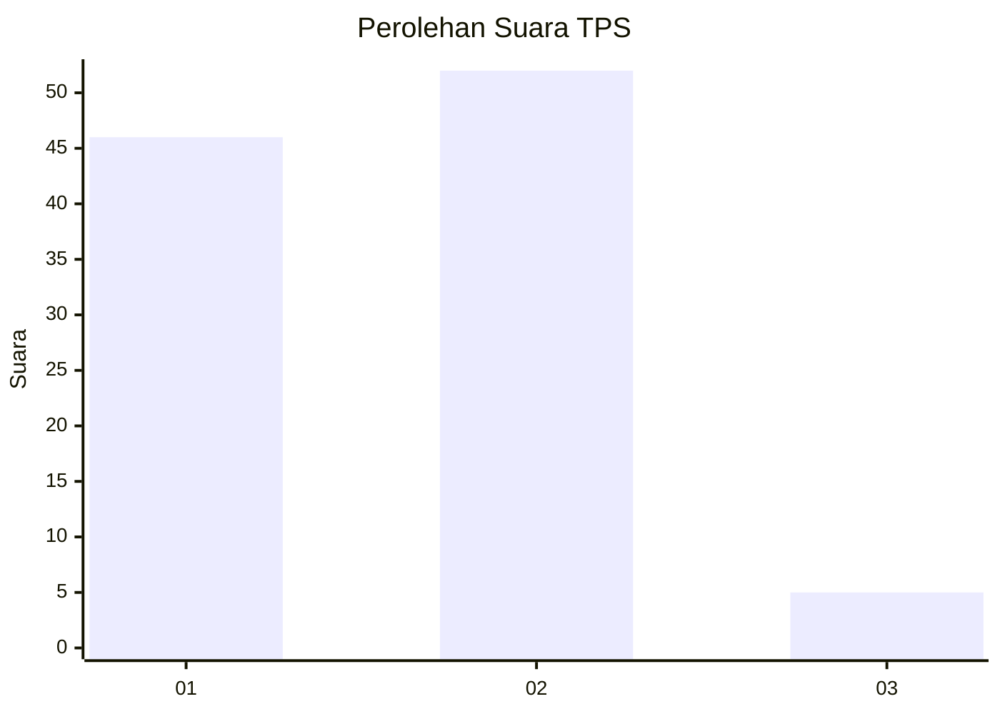
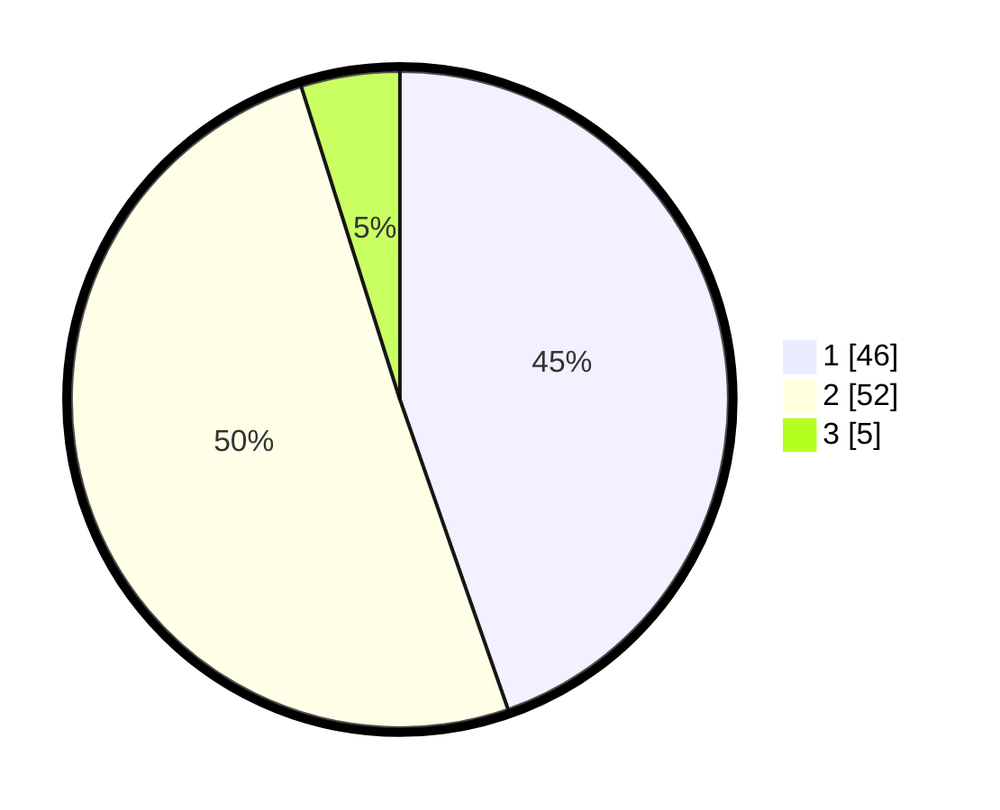

# Hasil

## Grafik

## Tabel

| No. | Nama Paslon    | Suara | Suara (raw) | Persentase |
|:--- |:-------------- | -----:| -----------:| ----------:|
| 1   | ANIES MUHAIMIN | 46    | [46][p-1]   | 44,66      |
| 2   | PRABOWO GIBRAN | 52    | [52][p-2]   | 50,49      |
| 3   | GANJAR MAHFUD  | 5     | [5][p-3]    | 4,85       |

[p-1]: https://github.com/gigit-pemilu/pemilu-2024/blob/main/pilpres/hitung-suara/sub/12-sumatera-utara/sub/07-deli-serdang/sub/26-percut-sei-tuan/sub/2005-laut-dendang/sub/018-tps/sub/paslon-1.txt
[p-2]: https://github.com/gigit-pemilu/pemilu-2024/blob/main/pilpres/hitung-suara/sub/12-sumatera-utara/sub/07-deli-serdang/sub/26-percut-sei-tuan/sub/2005-laut-dendang/sub/018-tps/sub/paslon-2.txt
[p-3]: https://github.com/gigit-pemilu/pemilu-2024/blob/main/pilpres/hitung-suara/sub/12-sumatera-utara/sub/07-deli-serdang/sub/26-percut-sei-tuan/sub/2005-laut-dendang/sub/018-tps/sub/paslon-3.txt

## Foto C Plano

https://sirekap-obj-formc.kpu.go.id/aae4/pemilu/ppwp/12/07/26/20/05/1207262005018-20240215-011250--c4413408-8c3b-4320-8806-83f47050aa5f.jpg

https://sirekap-obj-formc.kpu.go.id/aae4/pemilu/ppwp/12/07/26/20/05/1207262005018-20240214-233550--d0852dfd-490d-46f8-9bf6-46017676808d.jpg

https://sirekap-obj-formc.kpu.go.id/aae4/pemilu/ppwp/12/07/26/20/05/1207262005018-20240214-233713--79d7ed16-3c15-4787-80ec-efe548f423fc.jpg

## Metadata

| Key        | Value               |
| ---------- | ------------------- |
| Time Stamp | 2024-02-26 10:00:00 |

