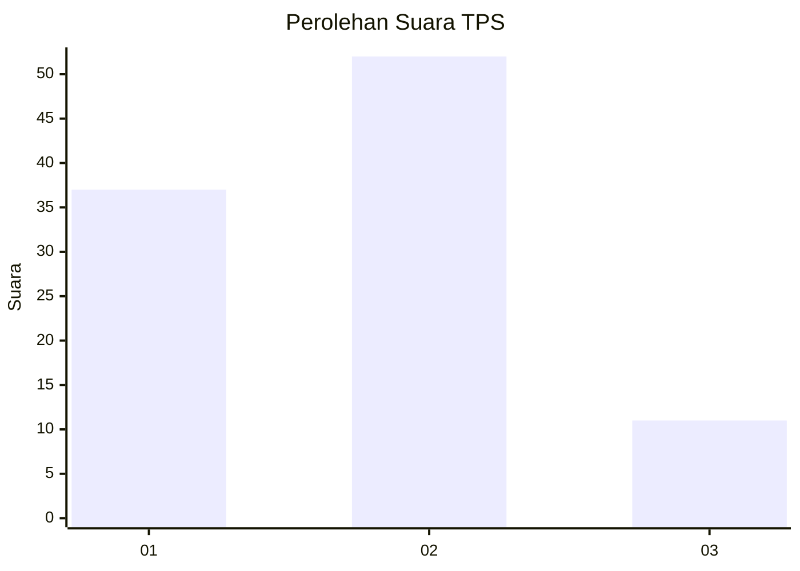
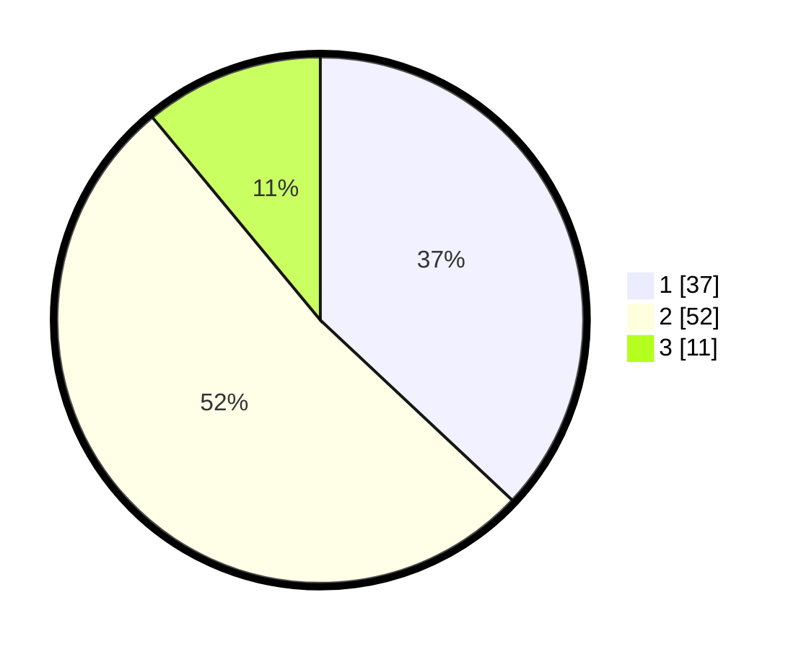

# Hasil

## Grafik

## Tabel

| No. | Nama Paslon    | Suara | Suara (raw) | Persentase |
|:--- |:-------------- | -----:| -----------:| ----------:|
| 1   | ANIES MUHAIMIN | 37    | [37][p-1]   | 37,00      |
| 2   | PRABOWO GIBRAN | 52    | [52][p-2]   | 52,00      |
| 3   | GANJAR MAHFUD  | 11    | [11][p-3]   | 11,00      |

[p-1]: https://github.com/gigit-pemilu/pemilu-2024/blob/main/pilpres/hitung-suara/sub/12-sumatera-utara/sub/07-deli-serdang/sub/26-percut-sei-tuan/sub/2005-laut-dendang/sub/035-tps/sub/paslon-1.txt
[p-2]: https://github.com/gigit-pemilu/pemilu-2024/blob/main/pilpres/hitung-suara/sub/12-sumatera-utara/sub/07-deli-serdang/sub/26-percut-sei-tuan/sub/2005-laut-dendang/sub/035-tps/sub/paslon-2.txt
[p-3]: https://github.com/gigit-pemilu/pemilu-2024/blob/main/pilpres/hitung-suara/sub/12-sumatera-utara/sub/07-deli-serdang/sub/26-percut-sei-tuan/sub/2005-laut-dendang/sub/035-tps/sub/paslon-3.txt

## Foto C Plano

https://sirekap-obj-formc.kpu.go.id/d3a4/pemilu/ppwp/12/07/26/20/05/1207262005035-20240215-022644--3a4b65fc-6bfc-461a-8e67-92a6f4004695.jpg

https://sirekap-obj-formc.kpu.go.id/d3a4/pemilu/ppwp/12/07/26/20/05/1207262005035-20240215-022628--dfa9226c-f9b3-4a7f-8968-0fec192d15fa.jpg

https://sirekap-obj-formc.kpu.go.id/d3a4/pemilu/ppwp/12/07/26/20/05/1207262005035-20240215-023017--26f0b49a-5eed-48e1-ac9c-45371374215b.jpg

## Metadata

| Key        | Value               |
| ---------- | ------------------- |
| Time Stamp | 2024-02-16 16:25:10 |

