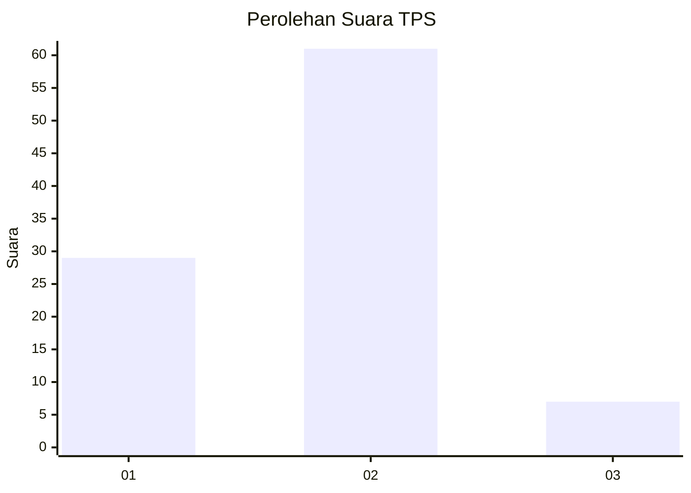
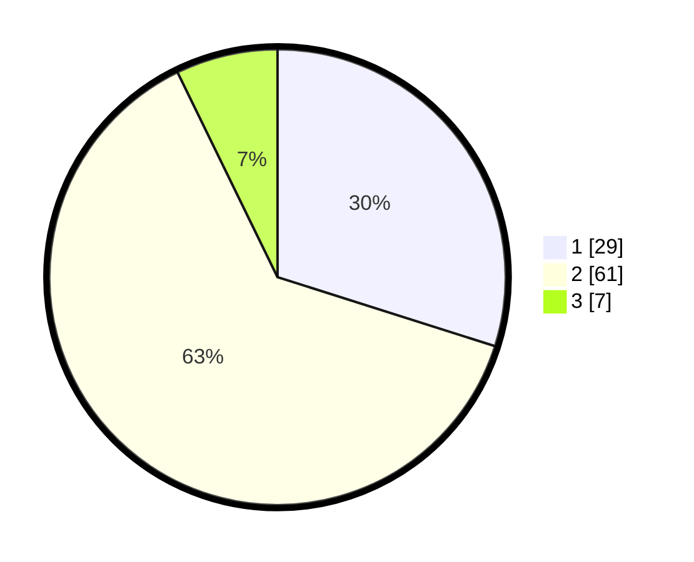

# Hasil

## Grafik

## Tabel

| No. | Nama Paslon    | Suara | Suara (raw) | Persentase |
|:--- |:-------------- | -----:| -----------:| ----------:|
| 1   | ANIES MUHAIMIN | 29    | [29][p-1]   | 29,90      |
| 2   | PRABOWO GIBRAN | 61    | [61][p-2]   | 62,89      |
| 3   | GANJAR MAHFUD  | 7     | [7][p-3]    | 7,22       |

[p-1]: https://github.com/gigit-pemilu/pemilu-2024-12-sumatera-utara/blob/main/pilpres/hitung-suara/sub/12-sumatera-utara/sub/07-deli-serdang/sub/26-percut-sei-tuan/sub/2005-laut-dendang/sub/036-tps/sub/paslon-1.txt
[p-2]: https://github.com/gigit-pemilu/pemilu-2024-12-sumatera-utara/blob/main/pilpres/hitung-suara/sub/12-sumatera-utara/sub/07-deli-serdang/sub/26-percut-sei-tuan/sub/2005-laut-dendang/sub/036-tps/sub/paslon-2.txt
[p-3]: https://github.com/gigit-pemilu/pemilu-2024-12-sumatera-utara/blob/main/pilpres/hitung-suara/sub/12-sumatera-utara/sub/07-deli-serdang/sub/26-percut-sei-tuan/sub/2005-laut-dendang/sub/036-tps/sub/paslon-3.txt

## Foto C Plano

https://sirekap-obj-formc.kpu.go.id/84fc/pemilu/ppwp/12/07/26/20/05/1207262005036-20240215-004121--eecf6494-7fc2-4ed1-907f-9e4771565263.jpg

https://sirekap-obj-formc.kpu.go.id/84fc/pemilu/ppwp/12/07/26/20/05/1207262005036-20240215-005016--0b801332-2571-4ef6-acff-792596360a65.jpg

https://sirekap-obj-formc.kpu.go.id/84fc/pemilu/ppwp/12/07/26/20/05/1207262005036-20240215-024641--5d7a55f2-d883-42ab-9f5f-eb0c81c32060.jpg

## Metadata

| Key        | Value               |
| ---------- | ------------------- |
| Time Stamp | 2024-02-24 22:31:28 |

