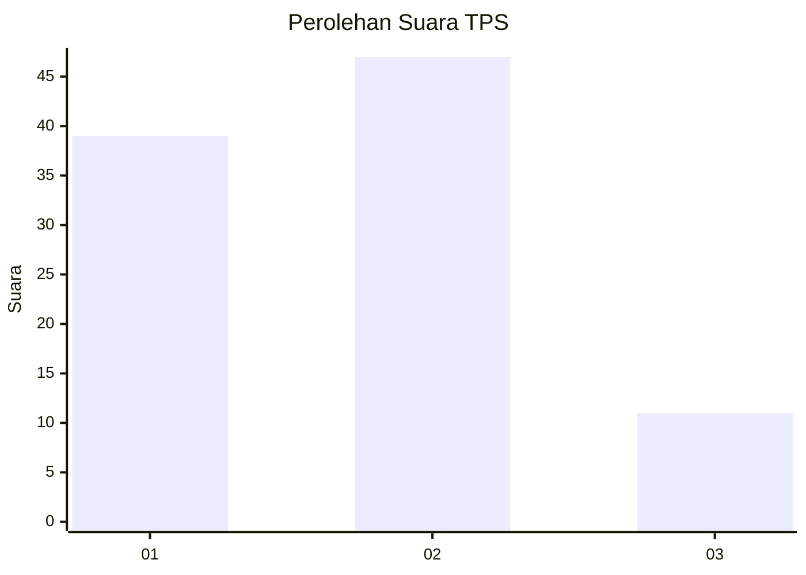
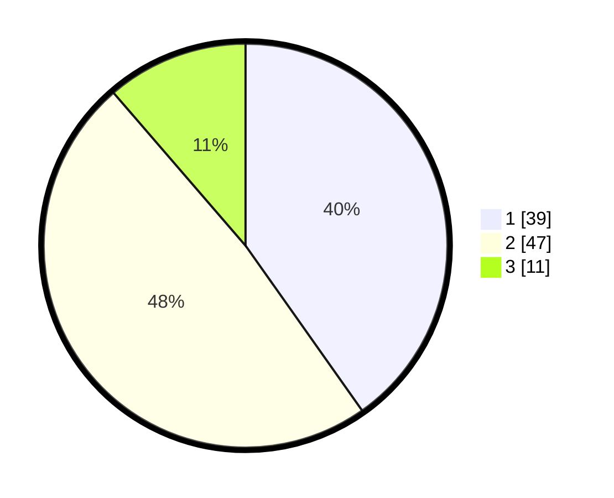

# Hasil

## Grafik

## Tabel

| No. | Nama Paslon    | Suara | Suara (raw) | Persentase |
|:--- |:-------------- | -----:| -----------:| ----------:|
| 1   | ANIES MUHAIMIN | 39    | [39][p-1]   | 40,21      |
| 2   | PRABOWO GIBRAN | 47    | [47][p-2]   | 48,45      |
| 3   | GANJAR MAHFUD  | 11    | [11][p-3]   | 11,34      |

[p-1]: https://github.com/gigit-pemilu/pemilu-2024/blob/main/pilpres/hitung-suara/sub/12-sumatera-utara/sub/07-deli-serdang/sub/26-percut-sei-tuan/sub/2005-laut-dendang/sub/041-tps/sub/paslon-1.txt
[p-2]: https://github.com/gigit-pemilu/pemilu-2024/blob/main/pilpres/hitung-suara/sub/12-sumatera-utara/sub/07-deli-serdang/sub/26-percut-sei-tuan/sub/2005-laut-dendang/sub/041-tps/sub/paslon-2.txt
[p-3]: https://github.com/gigit-pemilu/pemilu-2024/blob/main/pilpres/hitung-suara/sub/12-sumatera-utara/sub/07-deli-serdang/sub/26-percut-sei-tuan/sub/2005-laut-dendang/sub/041-tps/sub/paslon-3.txt

## Foto C Plano

https://sirekap-obj-formc.kpu.go.id/f0fe/pemilu/ppwp/12/07/26/20/05/1207262005041-20240215-042334--b1d3a68c-a8f0-4416-af49-456f6c9135f6.jpg

https://sirekap-obj-formc.kpu.go.id/f0fe/pemilu/ppwp/12/07/26/20/05/1207262005041-20240215-042402--7e1a2621-249e-4a77-8083-5a57006572ef.jpg

https://sirekap-obj-formc.kpu.go.id/f0fe/pemilu/ppwp/12/07/26/20/05/1207262005041-20240215-042415--aec588fc-2e35-4f66-8cd2-22eacca97a2e.jpg

## Metadata

| Key        | Value               |
| ---------- | ------------------- |
| Time Stamp | 2024-02-25 00:00:00 |

