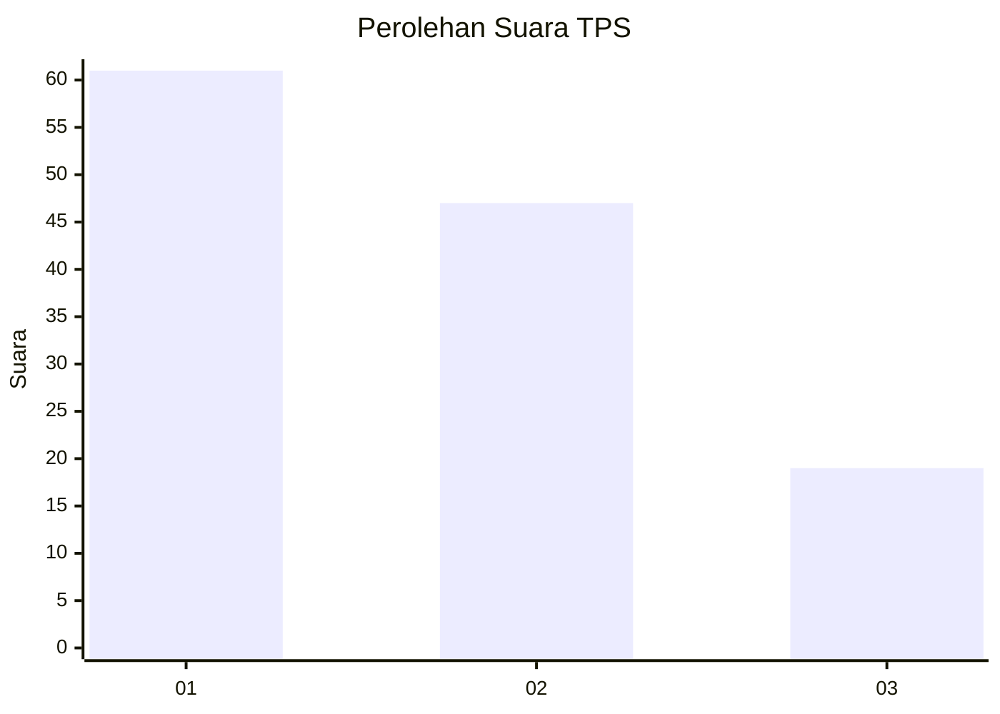
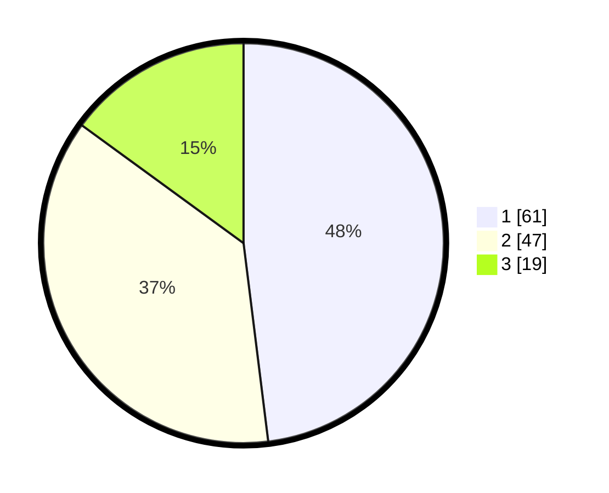

# Hasil

## Grafik

## Tabel

| No. | Nama Paslon    | Suara | Suara (raw) | Persentase |
|:--- |:-------------- | -----:| -----------:| ----------:|
| 1   | ANIES MUHAIMIN | 61    | [61][p-1]   | 48,03      |
| 2   | PRABOWO GIBRAN | 47    | [47][p-2]   | 37,01      |
| 3   | GANJAR MAHFUD  | 19    | [19][p-3]   | 14,96      |

[p-1]: https://github.com/gigit-pemilu/pemilu-2024-12-sumatera-utara/blob/main/pilpres/hitung-suara/sub/12-sumatera-utara/sub/07-deli-serdang/sub/26-percut-sei-tuan/sub/2005-laut-dendang/sub/043-tps/sub/paslon-1.txt
[p-2]: https://github.com/gigit-pemilu/pemilu-2024-12-sumatera-utara/blob/main/pilpres/hitung-suara/sub/12-sumatera-utara/sub/07-deli-serdang/sub/26-percut-sei-tuan/sub/2005-laut-dendang/sub/043-tps/sub/paslon-2.txt
[p-3]: https://github.com/gigit-pemilu/pemilu-2024-12-sumatera-utara/blob/main/pilpres/hitung-suara/sub/12-sumatera-utara/sub/07-deli-serdang/sub/26-percut-sei-tuan/sub/2005-laut-dendang/sub/043-tps/sub/paslon-3.txt

## Foto C Plano

https://sirekap-obj-formc.kpu.go.id/867c/pemilu/ppwp/12/07/26/20/05/1207262005043-20240215-023410--9380089e-f0a3-4570-b6e2-9b2150ea91e4.jpg

https://sirekap-obj-formc.kpu.go.id/867c/pemilu/ppwp/12/07/26/20/05/1207262005043-20240215-023433--2f584c2e-3d2c-442c-a186-982b02a2df9f.jpg

https://sirekap-obj-formc.kpu.go.id/867c/pemilu/ppwp/12/07/26/20/05/1207262005043-20240215-023449--a2c6ba91-6cc6-4d43-a0fe-a2cc4edb37b7.jpg

## Metadata

| Key        | Value               |
| ---------- | ------------------- |
| Time Stamp | 2024-02-25 16:00:00 |

