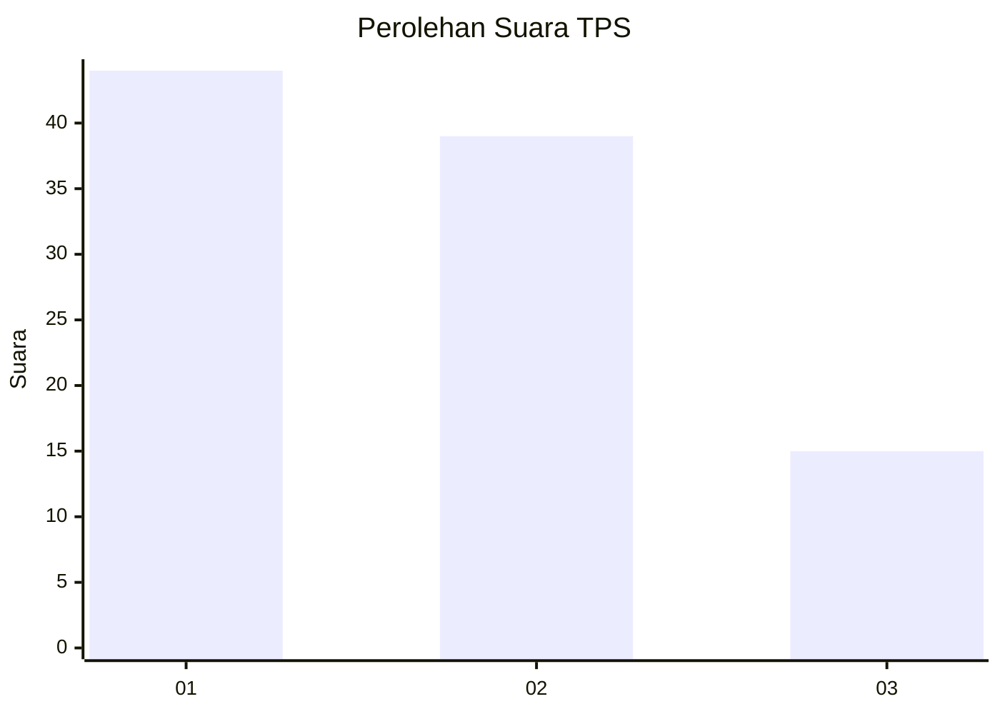
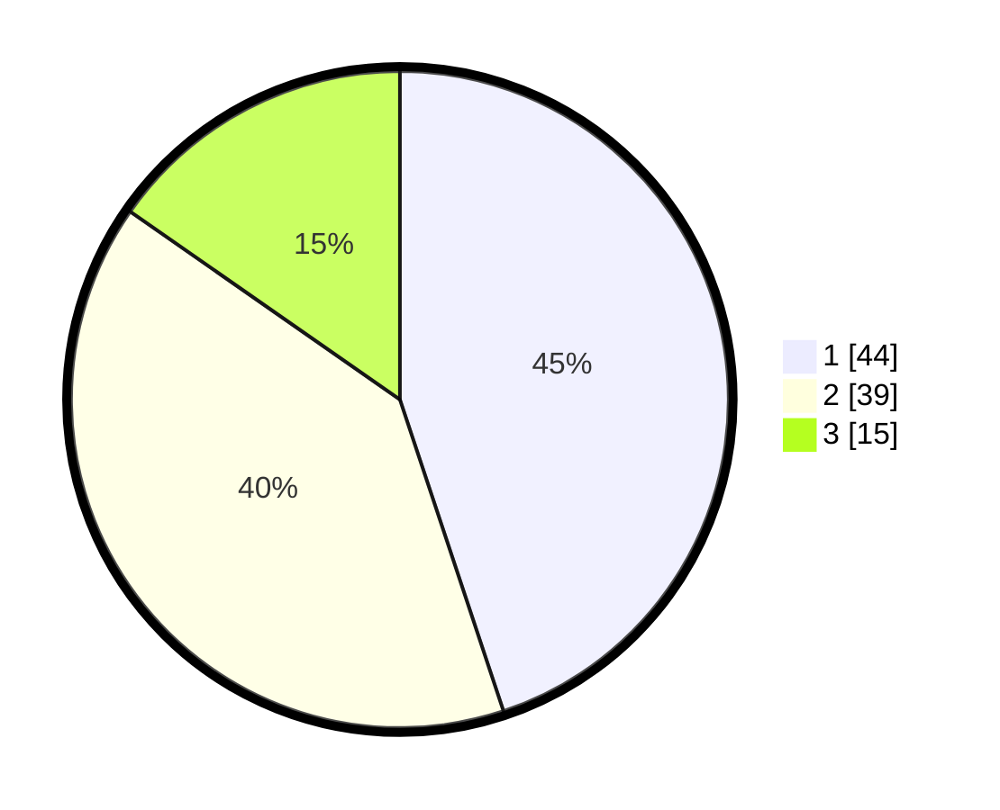

# Hasil

## Grafik

## Tabel

| No. | Nama Paslon    | Suara | Suara (raw) | Persentase |
|:--- |:-------------- | -----:| -----------:| ----------:|
| 1   | ANIES MUHAIMIN | 44    | [44][p-1]   | 44,90      |
| 2   | PRABOWO GIBRAN | 39    | [39][p-2]   | 39,80      |
| 3   | GANJAR MAHFUD  | 15    | [15][p-3]   | 15,31      |

[p-1]: https://github.com/gigit-pemilu/pemilu-2024-12-sumatera-utara/blob/main/pilpres/hitung-suara/sub/12-sumatera-utara/sub/07-deli-serdang/sub/26-percut-sei-tuan/sub/2005-laut-dendang/sub/046-tps/sub/paslon-1.txt
[p-2]: https://github.com/gigit-pemilu/pemilu-2024-12-sumatera-utara/blob/main/pilpres/hitung-suara/sub/12-sumatera-utara/sub/07-deli-serdang/sub/26-percut-sei-tuan/sub/2005-laut-dendang/sub/046-tps/sub/paslon-2.txt
[p-3]: https://github.com/gigit-pemilu/pemilu-2024-12-sumatera-utara/blob/main/pilpres/hitung-suara/sub/12-sumatera-utara/sub/07-deli-serdang/sub/26-percut-sei-tuan/sub/2005-laut-dendang/sub/046-tps/sub/paslon-3.txt

## Foto C Plano

https://sirekap-obj-formc.kpu.go.id/4b64/pemilu/ppwp/12/07/26/20/05/1207262005046-20240215-195524--d4674f1d-22eb-4a3f-8fae-da070266b7b7.jpg

https://sirekap-obj-formc.kpu.go.id/4b64/pemilu/ppwp/12/07/26/20/05/1207262005046-20240215-200026--56e57b09-9cff-477a-a95e-49bad6decc63.jpg

https://sirekap-obj-formc.kpu.go.id/4b64/pemilu/ppwp/12/07/26/20/05/1207262005046-20240215-195913--05cebccb-bcaf-429f-bbb8-417e761a6ed7.jpg

## Metadata

| Key        | Value               |
| ---------- | ------------------- |
| Time Stamp | 2024-02-24 22:31:28 |

