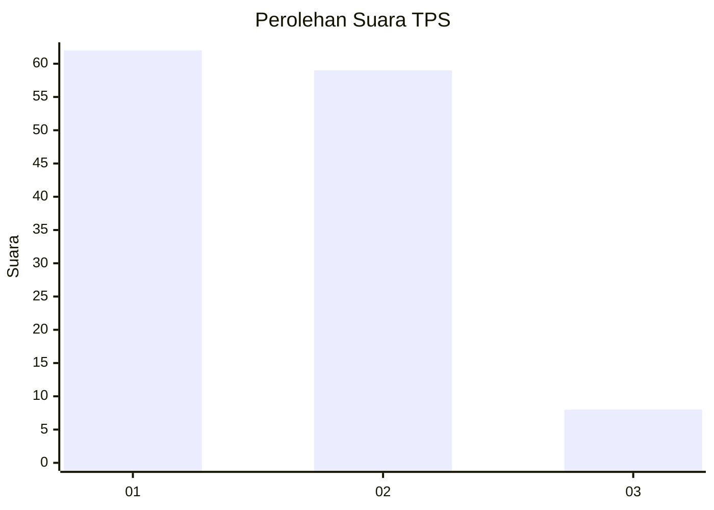
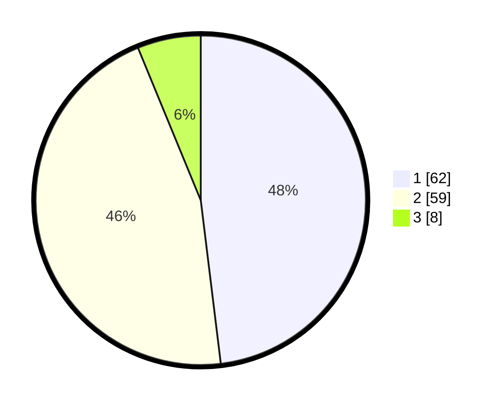

# Hasil

## Grafik

## Tabel

| No. | Nama Paslon    | Suara | Suara (raw) | Persentase |
|:--- |:-------------- | -----:| -----------:| ----------:|
| 1   | ANIES MUHAIMIN | 62    | [62][p-1]   | 48,06      |
| 2   | PRABOWO GIBRAN | 59    | [59][p-2]   | 45,74      |
| 3   | GANJAR MAHFUD  | 8     | [8][p-3]    | 6,20       |

[p-1]: https://github.com/gigit-pemilu/pemilu-2024-12-sumatera-utara/blob/main/pilpres/hitung-suara/sub/12-sumatera-utara/sub/07-deli-serdang/sub/26-percut-sei-tuan/sub/2006-tembung/sub/046-tps/sub/paslon-1.txt
[p-2]: https://github.com/gigit-pemilu/pemilu-2024-12-sumatera-utara/blob/main/pilpres/hitung-suara/sub/12-sumatera-utara/sub/07-deli-serdang/sub/26-percut-sei-tuan/sub/2006-tembung/sub/046-tps/sub/paslon-2.txt
[p-3]: https://github.com/gigit-pemilu/pemilu-2024-12-sumatera-utara/blob/main/pilpres/hitung-suara/sub/12-sumatera-utara/sub/07-deli-serdang/sub/26-percut-sei-tuan/sub/2006-tembung/sub/046-tps/sub/paslon-3.txt

## Foto C Plano

https://sirekap-obj-formc.kpu.go.id/4151/pemilu/ppwp/12/07/26/20/06/1207262006046-20240215-003143--6c51f881-51a4-43bb-bee6-e06b1544fc11.jpg

https://sirekap-obj-formc.kpu.go.id/4151/pemilu/ppwp/12/07/26/20/06/1207262006046-20240215-003331--4c012fc4-901b-4da3-af0a-1226458e8c75.jpg

https://sirekap-obj-formc.kpu.go.id/4151/pemilu/ppwp/12/07/26/20/06/1207262006046-20240215-003425--a4836c1d-2cb4-412f-b075-30c3a6e01bf2.jpg

## Metadata

| Key        | Value               |
| ---------- | ------------------- |
| Time Stamp | 2024-02-25 21:00:00 |

