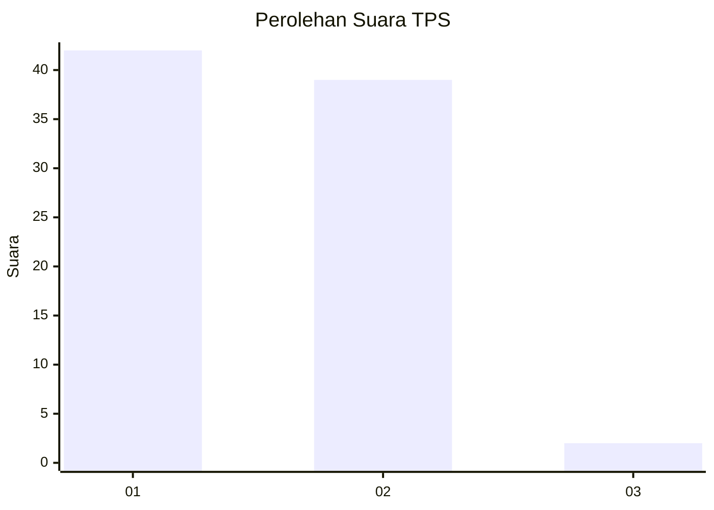
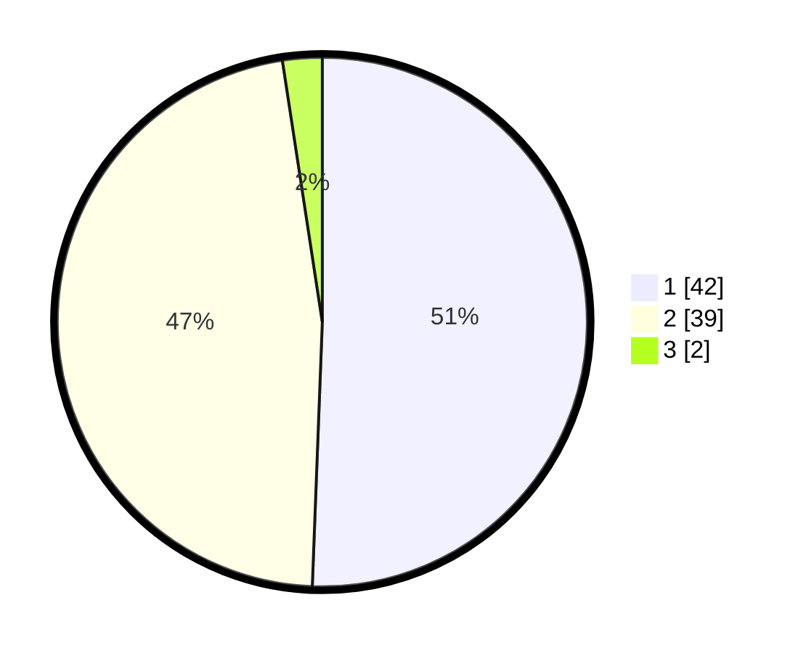

# Hasil

## Grafik

## Tabel

| No. | Nama Paslon    | Suara | Suara (raw) | Persentase |
|:--- |:-------------- | -----:| -----------:| ----------:|
| 1   | ANIES MUHAIMIN | 42    | [42][p-1]   | 50,60      |
| 2   | PRABOWO GIBRAN | 39    | [39][p-2]   | 46,99      |
| 3   | GANJAR MAHFUD  | 2     | [2][p-3]    | 2,41       |

[p-1]: https://github.com/gigit-pemilu/pemilu-2024-12-sumatera-utara/blob/main/pilpres/hitung-suara/sub/12-sumatera-utara/sub/07-deli-serdang/sub/26-percut-sei-tuan/sub/2006-tembung/sub/069-tps/sub/paslon-1.txt
[p-2]: https://github.com/gigit-pemilu/pemilu-2024-12-sumatera-utara/blob/main/pilpres/hitung-suara/sub/12-sumatera-utara/sub/07-deli-serdang/sub/26-percut-sei-tuan/sub/2006-tembung/sub/069-tps/sub/paslon-2.txt
[p-3]: https://github.com/gigit-pemilu/pemilu-2024-12-sumatera-utara/blob/main/pilpres/hitung-suara/sub/12-sumatera-utara/sub/07-deli-serdang/sub/26-percut-sei-tuan/sub/2006-tembung/sub/069-tps/sub/paslon-3.txt

## Foto C Plano

https://sirekap-obj-formc.kpu.go.id/bbe7/pemilu/ppwp/12/07/26/20/06/1207262006069-20240215-023304--24b830b0-9c26-41e2-b4fa-5e6d66d6f06d.jpg

https://sirekap-obj-formc.kpu.go.id/bbe7/pemilu/ppwp/12/07/26/20/06/1207262006069-20240215-023458--7376f0ac-7612-43e9-afc2-e05b500ccea7.jpg

https://sirekap-obj-formc.kpu.go.id/bbe7/pemilu/ppwp/12/07/26/20/06/1207262006069-20240215-023540--7c3b6ecf-3364-4bcc-9fab-658b39d3650b.jpg

## Metadata

| Key        | Value               |
| ---------- | ------------------- |
| Time Stamp | 2024-02-25 16:00:00 |

