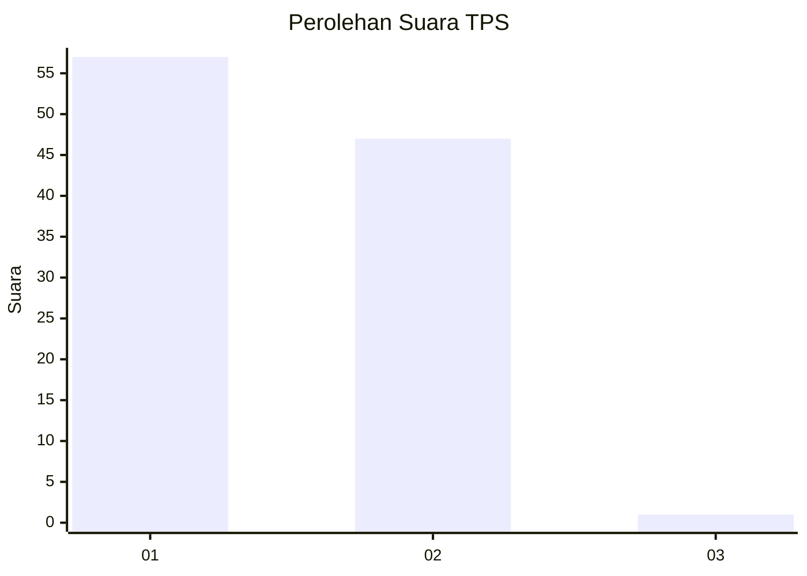
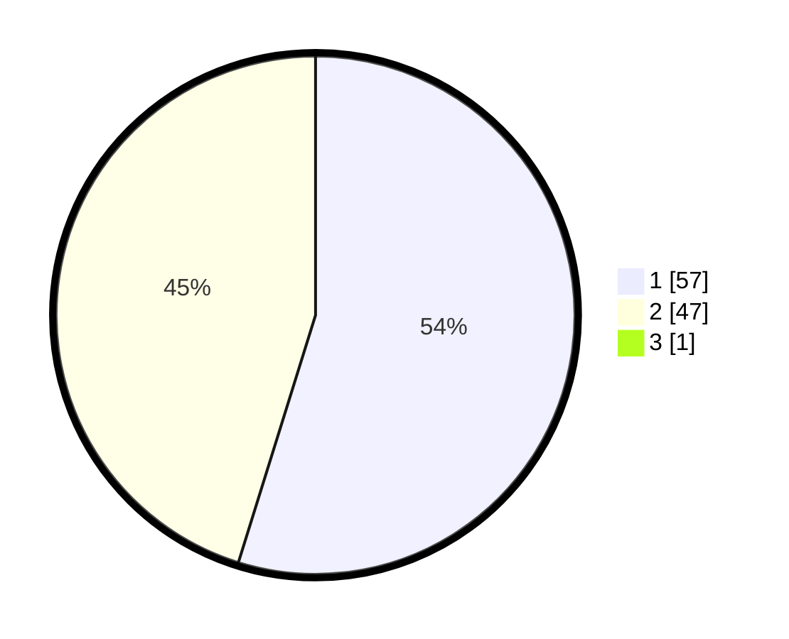

# Hasil

## Grafik

## Tabel

| No. | Nama Paslon    | Suara | Suara (raw) | Persentase |
|:--- |:-------------- | -----:| -----------:| ----------:|
| 1   | ANIES MUHAIMIN | 57    | [57][p-1]   | 54,29      |
| 2   | PRABOWO GIBRAN | 47    | [47][p-2]   | 44,76      |
| 3   | GANJAR MAHFUD  | 1     | [1][p-3]    | 0,95       |

[p-1]: https://github.com/gigit-pemilu/pemilu-2024-12-sumatera-utara/blob/main/pilpres/hitung-suara/sub/12-sumatera-utara/sub/07-deli-serdang/sub/26-percut-sei-tuan/sub/2006-tembung/sub/070-tps/sub/paslon-1.txt
[p-2]: https://github.com/gigit-pemilu/pemilu-2024-12-sumatera-utara/blob/main/pilpres/hitung-suara/sub/12-sumatera-utara/sub/07-deli-serdang/sub/26-percut-sei-tuan/sub/2006-tembung/sub/070-tps/sub/paslon-2.txt
[p-3]: https://github.com/gigit-pemilu/pemilu-2024-12-sumatera-utara/blob/main/pilpres/hitung-suara/sub/12-sumatera-utara/sub/07-deli-serdang/sub/26-percut-sei-tuan/sub/2006-tembung/sub/070-tps/sub/paslon-3.txt

## Foto C Plano

https://sirekap-obj-formc.kpu.go.id/7a21/pemilu/ppwp/12/07/26/20/06/1207262006070-20240215-125600--3db951be-08eb-48d5-b59b-3930c538907c.jpg

https://sirekap-obj-formc.kpu.go.id/7a21/pemilu/ppwp/12/07/26/20/06/1207262006070-20240215-125921--d066ec95-8b8e-498e-a398-502fd86034cf.jpg

https://sirekap-obj-formc.kpu.go.id/7a21/pemilu/ppwp/12/07/26/20/06/1207262006070-20240215-130307--b093425e-6a04-4b21-bd3b-5aeb77a4ab8c.jpg

## Metadata

| Key        | Value               |
| ---------- | ------------------- |
| Time Stamp | 2024-02-25 13:00:00 |

