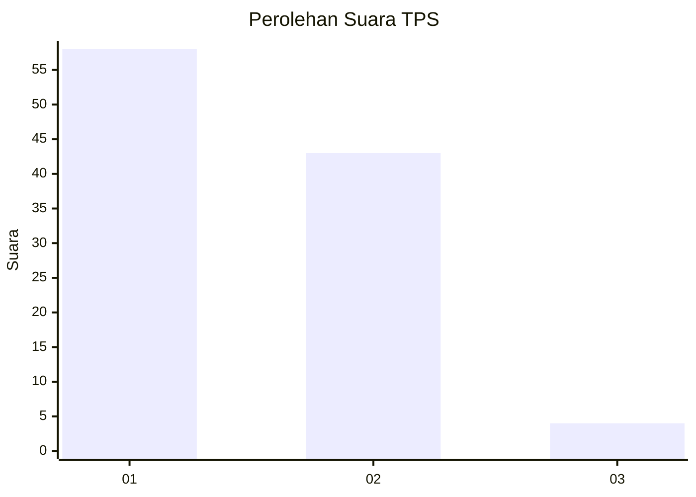
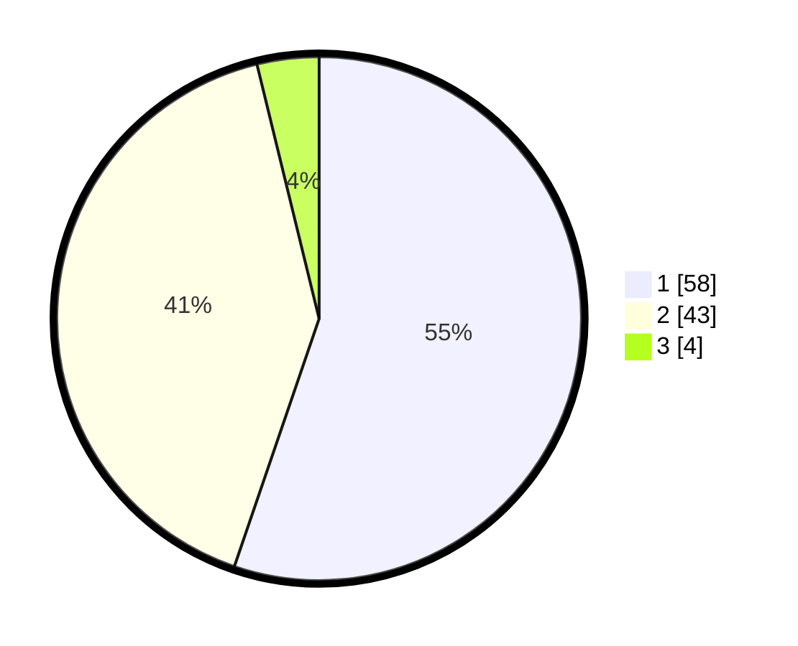

# Hasil

## Grafik

## Tabel

| No. | Nama Paslon    | Suara | Suara (raw) | Persentase |
|:--- |:-------------- | -----:| -----------:| ----------:|
| 1   | ANIES MUHAIMIN | 58    | [58][p-1]   | 55,24      |
| 2   | PRABOWO GIBRAN | 43    | [43][p-2]   | 40,95      |
| 3   | GANJAR MAHFUD  | 4     | [4][p-3]    | 3,81       |

[p-1]: https://github.com/gigit-pemilu/pemilu-2024/blob/main/pilpres/hitung-suara/sub/12-sumatera-utara/sub/07-deli-serdang/sub/26-percut-sei-tuan/sub/2006-tembung/sub/071-tps/sub/paslon-1.txt
[p-2]: https://github.com/gigit-pemilu/pemilu-2024/blob/main/pilpres/hitung-suara/sub/12-sumatera-utara/sub/07-deli-serdang/sub/26-percut-sei-tuan/sub/2006-tembung/sub/071-tps/sub/paslon-2.txt
[p-3]: https://github.com/gigit-pemilu/pemilu-2024/blob/main/pilpres/hitung-suara/sub/12-sumatera-utara/sub/07-deli-serdang/sub/26-percut-sei-tuan/sub/2006-tembung/sub/071-tps/sub/paslon-3.txt

## Foto C Plano

https://sirekap-obj-formc.kpu.go.id/e1c5/pemilu/ppwp/12/07/26/20/06/1207262006071-20240215-140604--ae751805-c6d9-41f4-95fa-428d881822ed.jpg

https://sirekap-obj-formc.kpu.go.id/e1c5/pemilu/ppwp/12/07/26/20/06/1207262006071-20240215-140627--b147d4d7-93f7-4ba8-b1a9-17cbbc3584be.jpg

https://sirekap-obj-formc.kpu.go.id/e1c5/pemilu/ppwp/12/07/26/20/06/1207262006071-20240215-140639--239e8122-a342-4243-ae08-f593680069b2.jpg

## Metadata

| Key        | Value               |
| ---------- | ------------------- |
| Time Stamp | 2024-02-25 16:00:00 |

