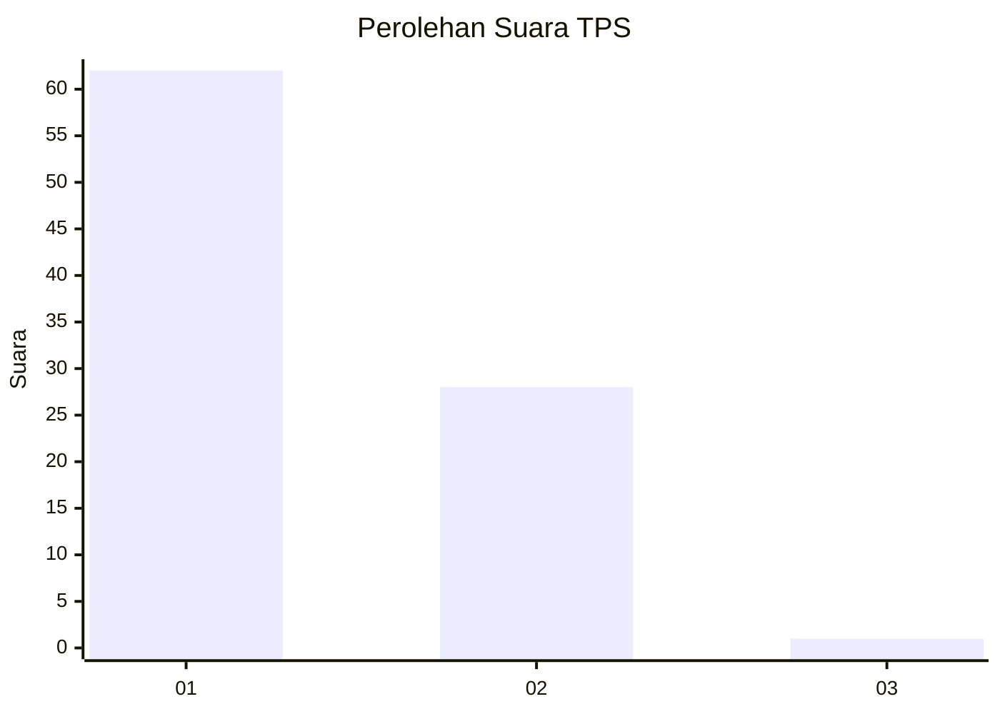
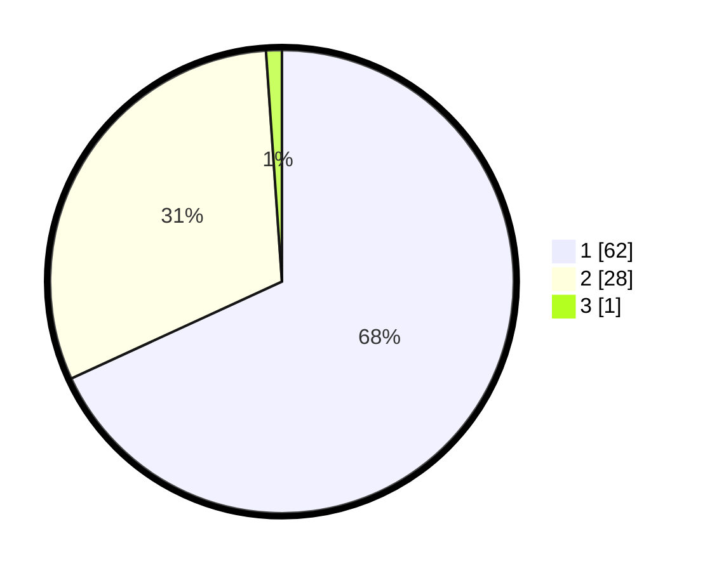

# Hasil

## Grafik

## Tabel

| No. | Nama Paslon    | Suara | Suara (raw) | Persentase |
|:--- |:-------------- | -----:| -----------:| ----------:|
| 1   | ANIES MUHAIMIN | 62    | [62][p-1]   | 68,13      |
| 2   | PRABOWO GIBRAN | 28    | [28][p-2]   | 30,77      |
| 3   | GANJAR MAHFUD  | 1     | [1][p-3]    | 1,10       |

[p-1]: https://github.com/gigit-pemilu/pemilu-2024/blob/main/pilpres/hitung-suara/sub/12-sumatera-utara/sub/07-deli-serdang/sub/26-percut-sei-tuan/sub/2006-tembung/sub/073-tps/sub/paslon-1.txt
[p-2]: https://github.com/gigit-pemilu/pemilu-2024/blob/main/pilpres/hitung-suara/sub/12-sumatera-utara/sub/07-deli-serdang/sub/26-percut-sei-tuan/sub/2006-tembung/sub/073-tps/sub/paslon-2.txt
[p-3]: https://github.com/gigit-pemilu/pemilu-2024/blob/main/pilpres/hitung-suara/sub/12-sumatera-utara/sub/07-deli-serdang/sub/26-percut-sei-tuan/sub/2006-tembung/sub/073-tps/sub/paslon-3.txt

## Foto C Plano

https://sirekap-obj-formc.kpu.go.id/0f86/pemilu/ppwp/12/07/26/20/06/1207262006073-20240215-093208--6efb5545-8d1a-4d59-8520-5ed454b87901.jpg

https://sirekap-obj-formc.kpu.go.id/0f86/pemilu/ppwp/12/07/26/20/06/1207262006073-20240215-093342--946814b2-7f28-4b49-91c6-5795c8143cf5.jpg

https://sirekap-obj-formc.kpu.go.id/0f86/pemilu/ppwp/12/07/26/20/06/1207262006073-20240215-093809--8748c8ab-de85-4357-91f8-cb31ba164a86.jpg

## Metadata

| Key        | Value               |
| ---------- | ------------------- |
| Time Stamp | 2024-02-25 16:00:00 |

