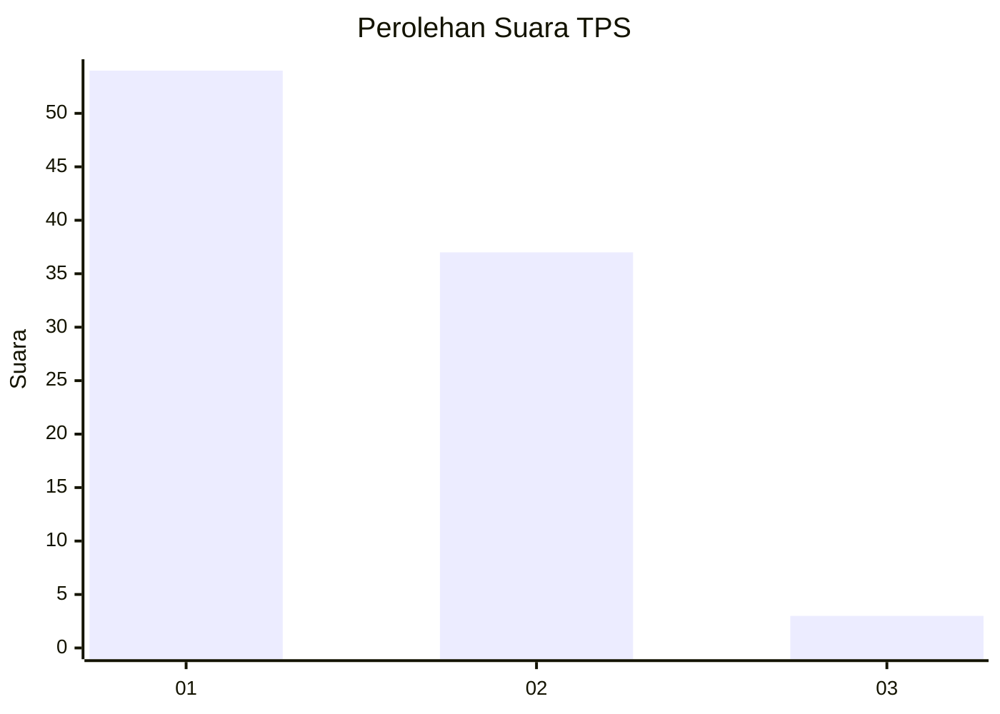
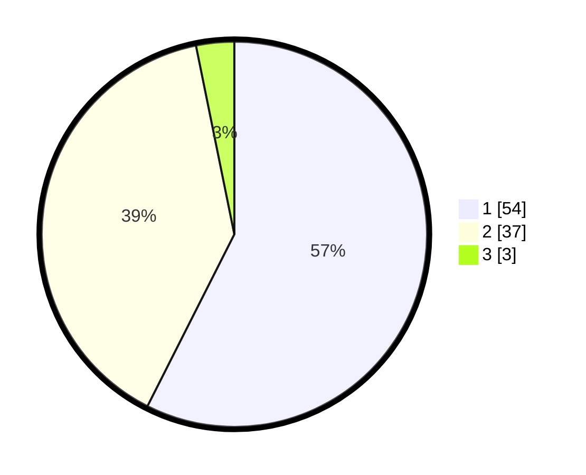

# Hasil

## Grafik

## Tabel

| No. | Nama Paslon    | Suara | Suara (raw) | Persentase |
|:--- |:-------------- | -----:| -----------:| ----------:|
| 1   | ANIES MUHAIMIN | 54    | [54][p-1]   | 57,45      |
| 2   | PRABOWO GIBRAN | 37    | [37][p-2]   | 39,36      |
| 3   | GANJAR MAHFUD  | 3     | [3][p-3]    | 3,19       |

[p-1]: https://github.com/gigit-pemilu/pemilu-2024-12-sumatera-utara/blob/main/pilpres/hitung-suara/sub/12-sumatera-utara/sub/07-deli-serdang/sub/26-percut-sei-tuan/sub/2006-tembung/sub/076-tps/sub/paslon-1.txt
[p-2]: https://github.com/gigit-pemilu/pemilu-2024-12-sumatera-utara/blob/main/pilpres/hitung-suara/sub/12-sumatera-utara/sub/07-deli-serdang/sub/26-percut-sei-tuan/sub/2006-tembung/sub/076-tps/sub/paslon-2.txt
[p-3]: https://github.com/gigit-pemilu/pemilu-2024-12-sumatera-utara/blob/main/pilpres/hitung-suara/sub/12-sumatera-utara/sub/07-deli-serdang/sub/26-percut-sei-tuan/sub/2006-tembung/sub/076-tps/sub/paslon-3.txt

## Foto C Plano

https://sirekap-obj-formc.kpu.go.id/d81a/pemilu/ppwp/12/07/26/20/06/1207262006076-20240215-005838--7e9dea64-ece1-4f86-bac2-3a69accd78eb.jpg

https://sirekap-obj-formc.kpu.go.id/d81a/pemilu/ppwp/12/07/26/20/06/1207262006076-20240215-005952--8ebb83fe-c1cf-49ea-be86-7165b9915867.jpg

https://sirekap-obj-formc.kpu.go.id/d81a/pemilu/ppwp/12/07/26/20/06/1207262006076-20240215-010109--fabf44d2-56d8-4be4-822f-c1a059fd9a67.jpg

## Metadata

| Key        | Value               |
| ---------- | ------------------- |
| Time Stamp | 2024-02-25 13:00:00 |

