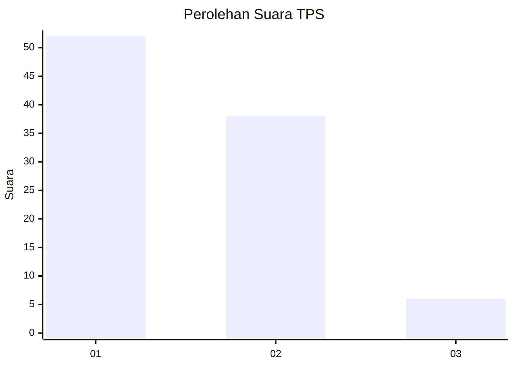
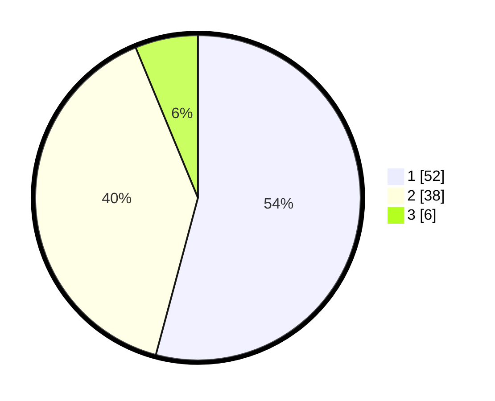

# Hasil

## Grafik

## Tabel

| No. | Nama Paslon    | Suara | Suara (raw) | Persentase |
|:--- |:-------------- | -----:| -----------:| ----------:|
| 1   | ANIES MUHAIMIN | 52    | [52][p-1]   | 54,17      |
| 2   | PRABOWO GIBRAN | 38    | [38][p-2]   | 39,58      |
| 3   | GANJAR MAHFUD  | 6     | [6][p-3]    | 6,25       |

[p-1]: https://github.com/gigit-pemilu/pemilu-2024-12-sumatera-utara/blob/main/pilpres/hitung-suara/sub/12-sumatera-utara/sub/07-deli-serdang/sub/26-percut-sei-tuan/sub/2006-tembung/sub/079-tps/sub/paslon-1.txt
[p-2]: https://github.com/gigit-pemilu/pemilu-2024-12-sumatera-utara/blob/main/pilpres/hitung-suara/sub/12-sumatera-utara/sub/07-deli-serdang/sub/26-percut-sei-tuan/sub/2006-tembung/sub/079-tps/sub/paslon-2.txt
[p-3]: https://github.com/gigit-pemilu/pemilu-2024-12-sumatera-utara/blob/main/pilpres/hitung-suara/sub/12-sumatera-utara/sub/07-deli-serdang/sub/26-percut-sei-tuan/sub/2006-tembung/sub/079-tps/sub/paslon-3.txt

## Foto C Plano

https://sirekap-obj-formc.kpu.go.id/fe3d/pemilu/ppwp/12/07/26/20/06/1207262006079-20240214-232109--ed8e470c-b21b-4b9b-bd1c-f8c8e331807b.jpg

https://sirekap-obj-formc.kpu.go.id/fe3d/pemilu/ppwp/12/07/26/20/06/1207262006079-20240214-223634--bb91394b-7964-4469-b8e3-2a0569a44d06.jpg

https://sirekap-obj-formc.kpu.go.id/fe3d/pemilu/ppwp/12/07/26/20/06/1207262006079-20240214-232225--fc34e099-8d1a-4a0d-a34a-8508e1356aad.jpg

## Metadata

| Key        | Value               |
| ---------- | ------------------- |
| Time Stamp | 2024-02-25 17:00:00 |

