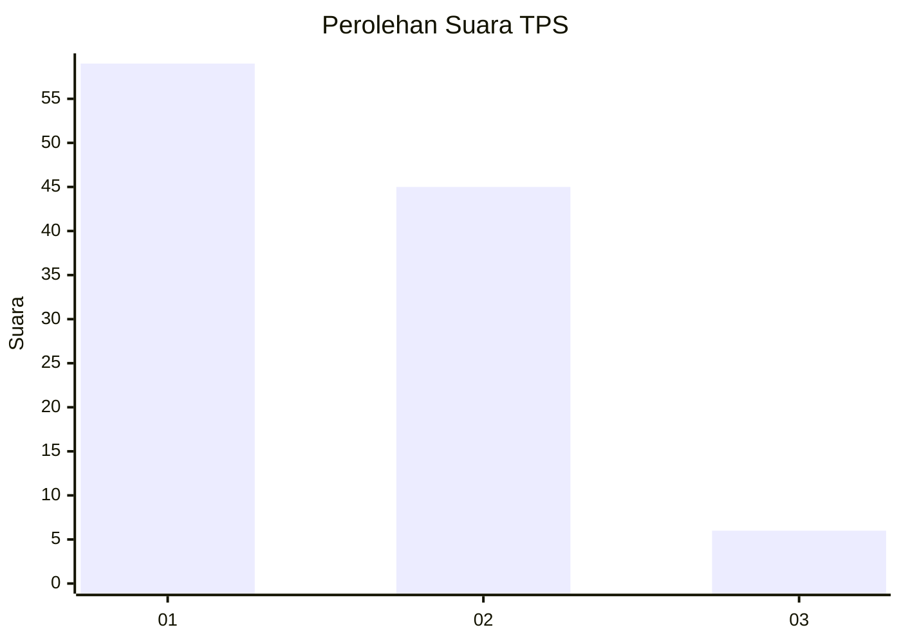
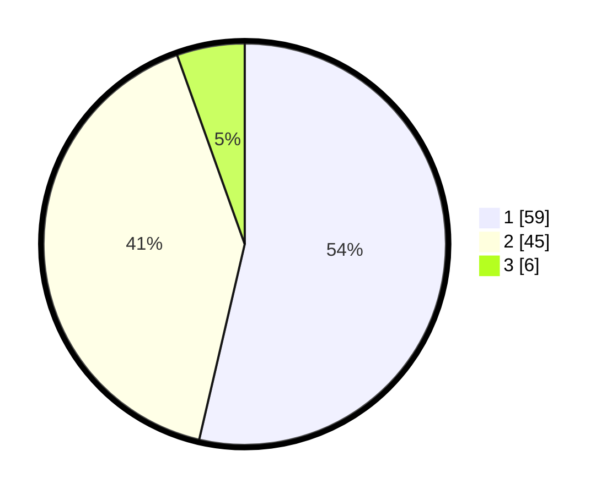

# Hasil

## Grafik

## Tabel

| No. | Nama Paslon    | Suara | Suara (raw) | Persentase |
|:--- |:-------------- | -----:| -----------:| ----------:|
| 1   | ANIES MUHAIMIN | 59    | [59][p-1]   | 53,64      |
| 2   | PRABOWO GIBRAN | 45    | [45][p-2]   | 40,91      |
| 3   | GANJAR MAHFUD  | 6     | [6][p-3]    | 5,45       |

[p-1]: https://github.com/gigit-pemilu/pemilu-2024/blob/main/pilpres/hitung-suara/sub/12-sumatera-utara/sub/07-deli-serdang/sub/26-percut-sei-tuan/sub/2006-tembung/sub/082-tps/sub/paslon-1.txt
[p-2]: https://github.com/gigit-pemilu/pemilu-2024/blob/main/pilpres/hitung-suara/sub/12-sumatera-utara/sub/07-deli-serdang/sub/26-percut-sei-tuan/sub/2006-tembung/sub/082-tps/sub/paslon-2.txt
[p-3]: https://github.com/gigit-pemilu/pemilu-2024/blob/main/pilpres/hitung-suara/sub/12-sumatera-utara/sub/07-deli-serdang/sub/26-percut-sei-tuan/sub/2006-tembung/sub/082-tps/sub/paslon-3.txt

## Foto C Plano

https://sirekap-obj-formc.kpu.go.id/69de/pemilu/ppwp/12/07/26/20/06/1207262006082-20240215-013136--3c94c466-4768-45d0-940d-5f02467fc22a.jpg

https://sirekap-obj-formc.kpu.go.id/69de/pemilu/ppwp/12/07/26/20/06/1207262006082-20240215-012723--c6ca3941-1969-45e7-a04a-58757a7b4b24.jpg

https://sirekap-obj-formc.kpu.go.id/69de/pemilu/ppwp/12/07/26/20/06/1207262006082-20240215-014249--61f22cb8-05fb-40a9-b943-79c9e8649ff0.jpg

## Metadata

| Key        | Value               |
| ---------- | ------------------- |
| Time Stamp | 2024-02-25 18:00:00 |

