# Hasil

## Grafik

```mermaid
%%{init: {"pie": {"textPosition": 0.5}, "themeVariables": {"pieOuterStrokeWidth": "5px"}} }%%
pie showData
    "1" : 56
    "2" : 38
    "3" : 1
```

## Tabel

| No. | Nama Paslon    | Suara | Suara (raw) | Persentase |
|:--- |:-------------- | -----:| -----------:| ----------:|
| 1   | ANIES MUHAIMIN | 56    | [56][p-1]   | 58,95      |
| 2   | PRABOWO GIBRAN | 38    | [38][p-2]   | 40,00      |
| 3   | GANJAR MAHFUD  | 1     | [1][p-3]    | 1,05       |

[p-1]: https://github.com/gigit-pemilu/pemilu-2024-12-sumatera-utara/blob/main/pilpres/hitung-suara/sub/12-sumatera-utara/sub/07-deli-serdang/sub/26-percut-sei-tuan/sub/2006-tembung/sub/083-tps/sub/paslon-1.txt
[p-2]: https://github.com/gigit-pemilu/pemilu-2024-12-sumatera-utara/blob/main/pilpres/hitung-suara/sub/12-sumatera-utara/sub/07-deli-serdang/sub/26-percut-sei-tuan/sub/2006-tembung/sub/083-tps/sub/paslon-2.txt
[p-3]: https://github.com/gigit-pemilu/pemilu-2024-12-sumatera-utara/blob/main/pilpres/hitung-suara/sub/12-sumatera-utara/sub/07-deli-serdang/sub/26-percut-sei-tuan/sub/2006-tembung/sub/083-tps/sub/paslon-3.txt

## Foto C Plano

https://sirekap-obj-formc.kpu.go.id/501b/pemilu/ppwp/12/07/26/20/06/1207262006083-20240215-120742--ddf0a80f-ef84-4238-9589-9c816d236a73.jpg

https://sirekap-obj-formc.kpu.go.id/501b/pemilu/ppwp/12/07/26/20/06/1207262006083-20240215-121625--bf577de1-a269-45c6-b5f4-fe5cd7172030.jpg

https://sirekap-obj-formc.kpu.go.id/501b/pemilu/ppwp/12/07/26/20/06/1207262006083-20240215-122446--78c57d60-cc99-4a49-948a-48e0ee73f65d.jpg

## Metadata

| Key        | Value               |
| ---------- | ------------------- |
| Time Stamp | 2024-02-25 17:00:00 |

