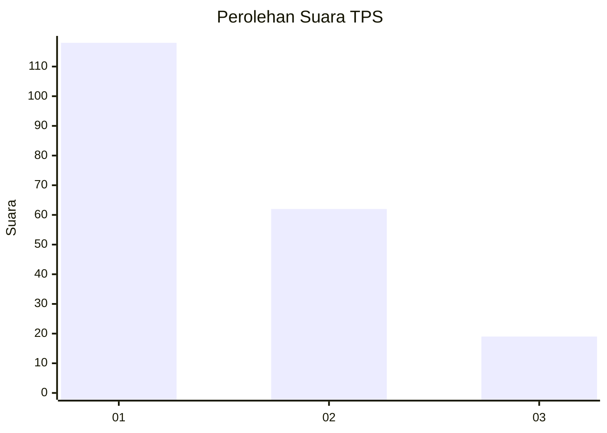
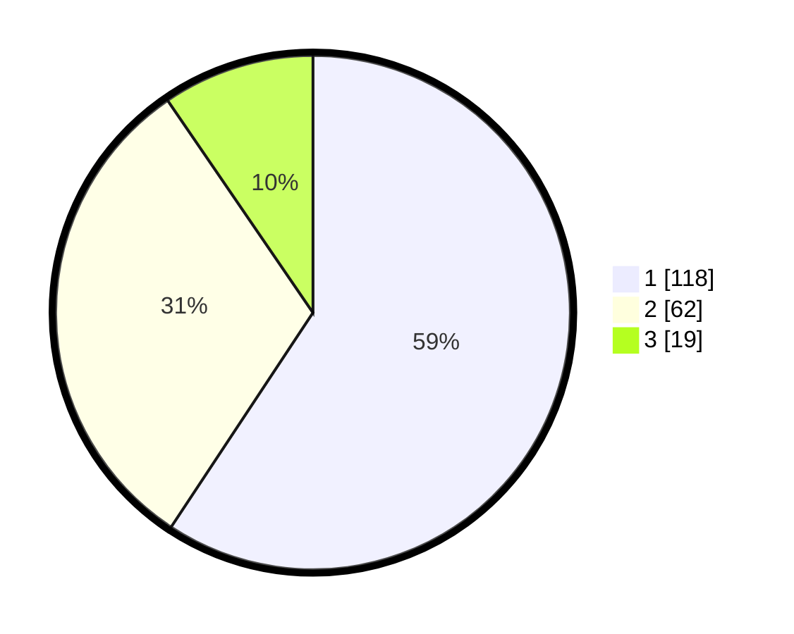

# Hasil

## Grafik

## Tabel

| No. | Nama Paslon    | Suara | Suara (raw) | Persentase |
|:--- |:-------------- | -----:| -----------:| ----------:|
| 1   | ANIES MUHAIMIN | 118   | [118][p-1]  | 59,30      |
| 2   | PRABOWO GIBRAN | 62    | [62][p-2]   | 31,16      |
| 3   | GANJAR MAHFUD  | 19    | [19][p-3]   | 9,55       |

[p-1]: https://github.com/gigit-pemilu/pemilu-2024-12-sumatera-utara/blob/main/pilpres/hitung-suara/sub/12-sumatera-utara/sub/07-deli-serdang/sub/26-percut-sei-tuan/sub/2006-tembung/sub/089-tps/sub/paslon-1.txt
[p-2]: https://github.com/gigit-pemilu/pemilu-2024-12-sumatera-utara/blob/main/pilpres/hitung-suara/sub/12-sumatera-utara/sub/07-deli-serdang/sub/26-percut-sei-tuan/sub/2006-tembung/sub/089-tps/sub/paslon-2.txt
[p-3]: https://github.com/gigit-pemilu/pemilu-2024-12-sumatera-utara/blob/main/pilpres/hitung-suara/sub/12-sumatera-utara/sub/07-deli-serdang/sub/26-percut-sei-tuan/sub/2006-tembung/sub/089-tps/sub/paslon-3.txt

## Foto C Plano

https://sirekap-obj-formc.kpu.go.id/1e99/pemilu/ppwp/12/07/26/20/06/1207262006089-20240214-230254--b1c17947-dc03-42de-9efc-9895b44d4c0c.jpg

https://sirekap-obj-formc.kpu.go.id/1e99/pemilu/ppwp/12/07/26/20/06/1207262006089-20240214-230424--46868e3a-c08c-49a2-9bb2-d2f3c375ec7f.jpg

https://sirekap-obj-formc.kpu.go.id/1e99/pemilu/ppwp/12/07/26/20/06/1207262006089-20240214-230452--7105cf0b-82d6-413c-a697-9460eae684c2.jpg

## Metadata

| Key        | Value               |
| ---------- | ------------------- |
| Time Stamp | 2024-02-24 22:31:28 |

