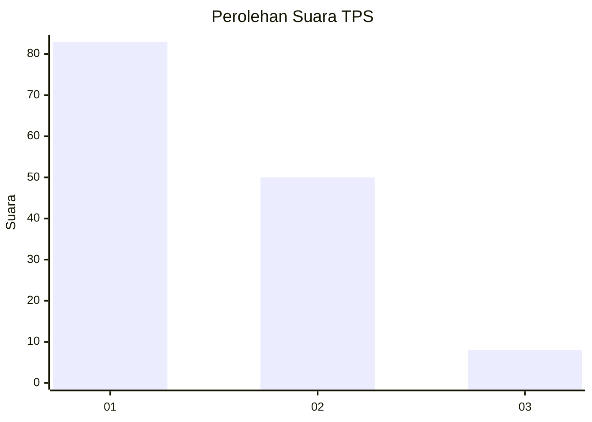
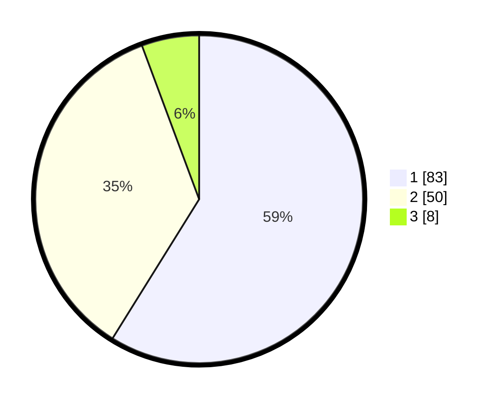

# Hasil

## Grafik

## Tabel

| No. | Nama Paslon    | Suara | Suara (raw) | Persentase |
|:--- |:-------------- | -----:| -----------:| ----------:|
| 1   | ANIES MUHAIMIN | 83    | [83][p-1]   | 58,87      |
| 2   | PRABOWO GIBRAN | 50    | [50][p-2]   | 35,46      |
| 3   | GANJAR MAHFUD  | 8     | [8][p-3]    | 5,67       |

[p-1]: https://github.com/gigit-pemilu/pemilu-2024-12-sumatera-utara/blob/main/pilpres/hitung-suara/sub/12-sumatera-utara/sub/07-deli-serdang/sub/26-percut-sei-tuan/sub/2006-tembung/sub/091-tps/sub/paslon-1.txt
[p-2]: https://github.com/gigit-pemilu/pemilu-2024-12-sumatera-utara/blob/main/pilpres/hitung-suara/sub/12-sumatera-utara/sub/07-deli-serdang/sub/26-percut-sei-tuan/sub/2006-tembung/sub/091-tps/sub/paslon-2.txt
[p-3]: https://github.com/gigit-pemilu/pemilu-2024-12-sumatera-utara/blob/main/pilpres/hitung-suara/sub/12-sumatera-utara/sub/07-deli-serdang/sub/26-percut-sei-tuan/sub/2006-tembung/sub/091-tps/sub/paslon-3.txt

## Foto C Plano

https://sirekap-obj-formc.kpu.go.id/4ea4/pemilu/ppwp/12/07/26/20/06/1207262006091-20240215-032641--1a2f7ff4-6d14-4353-9b22-85dfcad5c40f.jpg

https://sirekap-obj-formc.kpu.go.id/4ea4/pemilu/ppwp/12/07/26/20/06/1207262006091-20240215-032801--aeb81352-8d49-412b-9e64-7ed1cb6909d4.jpg

https://sirekap-obj-formc.kpu.go.id/4ea4/pemilu/ppwp/12/07/26/20/06/1207262006091-20240215-032810--3fbbec09-edbd-4818-84be-410cab7fdb93.jpg

## Metadata

| Key        | Value               |
| ---------- | ------------------- |
| Time Stamp | 2024-02-24 23:00:00 |

