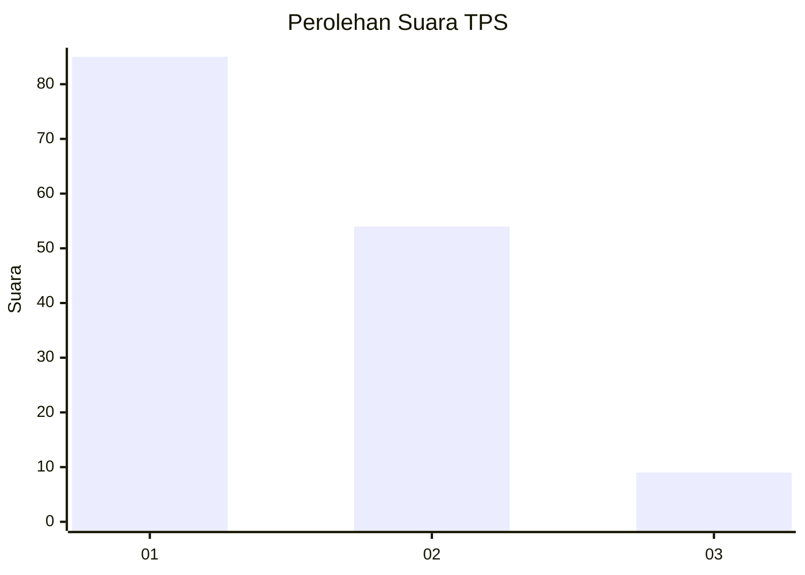
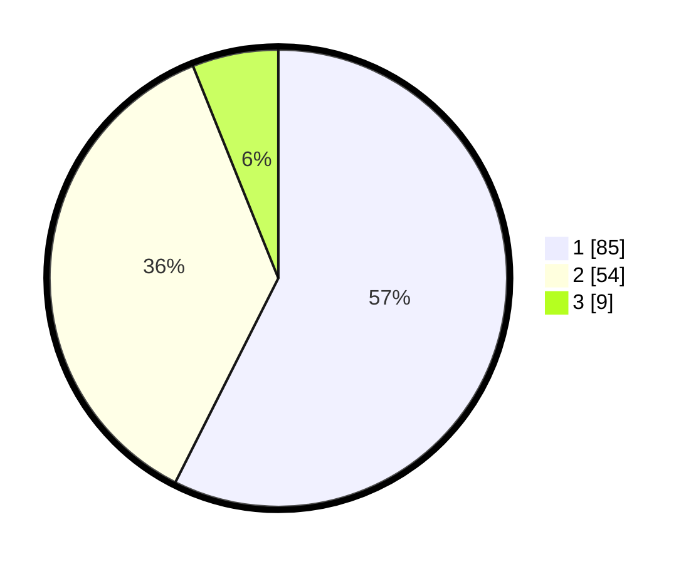

# Hasil

## Grafik

## Tabel

| No. | Nama Paslon    | Suara | Suara (raw) | Persentase |
|:--- |:-------------- | -----:| -----------:| ----------:|
| 1   | ANIES MUHAIMIN | 85    | [85][p-1]   | 57,43      |
| 2   | PRABOWO GIBRAN | 54    | [54][p-2]   | 36,49      |
| 3   | GANJAR MAHFUD  | 9     | [9][p-3]    | 6,08       |

[p-1]: https://github.com/gigit-pemilu/pemilu-2024/blob/main/pilpres/hitung-suara/sub/12-sumatera-utara/sub/07-deli-serdang/sub/26-percut-sei-tuan/sub/2006-tembung/sub/100-tps/sub/paslon-1.txt
[p-2]: https://github.com/gigit-pemilu/pemilu-2024/blob/main/pilpres/hitung-suara/sub/12-sumatera-utara/sub/07-deli-serdang/sub/26-percut-sei-tuan/sub/2006-tembung/sub/100-tps/sub/paslon-2.txt
[p-3]: https://github.com/gigit-pemilu/pemilu-2024/blob/main/pilpres/hitung-suara/sub/12-sumatera-utara/sub/07-deli-serdang/sub/26-percut-sei-tuan/sub/2006-tembung/sub/100-tps/sub/paslon-3.txt

## Foto C Plano

https://sirekap-obj-formc.kpu.go.id/a238/pemilu/ppwp/12/07/26/20/06/1207262006100-20240215-022545--0bce98e8-3f4d-440d-b8d7-80dcec7cfb67.jpg

https://sirekap-obj-formc.kpu.go.id/a238/pemilu/ppwp/12/07/26/20/06/1207262006100-20240214-221703--0c2b5fe2-2164-43b2-bb04-ed0b7f5be749.jpg

https://sirekap-obj-formc.kpu.go.id/a238/pemilu/ppwp/12/07/26/20/06/1207262006100-20240214-222228--60fecc41-7656-493f-b9ef-39a827c028dc.jpg

## Metadata

| Key        | Value               |
| ---------- | ------------------- |
| Time Stamp | 2024-02-24 23:00:00 |

