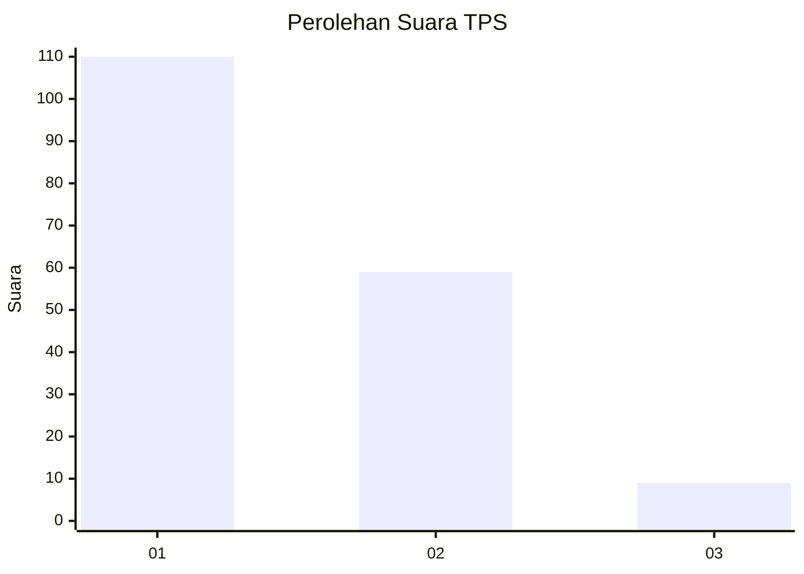
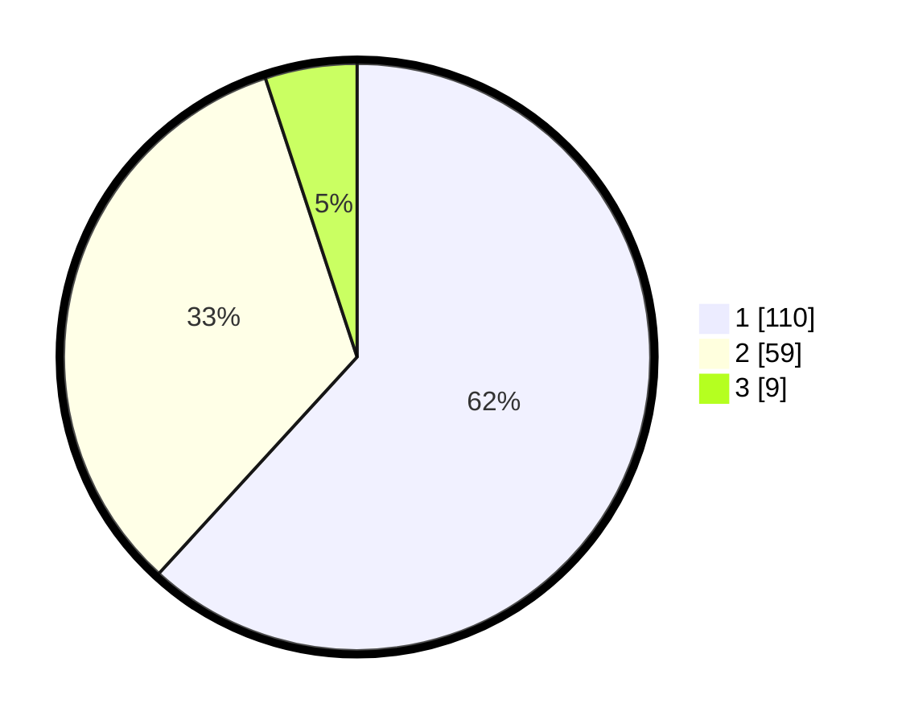

# Hasil

## Grafik

## Tabel

| No. | Nama Paslon    | Suara | Suara (raw) | Persentase |
|:--- |:-------------- | -----:| -----------:| ----------:|
| 1   | ANIES MUHAIMIN | 110   | [110][p-1]  | 61,80      |
| 2   | PRABOWO GIBRAN | 59    | [59][p-2]   | 33,15      |
| 3   | GANJAR MAHFUD  | 9     | [9][p-3]    | 5,06       |

[p-1]: https://github.com/gigit-pemilu/pemilu-2024/blob/main/pilpres/hitung-suara/sub/12-sumatera-utara/sub/07-deli-serdang/sub/26-percut-sei-tuan/sub/2006-tembung/sub/130-tps/sub/paslon-1.txt
[p-2]: https://github.com/gigit-pemilu/pemilu-2024/blob/main/pilpres/hitung-suara/sub/12-sumatera-utara/sub/07-deli-serdang/sub/26-percut-sei-tuan/sub/2006-tembung/sub/130-tps/sub/paslon-2.txt
[p-3]: https://github.com/gigit-pemilu/pemilu-2024/blob/main/pilpres/hitung-suara/sub/12-sumatera-utara/sub/07-deli-serdang/sub/26-percut-sei-tuan/sub/2006-tembung/sub/130-tps/sub/paslon-3.txt

## Foto C Plano

https://sirekap-obj-formc.kpu.go.id/1e74/pemilu/ppwp/12/07/26/20/06/1207262006130-20240215-004834--72012d83-79d8-40dd-86ce-34e4033cde94.jpg

https://sirekap-obj-formc.kpu.go.id/1e74/pemilu/ppwp/12/07/26/20/06/1207262006130-20240215-005000--dc7b46d0-0799-4142-9af0-da7348f17931.jpg

https://sirekap-obj-formc.kpu.go.id/1e74/pemilu/ppwp/12/07/26/20/06/1207262006130-20240215-005102--e71b76c5-6e92-419f-872c-a319f21056de.jpg

## Metadata

| Key        | Value               |
| ---------- | ------------------- |
| Time Stamp | 2024-02-25 18:00:00 |

