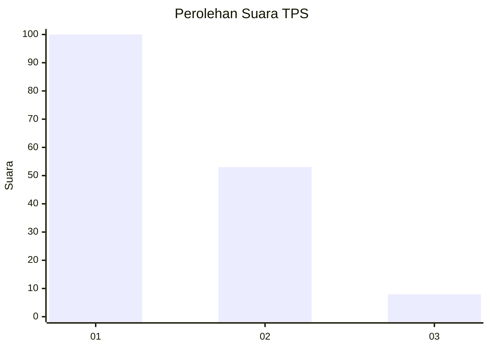
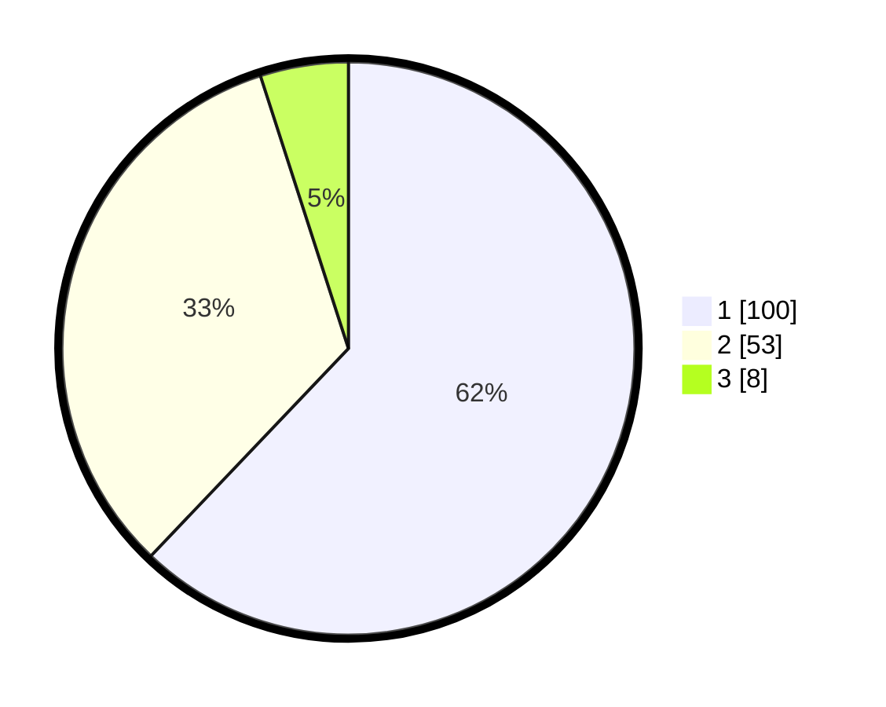

# Hasil

## Grafik

## Tabel

| No. | Nama Paslon    | Suara | Suara (raw) | Persentase |
|:--- |:-------------- | -----:| -----------:| ----------:|
| 1   | ANIES MUHAIMIN | 100   | [100][p-1]  | 62,11      |
| 2   | PRABOWO GIBRAN | 53    | [53][p-2]   | 32,92      |
| 3   | GANJAR MAHFUD  | 8     | [8][p-3]    | 4,97       |

[p-1]: https://github.com/gigit-pemilu/pemilu-2024-12-sumatera-utara/blob/main/pilpres/hitung-suara/sub/12-sumatera-utara/sub/07-deli-serdang/sub/26-percut-sei-tuan/sub/2006-tembung/sub/137-tps/sub/paslon-1.txt
[p-2]: https://github.com/gigit-pemilu/pemilu-2024-12-sumatera-utara/blob/main/pilpres/hitung-suara/sub/12-sumatera-utara/sub/07-deli-serdang/sub/26-percut-sei-tuan/sub/2006-tembung/sub/137-tps/sub/paslon-2.txt
[p-3]: https://github.com/gigit-pemilu/pemilu-2024-12-sumatera-utara/blob/main/pilpres/hitung-suara/sub/12-sumatera-utara/sub/07-deli-serdang/sub/26-percut-sei-tuan/sub/2006-tembung/sub/137-tps/sub/paslon-3.txt

## Foto C Plano

https://sirekap-obj-formc.kpu.go.id/68c0/pemilu/ppwp/12/07/26/20/06/1207262006137-20240215-062609--363d8ecf-cf4c-4d52-9381-2f38e726c40e.jpg

https://sirekap-obj-formc.kpu.go.id/68c0/pemilu/ppwp/12/07/26/20/06/1207262006137-20240215-062726--7d5150b2-c9b0-4a0c-aa09-2803e8aa25c4.jpg

https://sirekap-obj-formc.kpu.go.id/68c0/pemilu/ppwp/12/07/26/20/06/1207262006137-20240215-063006--6b743383-f000-4466-9685-bc7da20ec4df.jpg

## Metadata

| Key        | Value               |
| ---------- | ------------------- |
| Time Stamp | 2024-02-24 22:31:28 |

