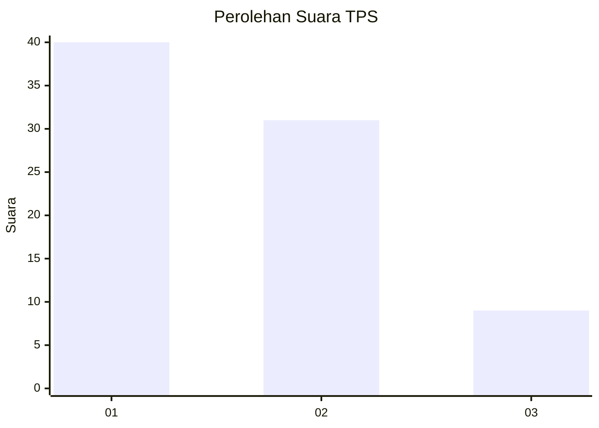
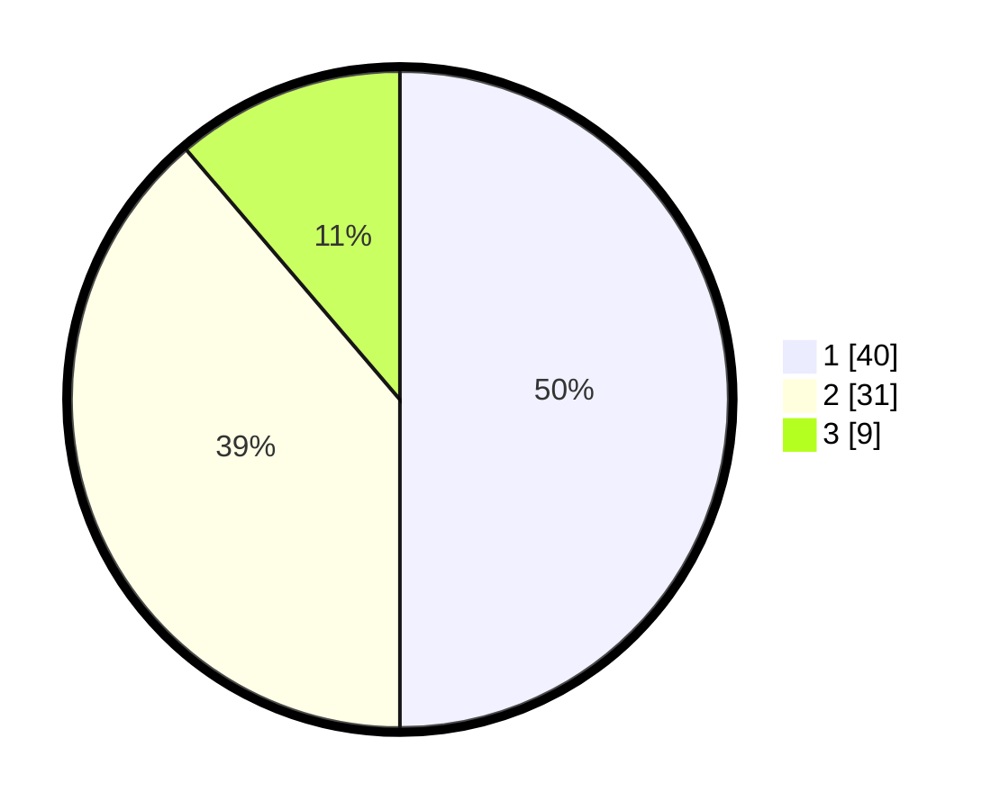

# Hasil

## Grafik

## Tabel

| No. | Nama Paslon    | Suara | Suara (raw) | Persentase |
|:--- |:-------------- | -----:| -----------:| ----------:|
| 1   | ANIES MUHAIMIN | 40    | [40][p-1]   | 50,00      |
| 2   | PRABOWO GIBRAN | 31    | [31][p-2]   | 38,75      |
| 3   | GANJAR MAHFUD  | 9     | [9][p-3]    | 11,25      |

[p-1]: https://github.com/gigit-pemilu/pemilu-2024/blob/main/pilpres/hitung-suara/sub/12-sumatera-utara/sub/07-deli-serdang/sub/26-percut-sei-tuan/sub/2006-tembung/sub/143-tps/sub/paslon-1.txt
[p-2]: https://github.com/gigit-pemilu/pemilu-2024/blob/main/pilpres/hitung-suara/sub/12-sumatera-utara/sub/07-deli-serdang/sub/26-percut-sei-tuan/sub/2006-tembung/sub/143-tps/sub/paslon-2.txt
[p-3]: https://github.com/gigit-pemilu/pemilu-2024/blob/main/pilpres/hitung-suara/sub/12-sumatera-utara/sub/07-deli-serdang/sub/26-percut-sei-tuan/sub/2006-tembung/sub/143-tps/sub/paslon-3.txt

## Foto C Plano

https://sirekap-obj-formc.kpu.go.id/8324/pemilu/ppwp/12/07/26/20/06/1207262006143-20240214-220354--fd7db04d-57ff-4134-a0a2-f13994f6ecd8.jpg

https://sirekap-obj-formc.kpu.go.id/8324/pemilu/ppwp/12/07/26/20/06/1207262006143-20240214-220554--0abbc575-a7d9-4747-bde6-c261af128d86.jpg

https://sirekap-obj-formc.kpu.go.id/8324/pemilu/ppwp/12/07/26/20/06/1207262006143-20240214-220710--50d9d05b-abe2-416a-b3ac-dea564512266.jpg

## Metadata

| Key        | Value               |
| ---------- | ------------------- |
| Time Stamp | 2024-02-24 22:31:28 |

