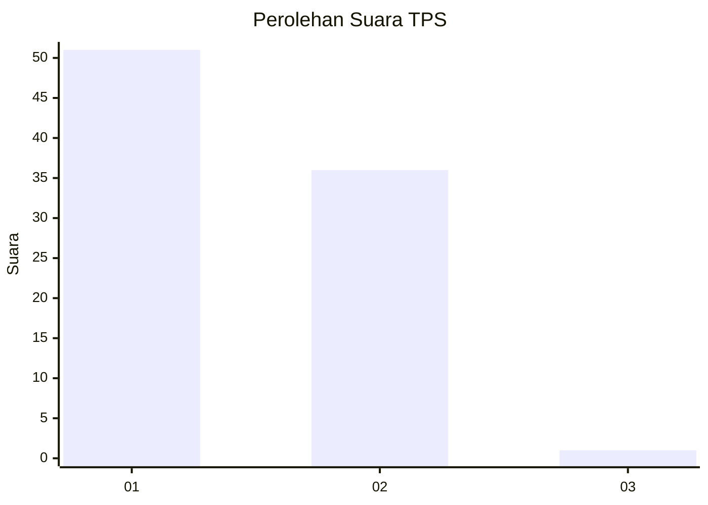
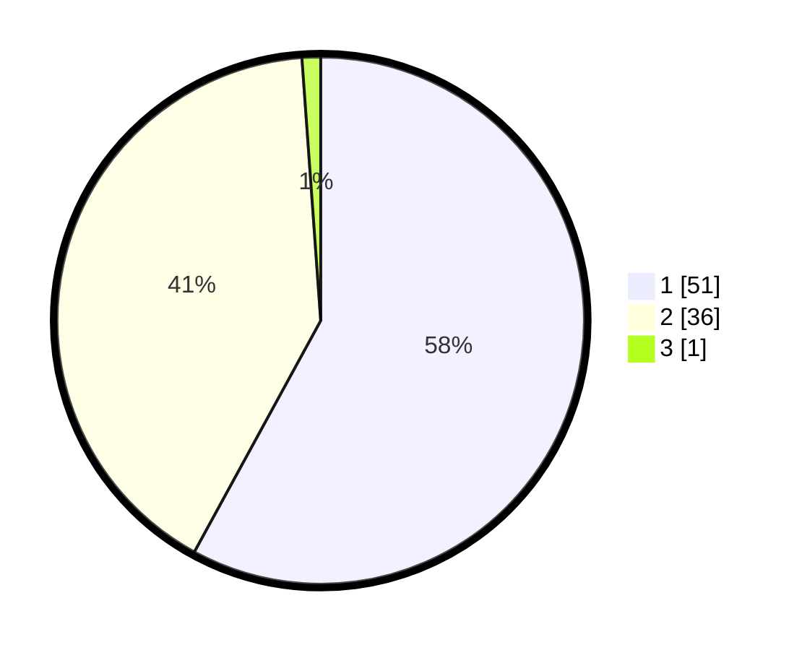

# Hasil

## Grafik

## Tabel

| No. | Nama Paslon    | Suara | Suara (raw) | Persentase |
|:--- |:-------------- | -----:| -----------:| ----------:|
| 1   | ANIES MUHAIMIN | 51    | [51][p-1]   | 57,95      |
| 2   | PRABOWO GIBRAN | 36    | [36][p-2]   | 40,91      |
| 3   | GANJAR MAHFUD  | 1     | [1][p-3]    | 1,14       |

[p-1]: https://github.com/gigit-pemilu/pemilu-2024-12-sumatera-utara/blob/main/pilpres/hitung-suara/sub/12-sumatera-utara/sub/07-deli-serdang/sub/26-percut-sei-tuan/sub/2006-tembung/sub/146-tps/sub/paslon-1.txt
[p-2]: https://github.com/gigit-pemilu/pemilu-2024-12-sumatera-utara/blob/main/pilpres/hitung-suara/sub/12-sumatera-utara/sub/07-deli-serdang/sub/26-percut-sei-tuan/sub/2006-tembung/sub/146-tps/sub/paslon-2.txt
[p-3]: https://github.com/gigit-pemilu/pemilu-2024-12-sumatera-utara/blob/main/pilpres/hitung-suara/sub/12-sumatera-utara/sub/07-deli-serdang/sub/26-percut-sei-tuan/sub/2006-tembung/sub/146-tps/sub/paslon-3.txt

## Foto C Plano

https://sirekap-obj-formc.kpu.go.id/8653/pemilu/ppwp/12/07/26/20/06/1207262006146-20240215-020145--acaba3ef-78a9-4d34-88b7-c3a0bfcd1aed.jpg

https://sirekap-obj-formc.kpu.go.id/8653/pemilu/ppwp/12/07/26/20/06/1207262006146-20240215-020342--2887a549-2683-48ae-9681-960da6d74800.jpg

https://sirekap-obj-formc.kpu.go.id/8653/pemilu/ppwp/12/07/26/20/06/1207262006146-20240215-020512--70dceed3-063b-4e00-8229-4b27c7528f89.jpg

## Metadata

| Key        | Value               |
| ---------- | ------------------- |
| Time Stamp | 2024-02-25 14:00:00 |

