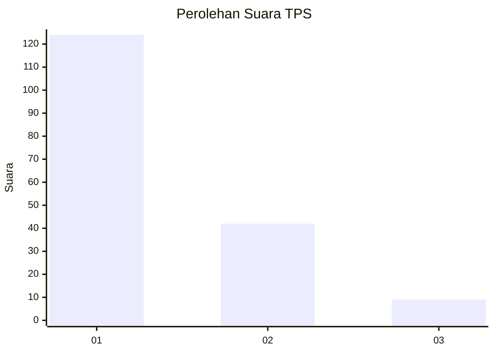
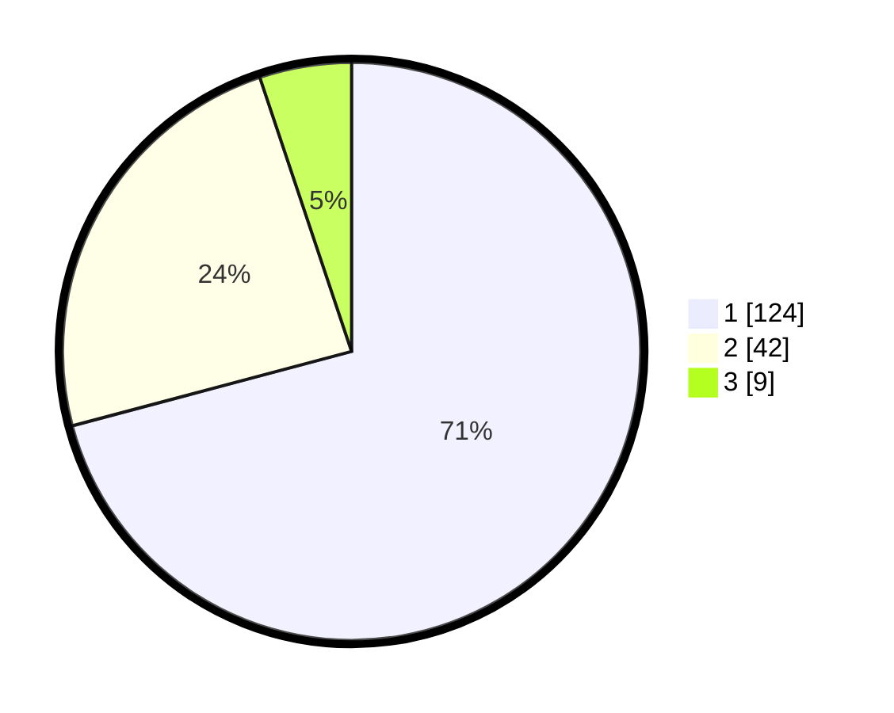

# Hasil

## Grafik

## Tabel

| No. | Nama Paslon    | Suara | Suara (raw) | Persentase |
|:--- |:-------------- | -----:| -----------:| ----------:|
| 1   | ANIES MUHAIMIN | 124   | [124][p-1]  | 70,86      |
| 2   | PRABOWO GIBRAN | 42    | [42][p-2]   | 24,00      |
| 3   | GANJAR MAHFUD  | 9     | [9][p-3]    | 5,14       |

[p-1]: https://github.com/gigit-pemilu/pemilu-2024-12-sumatera-utara/blob/main/pilpres/hitung-suara/sub/12-sumatera-utara/sub/07-deli-serdang/sub/26-percut-sei-tuan/sub/2006-tembung/sub/150-tps/sub/paslon-1.txt
[p-2]: https://github.com/gigit-pemilu/pemilu-2024-12-sumatera-utara/blob/main/pilpres/hitung-suara/sub/12-sumatera-utara/sub/07-deli-serdang/sub/26-percut-sei-tuan/sub/2006-tembung/sub/150-tps/sub/paslon-2.txt
[p-3]: https://github.com/gigit-pemilu/pemilu-2024-12-sumatera-utara/blob/main/pilpres/hitung-suara/sub/12-sumatera-utara/sub/07-deli-serdang/sub/26-percut-sei-tuan/sub/2006-tembung/sub/150-tps/sub/paslon-3.txt

## Foto C Plano

https://sirekap-obj-formc.kpu.go.id/ae9f/pemilu/ppwp/12/07/26/20/06/1207262006150-20240215-032256--b7c39511-6fd0-4643-a2fe-fe83206cd750.jpg

https://sirekap-obj-formc.kpu.go.id/ae9f/pemilu/ppwp/12/07/26/20/06/1207262006150-20240215-032457--63089eb8-355d-47aa-950f-34cfcef6c38d.jpg

https://sirekap-obj-formc.kpu.go.id/ae9f/pemilu/ppwp/12/07/26/20/06/1207262006150-20240215-032726--4d220e70-c382-4803-9fa2-3a94f70637a3.jpg

## Metadata

| Key        | Value               |
| ---------- | ------------------- |
| Time Stamp | 2024-02-24 22:31:28 |

