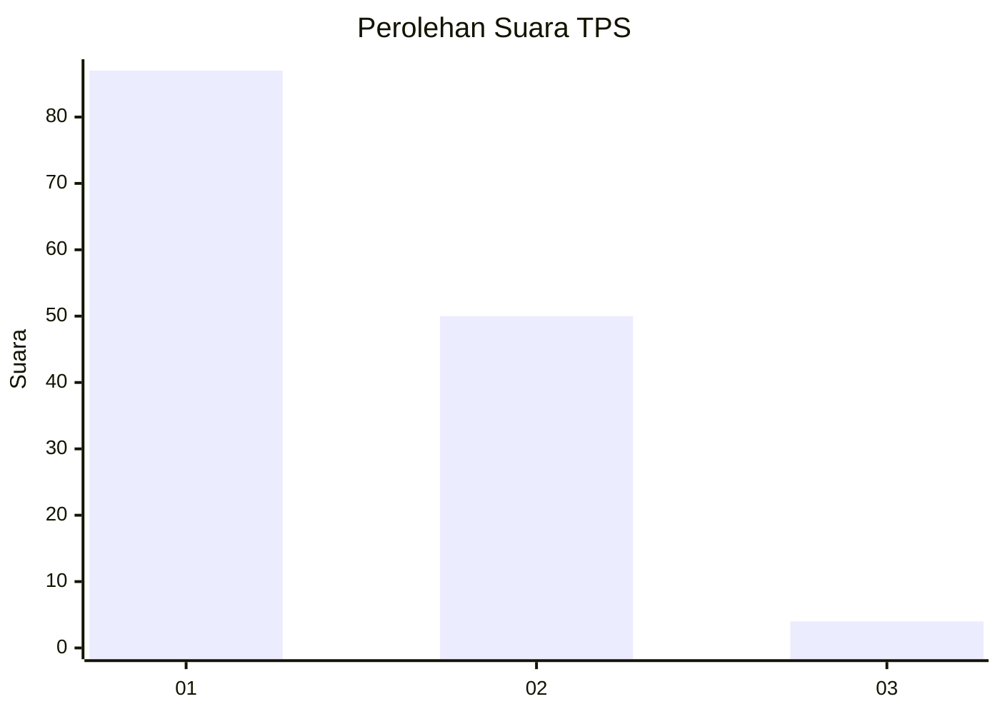
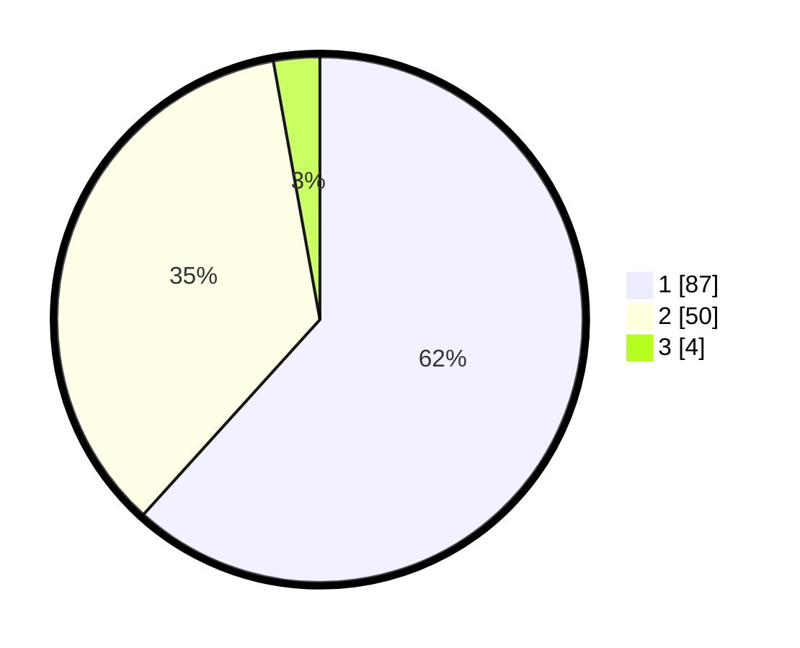

# Hasil

## Grafik

## Tabel

| No. | Nama Paslon    | Suara | Suara (raw) | Persentase |
|:--- |:-------------- | -----:| -----------:| ----------:|
| 1   | ANIES MUHAIMIN | 87    | [87][p-1]   | 61,70      |
| 2   | PRABOWO GIBRAN | 50    | [50][p-2]   | 35,46      |
| 3   | GANJAR MAHFUD  | 4     | [4][p-3]    | 2,84       |

[p-1]: https://github.com/gigit-pemilu/pemilu-2024-12-sumatera-utara/blob/main/pilpres/hitung-suara/sub/12-sumatera-utara/sub/07-deli-serdang/sub/26-percut-sei-tuan/sub/2006-tembung/sub/152-tps/sub/paslon-1.txt
[p-2]: https://github.com/gigit-pemilu/pemilu-2024-12-sumatera-utara/blob/main/pilpres/hitung-suara/sub/12-sumatera-utara/sub/07-deli-serdang/sub/26-percut-sei-tuan/sub/2006-tembung/sub/152-tps/sub/paslon-2.txt
[p-3]: https://github.com/gigit-pemilu/pemilu-2024-12-sumatera-utara/blob/main/pilpres/hitung-suara/sub/12-sumatera-utara/sub/07-deli-serdang/sub/26-percut-sei-tuan/sub/2006-tembung/sub/152-tps/sub/paslon-3.txt

## Foto C Plano

https://sirekap-obj-formc.kpu.go.id/5183/pemilu/ppwp/12/07/26/20/06/1207262006152-20240215-035241--caa87416-9c96-4081-8258-e943b0406a60.jpg

https://sirekap-obj-formc.kpu.go.id/5183/pemilu/ppwp/12/07/26/20/06/1207262006152-20240215-035249--14a08730-5327-4440-be74-8c8cbb98068a.jpg

https://sirekap-obj-formc.kpu.go.id/5183/pemilu/ppwp/12/07/26/20/06/1207262006152-20240215-035255--c7737ea8-1d1c-4f3d-88f6-6d5c93920bc3.jpg

## Metadata

| Key        | Value               |
| ---------- | ------------------- |
| Time Stamp | 2024-02-24 22:31:28 |

