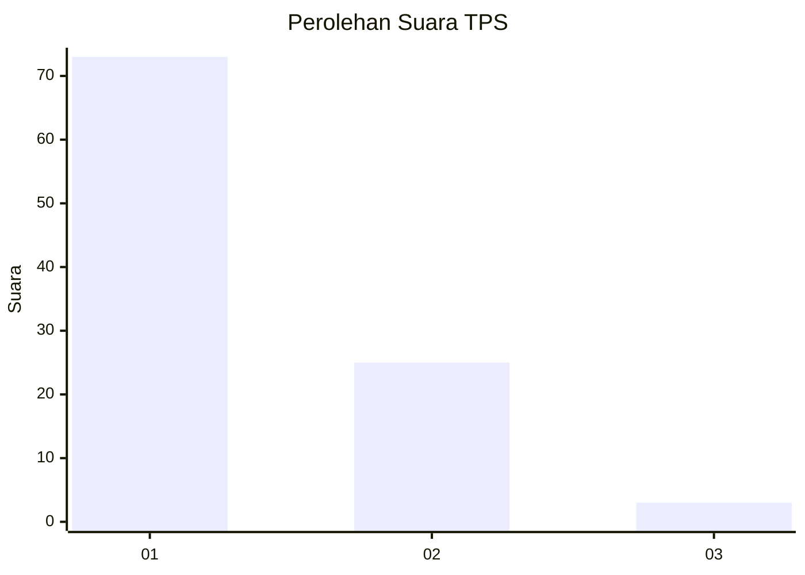
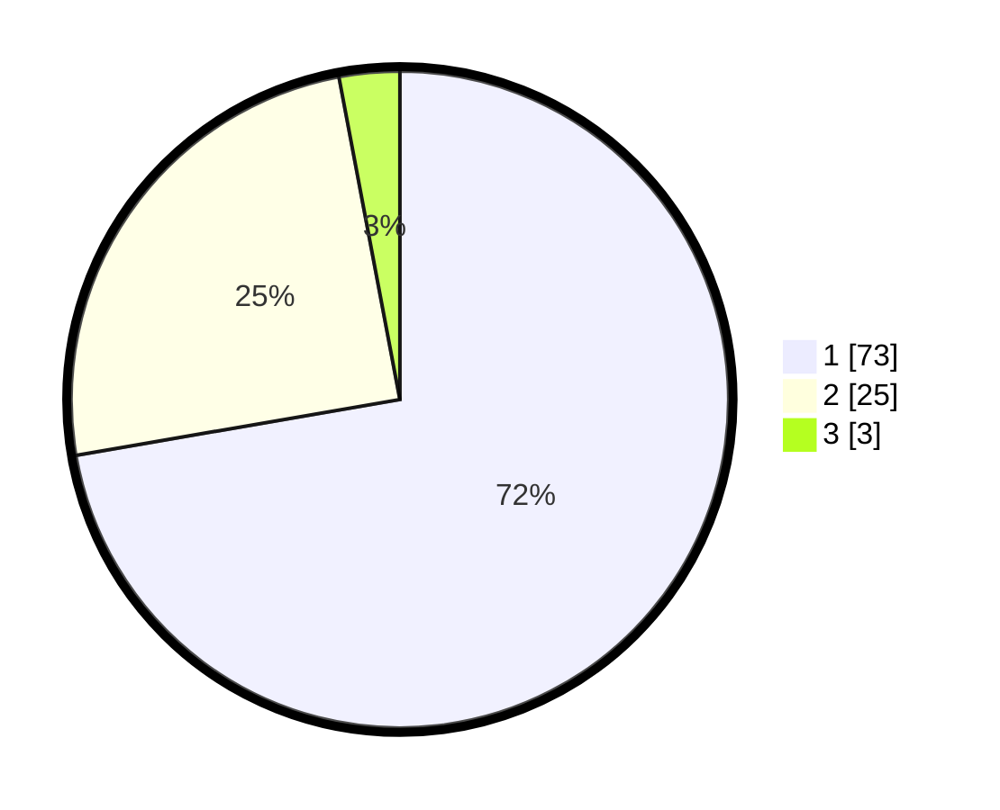

# Hasil

## Grafik

## Tabel

| No. | Nama Paslon    | Suara | Suara (raw) | Persentase |
|:--- |:-------------- | -----:| -----------:| ----------:|
| 1   | ANIES MUHAIMIN | 73    | [73][p-1]   | 72,28      |
| 2   | PRABOWO GIBRAN | 25    | [25][p-2]   | 24,75      |
| 3   | GANJAR MAHFUD  | 3     | [3][p-3]    | 2,97       |

[p-1]: https://github.com/gigit-pemilu/pemilu-2024/blob/main/pilpres/hitung-suara/sub/12-sumatera-utara/sub/07-deli-serdang/sub/26-percut-sei-tuan/sub/2006-tembung/sub/159-tps/sub/paslon-1.txt
[p-2]: https://github.com/gigit-pemilu/pemilu-2024/blob/main/pilpres/hitung-suara/sub/12-sumatera-utara/sub/07-deli-serdang/sub/26-percut-sei-tuan/sub/2006-tembung/sub/159-tps/sub/paslon-2.txt
[p-3]: https://github.com/gigit-pemilu/pemilu-2024/blob/main/pilpres/hitung-suara/sub/12-sumatera-utara/sub/07-deli-serdang/sub/26-percut-sei-tuan/sub/2006-tembung/sub/159-tps/sub/paslon-3.txt

## Foto C Plano

https://sirekap-obj-formc.kpu.go.id/39da/pemilu/ppwp/12/07/26/20/06/1207262006159-20240215-002247--12172ae5-ea6f-4dcb-aa54-9d45bf4a314e.jpg

https://sirekap-obj-formc.kpu.go.id/39da/pemilu/ppwp/12/07/26/20/06/1207262006159-20240215-001154--7943a31d-831a-490c-be80-861b47d2d186.jpg

https://sirekap-obj-formc.kpu.go.id/39da/pemilu/ppwp/12/07/26/20/06/1207262006159-20240215-001327--10cb92bb-5a2c-491b-a867-6de3ea475dfa.jpg

## Metadata

| Key        | Value               |
| ---------- | ------------------- |
| Time Stamp | 2024-02-25 16:00:00 |

