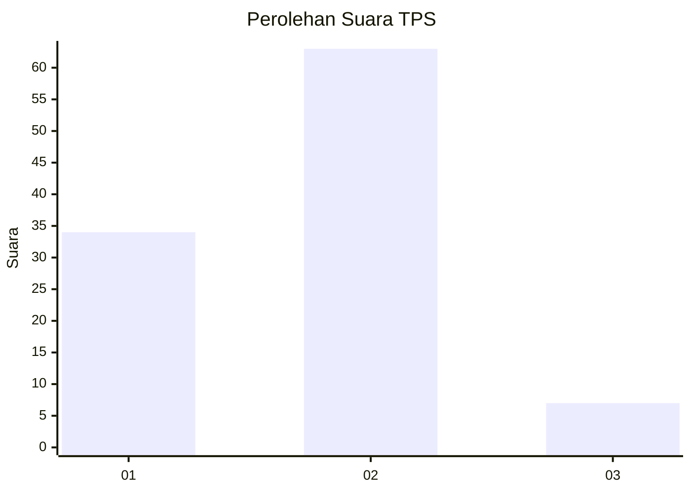
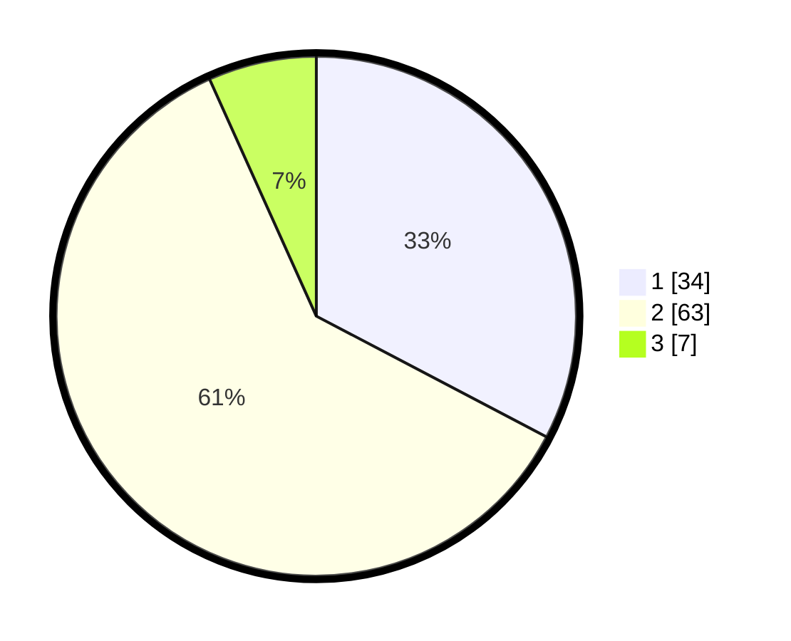

# Hasil

## Grafik

## Tabel

| No. | Nama Paslon    | Suara | Suara (raw) | Persentase |
|:--- |:-------------- | -----:| -----------:| ----------:|
| 1   | ANIES MUHAIMIN | 34    | [34][p-1]   | 32,69      |
| 2   | PRABOWO GIBRAN | 63    | [63][p-2]   | 60,58      |
| 3   | GANJAR MAHFUD  | 7     | [7][p-3]    | 6,73       |

[p-1]: https://github.com/gigit-pemilu/pemilu-2024-12-sumatera-utara/blob/main/pilpres/hitung-suara/sub/12-sumatera-utara/sub/07-deli-serdang/sub/26-percut-sei-tuan/sub/2007-cinta-rakyat/sub/012-tps/sub/paslon-1.txt
[p-2]: https://github.com/gigit-pemilu/pemilu-2024-12-sumatera-utara/blob/main/pilpres/hitung-suara/sub/12-sumatera-utara/sub/07-deli-serdang/sub/26-percut-sei-tuan/sub/2007-cinta-rakyat/sub/012-tps/sub/paslon-2.txt
[p-3]: https://github.com/gigit-pemilu/pemilu-2024-12-sumatera-utara/blob/main/pilpres/hitung-suara/sub/12-sumatera-utara/sub/07-deli-serdang/sub/26-percut-sei-tuan/sub/2007-cinta-rakyat/sub/012-tps/sub/paslon-3.txt

## Foto C Plano

https://sirekap-obj-formc.kpu.go.id/dd78/pemilu/ppwp/12/07/26/20/07/1207262007012-20240215-210431--681ae7d7-2dcc-4133-b93b-c7c688ea910d.jpg

https://sirekap-obj-formc.kpu.go.id/dd78/pemilu/ppwp/12/07/26/20/07/1207262007012-20240215-211012--d7704719-c9f8-4c15-8b9b-b6cd605c9735.jpg

https://sirekap-obj-formc.kpu.go.id/dd78/pemilu/ppwp/12/07/26/20/07/1207262007012-20240215-210628--184ba198-b3d2-4927-8d24-f27c79e8a462.jpg

## Metadata

| Key        | Value               |
| ---------- | ------------------- |
| Time Stamp | 2024-02-25 03:00:00 |

