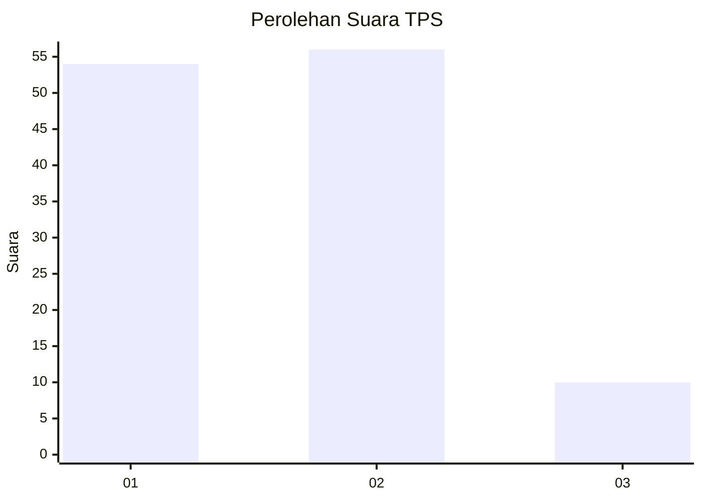
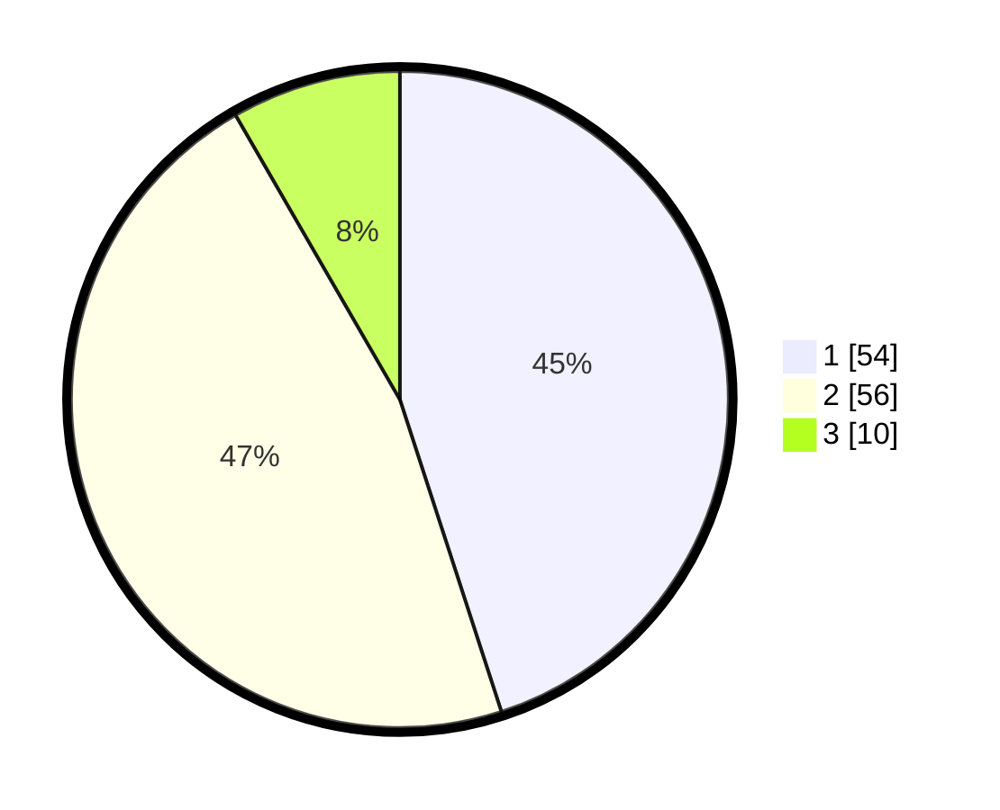

# Hasil

## Grafik

## Tabel

| No. | Nama Paslon    | Suara | Suara (raw) | Persentase |
|:--- |:-------------- | -----:| -----------:| ----------:|
| 1   | ANIES MUHAIMIN | 54    | [54][p-1]   | 45,00      |
| 2   | PRABOWO GIBRAN | 56    | [56][p-2]   | 46,67      |
| 3   | GANJAR MAHFUD  | 10    | [10][p-3]   | 8,33       |

[p-1]: https://github.com/gigit-pemilu/pemilu-2024/blob/main/pilpres/hitung-suara/sub/12-sumatera-utara/sub/07-deli-serdang/sub/26-percut-sei-tuan/sub/2007-cinta-rakyat/sub/014-tps/sub/paslon-1.txt
[p-2]: https://github.com/gigit-pemilu/pemilu-2024/blob/main/pilpres/hitung-suara/sub/12-sumatera-utara/sub/07-deli-serdang/sub/26-percut-sei-tuan/sub/2007-cinta-rakyat/sub/014-tps/sub/paslon-2.txt
[p-3]: https://github.com/gigit-pemilu/pemilu-2024/blob/main/pilpres/hitung-suara/sub/12-sumatera-utara/sub/07-deli-serdang/sub/26-percut-sei-tuan/sub/2007-cinta-rakyat/sub/014-tps/sub/paslon-3.txt

## Foto C Plano

https://sirekap-obj-formc.kpu.go.id/d7b4/pemilu/ppwp/12/07/26/20/07/1207262007014-20240214-212708--5bd4e506-0300-42dd-a7ad-768e2cbdd9b2.jpg

https://sirekap-obj-formc.kpu.go.id/d7b4/pemilu/ppwp/12/07/26/20/07/1207262007014-20240214-222927--105c95bd-9be7-468c-8abf-1eb0cbda351b.jpg

https://sirekap-obj-formc.kpu.go.id/d7b4/pemilu/ppwp/12/07/26/20/07/1207262007014-20240214-223057--b37a6f76-595f-468e-bd3a-3c66f486a68b.jpg

## Metadata

| Key        | Value               |
| ---------- | ------------------- |
| Time Stamp | 2024-02-25 17:00:00 |

