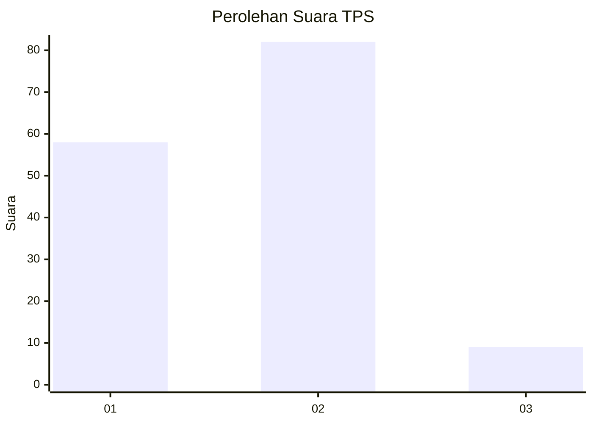
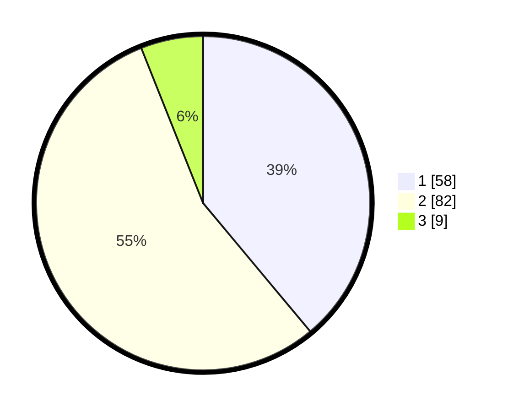

# Hasil

## Grafik

## Tabel

| No. | Nama Paslon    | Suara | Suara (raw) | Persentase |
|:--- |:-------------- | -----:| -----------:| ----------:|
| 1   | ANIES MUHAIMIN | 58    | [58][p-1]   | 38,93      |
| 2   | PRABOWO GIBRAN | 82    | [82][p-2]   | 55,03      |
| 3   | GANJAR MAHFUD  | 9     | [9][p-3]    | 6,04       |

[p-1]: https://github.com/gigit-pemilu/pemilu-2024-12-sumatera-utara/blob/main/pilpres/hitung-suara/sub/12-sumatera-utara/sub/07-deli-serdang/sub/26-percut-sei-tuan/sub/2007-cinta-rakyat/sub/017-tps/sub/paslon-1.txt
[p-2]: https://github.com/gigit-pemilu/pemilu-2024-12-sumatera-utara/blob/main/pilpres/hitung-suara/sub/12-sumatera-utara/sub/07-deli-serdang/sub/26-percut-sei-tuan/sub/2007-cinta-rakyat/sub/017-tps/sub/paslon-2.txt
[p-3]: https://github.com/gigit-pemilu/pemilu-2024-12-sumatera-utara/blob/main/pilpres/hitung-suara/sub/12-sumatera-utara/sub/07-deli-serdang/sub/26-percut-sei-tuan/sub/2007-cinta-rakyat/sub/017-tps/sub/paslon-3.txt

## Foto C Plano

https://sirekap-obj-formc.kpu.go.id/5e45/pemilu/ppwp/12/07/26/20/07/1207262007017-20240214-141221--49eb2bf8-9367-475c-a7f8-4470d20d7545.jpg

https://sirekap-obj-formc.kpu.go.id/5e45/pemilu/ppwp/12/07/26/20/07/1207262007017-20240214-141314--3bf0628a-3af6-43af-9d32-63b8ac8c20f8.jpg

https://sirekap-obj-formc.kpu.go.id/5e45/pemilu/ppwp/12/07/26/20/07/1207262007017-20240214-223606--5c656640-b885-4bba-a6f1-4ec635b7e62c.jpg

## Metadata

| Key        | Value               |
| ---------- | ------------------- |
| Time Stamp | 2024-02-16 04:00:27 |

## DATA PEMILIH TETAP

Jumlah pemilih dalam DPT: **327**.
 * L: **962**.
 * P: **365**.

## DATA PENGGUNA HAK PILIH

Jumlah pengguna hak pilih dalam DPT: **527**.
 * L: **962**.
 * P: **263**.

Jumlah pengguna hak pilih dalam DPTb: **525**.
 * L: **957**.
 * P: **957**.

Jumlah pengguna hak pilih dalam DPK: **355**.
 * L: **535**.
 * P: **555**.

Jumlah pengguna hak pilih: **555**.
 * L: **969**.
 * P: **322**.

## JUMLAH SUARA SAH DAN TIDAK SAH

JUMLAH SELURUH SUARA SAH: **149**.

JUMLAH SUARA TIDAK SAH: **2**.

JUMLAH SELURUH SUARA SAH DAN SUARA TIDAK SAH: **151**.

