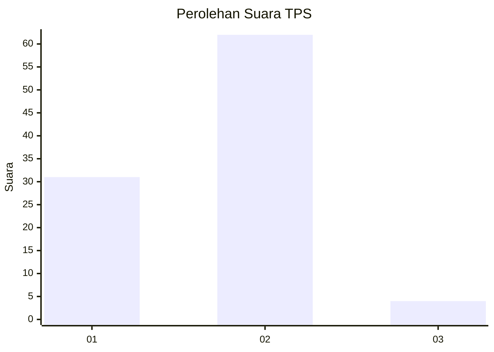
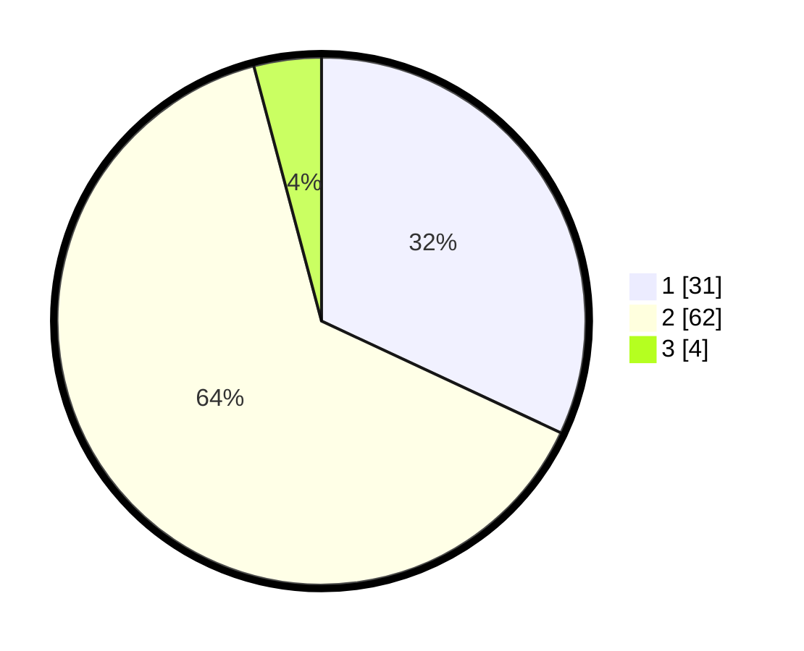

# Hasil

## Grafik

## Tabel

| No. | Nama Paslon    | Suara | Suara (raw) | Persentase |
|:--- |:-------------- | -----:| -----------:| ----------:|
| 1   | ANIES MUHAIMIN | 31    | [31][p-1]   | 31,96      |
| 2   | PRABOWO GIBRAN | 62    | [62][p-2]   | 63,92      |
| 3   | GANJAR MAHFUD  | 4     | [4][p-3]    | 4,12       |

[p-1]: https://github.com/gigit-pemilu/pemilu-2024/blob/main/pilpres/hitung-suara/sub/12-sumatera-utara/sub/07-deli-serdang/sub/26-percut-sei-tuan/sub/2009-saentis/sub/055-tps/sub/paslon-1.txt
[p-2]: https://github.com/gigit-pemilu/pemilu-2024/blob/main/pilpres/hitung-suara/sub/12-sumatera-utara/sub/07-deli-serdang/sub/26-percut-sei-tuan/sub/2009-saentis/sub/055-tps/sub/paslon-2.txt
[p-3]: https://github.com/gigit-pemilu/pemilu-2024/blob/main/pilpres/hitung-suara/sub/12-sumatera-utara/sub/07-deli-serdang/sub/26-percut-sei-tuan/sub/2009-saentis/sub/055-tps/sub/paslon-3.txt

## Foto C Plano

https://sirekap-obj-formc.kpu.go.id/d190/pemilu/ppwp/12/07/26/20/09/1207262009055-20240215-003742--59532d28-4880-4e70-8ad9-901dbd43f95e.jpg

https://sirekap-obj-formc.kpu.go.id/d190/pemilu/ppwp/12/07/26/20/09/1207262009055-20240214-235401--4af201c0-1f95-4dec-8d78-d50ee1539e0c.jpg

https://sirekap-obj-formc.kpu.go.id/d190/pemilu/ppwp/12/07/26/20/09/1207262009055-20240214-235451--75d51a91-394b-4516-8972-f4b82c5d2b39.jpg

## Metadata

| Key        | Value               |
| ---------- | ------------------- |
| Time Stamp | 2024-02-25 13:00:00 |

