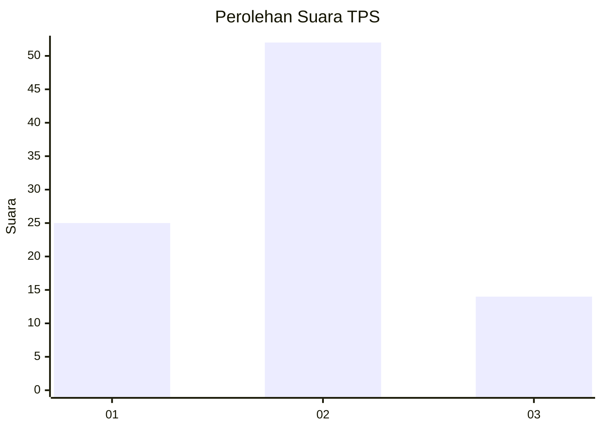
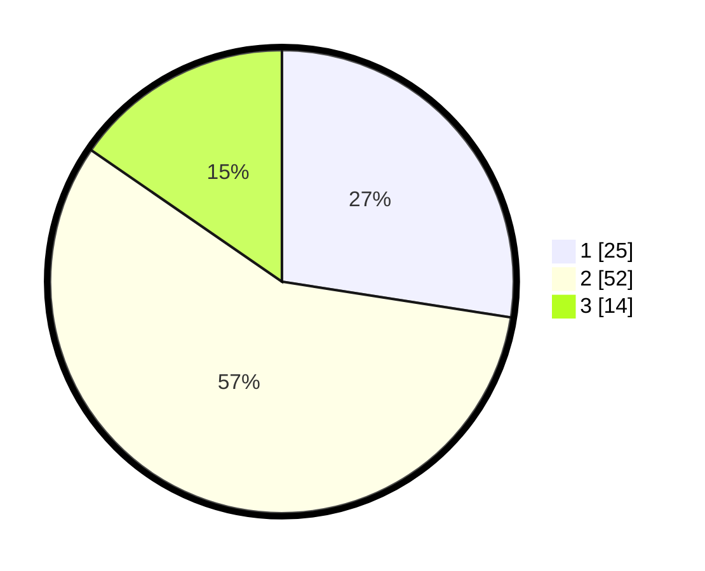

# Hasil

## Grafik

## Tabel

| No. | Nama Paslon    | Suara | Suara (raw) | Persentase |
|:--- |:-------------- | -----:| -----------:| ----------:|
| 1   | ANIES MUHAIMIN | 25    | [25][p-1]   | 27,47      |
| 2   | PRABOWO GIBRAN | 52    | [52][p-2]   | 57,14      |
| 3   | GANJAR MAHFUD  | 14    | [14][p-3]   | 15,38      |

[p-1]: https://github.com/gigit-pemilu/pemilu-2024-12-sumatera-utara/blob/main/pilpres/hitung-suara/sub/12-sumatera-utara/sub/07-deli-serdang/sub/26-percut-sei-tuan/sub/2010-sampali/sub/075-tps/sub/paslon-1.txt
[p-2]: https://github.com/gigit-pemilu/pemilu-2024-12-sumatera-utara/blob/main/pilpres/hitung-suara/sub/12-sumatera-utara/sub/07-deli-serdang/sub/26-percut-sei-tuan/sub/2010-sampali/sub/075-tps/sub/paslon-2.txt
[p-3]: https://github.com/gigit-pemilu/pemilu-2024-12-sumatera-utara/blob/main/pilpres/hitung-suara/sub/12-sumatera-utara/sub/07-deli-serdang/sub/26-percut-sei-tuan/sub/2010-sampali/sub/075-tps/sub/paslon-3.txt

## Foto C Plano

https://sirekap-obj-formc.kpu.go.id/7cf4/pemilu/ppwp/12/07/26/20/10/1207262010075-20240214-224834--75698f09-dba8-4e5d-8675-079acd73de70.jpg

https://sirekap-obj-formc.kpu.go.id/7cf4/pemilu/ppwp/12/07/26/20/10/1207262010075-20240214-224933--e4d763ab-4e4c-4caf-b87f-a276495b9332.jpg

https://sirekap-obj-formc.kpu.go.id/7cf4/pemilu/ppwp/12/07/26/20/10/1207262010075-20240214-225017--e5da1515-aa53-42dd-9c9e-c0c7efe6deb3.jpg

## Metadata

| Key        | Value               |
| ---------- | ------------------- |
| Time Stamp | 2024-02-25 18:00:00 |

