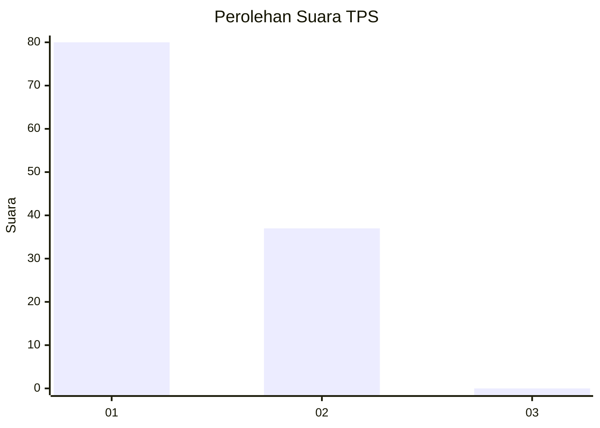
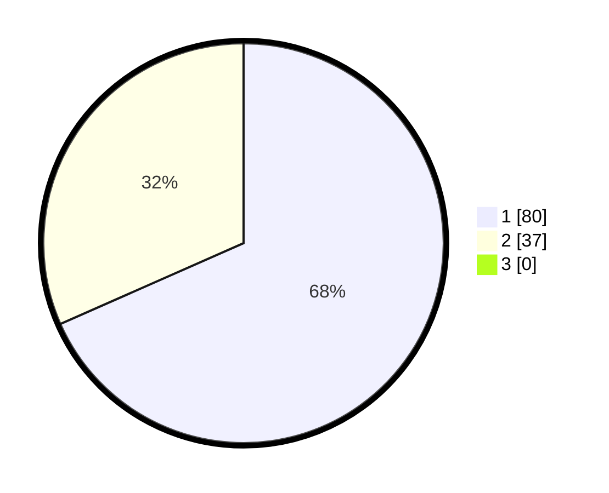

# Hasil

## Grafik

## Tabel

| No. | Nama Paslon    | Suara | Suara (raw) | Persentase |
|:--- |:-------------- | -----:| -----------:| ----------:|
| 1   | ANIES MUHAIMIN | 80    | [80][p-1]   | 68,38      |
| 2   | PRABOWO GIBRAN | 37    | [37][p-2]   | 31,62      |
| 3   | GANJAR MAHFUD  | 0     | [0][p-3]    | 0,00       |

[p-1]: https://github.com/gigit-pemilu/pemilu-2024/blob/main/pilpres/hitung-suara/sub/12-sumatera-utara/sub/07-deli-serdang/sub/26-percut-sei-tuan/sub/2011-bandar-khalipah/sub/002-tps/sub/paslon-1.txt
[p-2]: https://github.com/gigit-pemilu/pemilu-2024/blob/main/pilpres/hitung-suara/sub/12-sumatera-utara/sub/07-deli-serdang/sub/26-percut-sei-tuan/sub/2011-bandar-khalipah/sub/002-tps/sub/paslon-2.txt
[p-3]: https://github.com/gigit-pemilu/pemilu-2024/blob/main/pilpres/hitung-suara/sub/12-sumatera-utara/sub/07-deli-serdang/sub/26-percut-sei-tuan/sub/2011-bandar-khalipah/sub/002-tps/sub/paslon-3.txt

## Foto C Plano

https://sirekap-obj-formc.kpu.go.id/4abc/pemilu/ppwp/12/07/26/20/11/1207262011002-20240215-005625--b414a4a0-7881-41bc-bde0-4cb810facff9.jpg

https://sirekap-obj-formc.kpu.go.id/4abc/pemilu/ppwp/12/07/26/20/11/1207262011002-20240215-005744--7529b658-d50a-4e20-8114-903d4755c004.jpg

https://sirekap-obj-formc.kpu.go.id/4abc/pemilu/ppwp/12/07/26/20/11/1207262011002-20240215-005852--a9906e2a-5fe5-4744-9b59-eca533a5002e.jpg

## Metadata

| Key        | Value               |
| ---------- | ------------------- |
| Time Stamp | 2024-02-25 16:00:00 |

