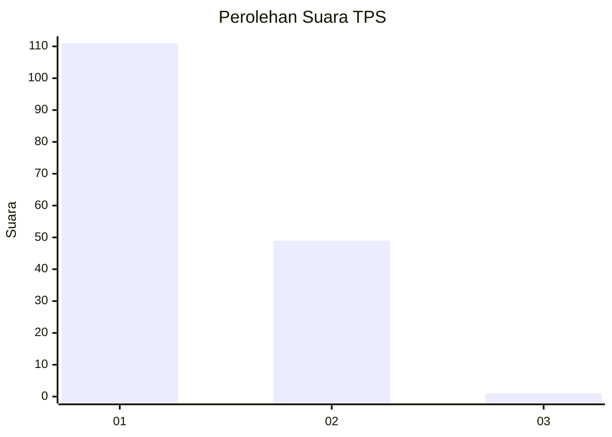
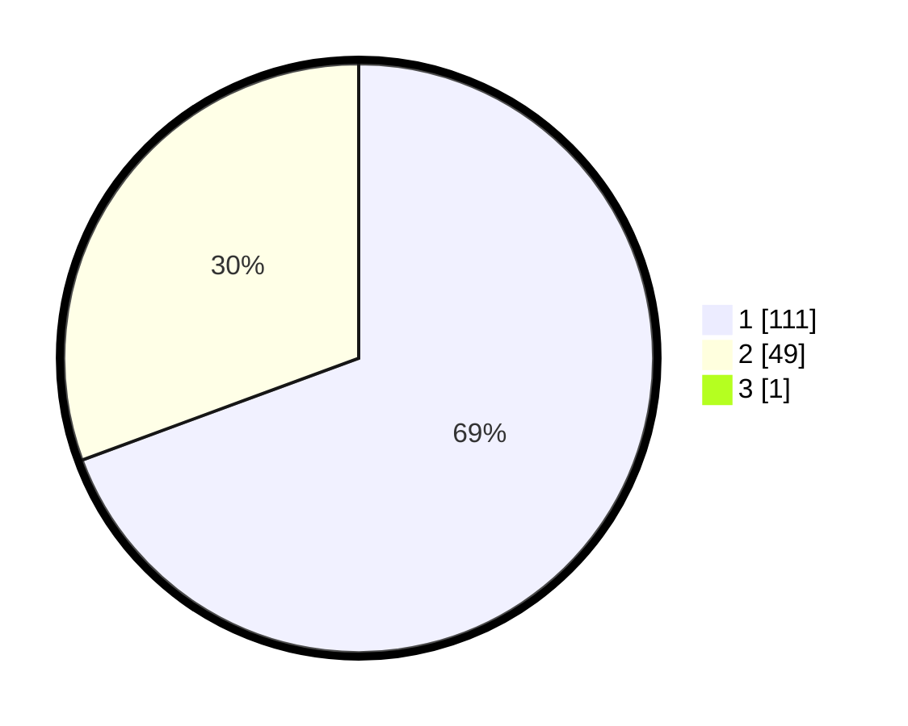

# Hasil

## Grafik

## Tabel

| No. | Nama Paslon    | Suara | Suara (raw) | Persentase |
|:--- |:-------------- | -----:| -----------:| ----------:|
| 1   | ANIES MUHAIMIN | 111   | [111][p-1]  | 68,94      |
| 2   | PRABOWO GIBRAN | 49    | [49][p-2]   | 30,43      |
| 3   | GANJAR MAHFUD  | 1     | [1][p-3]    | 0,62       |

[p-1]: https://github.com/gigit-pemilu/pemilu-2024-12-sumatera-utara/blob/main/pilpres/hitung-suara/sub/12-sumatera-utara/sub/07-deli-serdang/sub/26-percut-sei-tuan/sub/2011-bandar-khalipah/sub/008-tps/sub/paslon-1.txt
[p-2]: https://github.com/gigit-pemilu/pemilu-2024-12-sumatera-utara/blob/main/pilpres/hitung-suara/sub/12-sumatera-utara/sub/07-deli-serdang/sub/26-percut-sei-tuan/sub/2011-bandar-khalipah/sub/008-tps/sub/paslon-2.txt
[p-3]: https://github.com/gigit-pemilu/pemilu-2024-12-sumatera-utara/blob/main/pilpres/hitung-suara/sub/12-sumatera-utara/sub/07-deli-serdang/sub/26-percut-sei-tuan/sub/2011-bandar-khalipah/sub/008-tps/sub/paslon-3.txt

## Foto C Plano

https://sirekap-obj-formc.kpu.go.id/1b71/pemilu/ppwp/12/07/26/20/11/1207262011008-20240215-052634--2697ad13-6112-4053-9dea-2dd4ca5e8ff6.jpg

https://sirekap-obj-formc.kpu.go.id/1b71/pemilu/ppwp/12/07/26/20/11/1207262011008-20240215-052801--d2b25179-a9c7-4022-9eeb-264ef8fcfcf6.jpg

https://sirekap-obj-formc.kpu.go.id/1b71/pemilu/ppwp/12/07/26/20/11/1207262011008-20240215-052924--52d2fe7f-9a8f-42e3-9cf6-3e5a2d9c4a9d.jpg

## Metadata

| Key        | Value               |
| ---------- | ------------------- |
| Time Stamp | 2024-02-25 11:00:00 |

