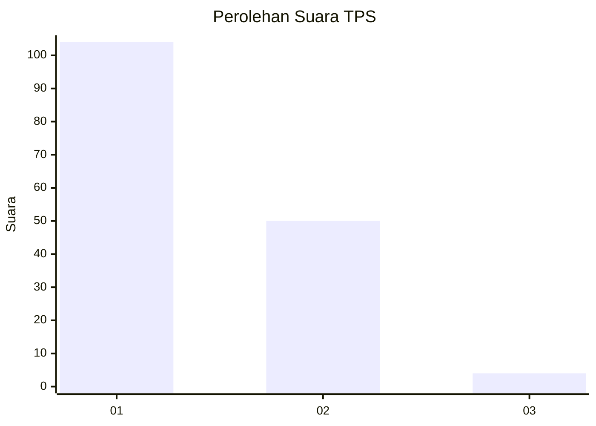
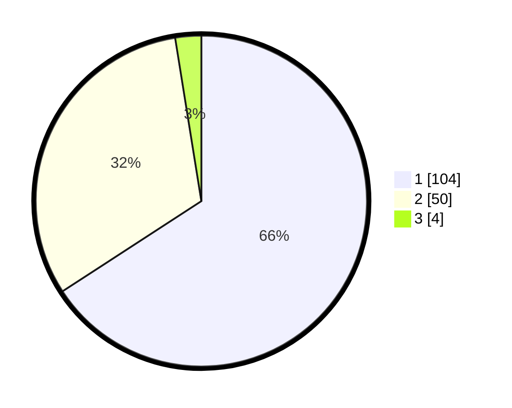

# Hasil

## Grafik

## Tabel

| No. | Nama Paslon    | Suara | Suara (raw) | Persentase |
|:--- |:-------------- | -----:| -----------:| ----------:|
| 1   | ANIES MUHAIMIN | 104   | [104][p-1]  | 65,82      |
| 2   | PRABOWO GIBRAN | 50    | [50][p-2]   | 31,65      |
| 3   | GANJAR MAHFUD  | 4     | [4][p-3]    | 2,53       |

[p-1]: https://github.com/gigit-pemilu/pemilu-2024-12-sumatera-utara/blob/main/pilpres/hitung-suara/sub/12-sumatera-utara/sub/07-deli-serdang/sub/26-percut-sei-tuan/sub/2011-bandar-khalipah/sub/010-tps/sub/paslon-1.txt
[p-2]: https://github.com/gigit-pemilu/pemilu-2024-12-sumatera-utara/blob/main/pilpres/hitung-suara/sub/12-sumatera-utara/sub/07-deli-serdang/sub/26-percut-sei-tuan/sub/2011-bandar-khalipah/sub/010-tps/sub/paslon-2.txt
[p-3]: https://github.com/gigit-pemilu/pemilu-2024-12-sumatera-utara/blob/main/pilpres/hitung-suara/sub/12-sumatera-utara/sub/07-deli-serdang/sub/26-percut-sei-tuan/sub/2011-bandar-khalipah/sub/010-tps/sub/paslon-3.txt

## Foto C Plano

https://sirekap-obj-formc.kpu.go.id/1917/pemilu/ppwp/12/07/26/20/11/1207262011010-20240215-040954--a70af062-b4bc-4d4a-a9a6-42a2c86e35e0.jpg

https://sirekap-obj-formc.kpu.go.id/1917/pemilu/ppwp/12/07/26/20/11/1207262011010-20240215-041231--55f6b8b9-3fa1-4168-a953-a686d532db4c.jpg

https://sirekap-obj-formc.kpu.go.id/1917/pemilu/ppwp/12/07/26/20/11/1207262011010-20240215-041045--2f3e90c5-3b0e-48d9-8a10-88fb5982da08.jpg

## Metadata

| Key        | Value               |
| ---------- | ------------------- |
| Time Stamp | 2024-02-24 22:31:28 |

