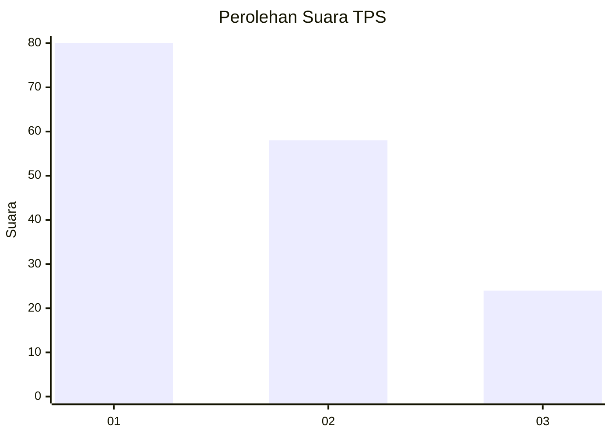
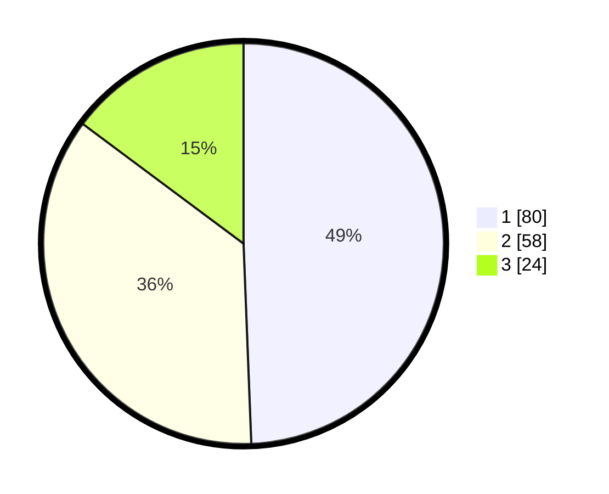

# Hasil

## Grafik

## Tabel

| No. | Nama Paslon    | Suara | Suara (raw) | Persentase |
|:--- |:-------------- | -----:| -----------:| ----------:|
| 1   | ANIES MUHAIMIN | 80    | [80][p-1]   | 49,38      |
| 2   | PRABOWO GIBRAN | 58    | [58][p-2]   | 35,80      |
| 3   | GANJAR MAHFUD  | 24    | [24][p-3]   | 14,81      |

[p-1]: https://github.com/gigit-pemilu/pemilu-2024/blob/main/pilpres/hitung-suara/sub/12-sumatera-utara/sub/07-deli-serdang/sub/26-percut-sei-tuan/sub/2011-bandar-khalipah/sub/087-tps/sub/paslon-1.txt
[p-2]: https://github.com/gigit-pemilu/pemilu-2024/blob/main/pilpres/hitung-suara/sub/12-sumatera-utara/sub/07-deli-serdang/sub/26-percut-sei-tuan/sub/2011-bandar-khalipah/sub/087-tps/sub/paslon-2.txt
[p-3]: https://github.com/gigit-pemilu/pemilu-2024/blob/main/pilpres/hitung-suara/sub/12-sumatera-utara/sub/07-deli-serdang/sub/26-percut-sei-tuan/sub/2011-bandar-khalipah/sub/087-tps/sub/paslon-3.txt

## Foto C Plano

https://sirekap-obj-formc.kpu.go.id/4678/pemilu/ppwp/12/07/26/20/11/1207262011087-20240215-045053--f0f80c6d-f249-4c1d-8551-178384e1bf8c.jpg

https://sirekap-obj-formc.kpu.go.id/4678/pemilu/ppwp/12/07/26/20/11/1207262011087-20240215-045243--5c4faf4d-514e-4006-b514-4a7bcd9c1e2c.jpg

https://sirekap-obj-formc.kpu.go.id/4678/pemilu/ppwp/12/07/26/20/11/1207262011087-20240215-045437--89860d40-6a52-43f0-be3a-4cbea008606c.jpg

## Metadata

| Key        | Value               |
| ---------- | ------------------- |
| Time Stamp | 2024-02-25 16:00:00 |

