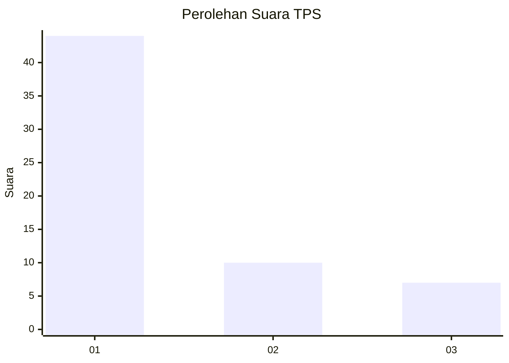
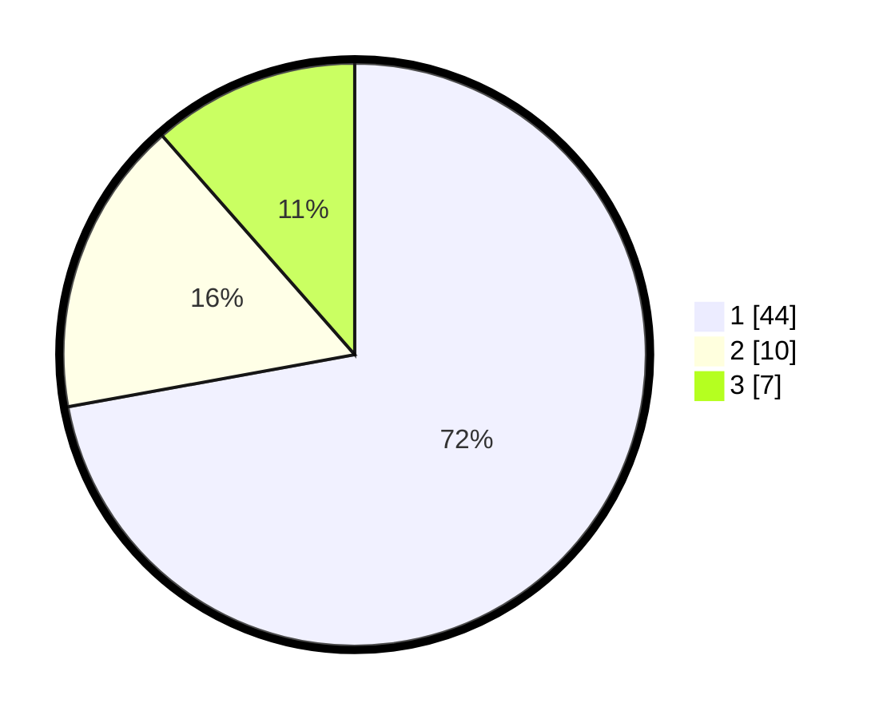

# Hasil

## Grafik

## Tabel

| No. | Nama Paslon    | Suara | Suara (raw) | Persentase |
|:--- |:-------------- | -----:| -----------:| ----------:|
| 1   | ANIES MUHAIMIN | 44    | [44][p-1]   | 72,13      |
| 2   | PRABOWO GIBRAN | 10    | [10][p-2]   | 16,39      |
| 3   | GANJAR MAHFUD  | 7     | [7][p-3]    | 11,48      |

[p-1]: https://github.com/gigit-pemilu/pemilu-2024/blob/main/pilpres/hitung-suara/sub/12-sumatera-utara/sub/07-deli-serdang/sub/26-percut-sei-tuan/sub/2012-bandar-klippa/sub/004-tps/sub/paslon-1.txt
[p-2]: https://github.com/gigit-pemilu/pemilu-2024/blob/main/pilpres/hitung-suara/sub/12-sumatera-utara/sub/07-deli-serdang/sub/26-percut-sei-tuan/sub/2012-bandar-klippa/sub/004-tps/sub/paslon-2.txt
[p-3]: https://github.com/gigit-pemilu/pemilu-2024/blob/main/pilpres/hitung-suara/sub/12-sumatera-utara/sub/07-deli-serdang/sub/26-percut-sei-tuan/sub/2012-bandar-klippa/sub/004-tps/sub/paslon-3.txt

## Foto C Plano

https://sirekap-obj-formc.kpu.go.id/c3bd/pemilu/ppwp/12/07/26/20/12/1207262012004-20240215-023852--27547823-0bcc-4308-8b7d-2f658e165d6c.jpg

https://sirekap-obj-formc.kpu.go.id/c3bd/pemilu/ppwp/12/07/26/20/12/1207262012004-20240215-023929--54d61e09-2f27-462a-ae7f-e18acef1efed.jpg

https://sirekap-obj-formc.kpu.go.id/c3bd/pemilu/ppwp/12/07/26/20/12/1207262012004-20240215-024015--0526f0c0-5b59-4f10-897b-2c14051ef084.jpg

## Metadata

| Key        | Value               |
| ---------- | ------------------- |
| Time Stamp | 2024-02-24 22:31:28 |

