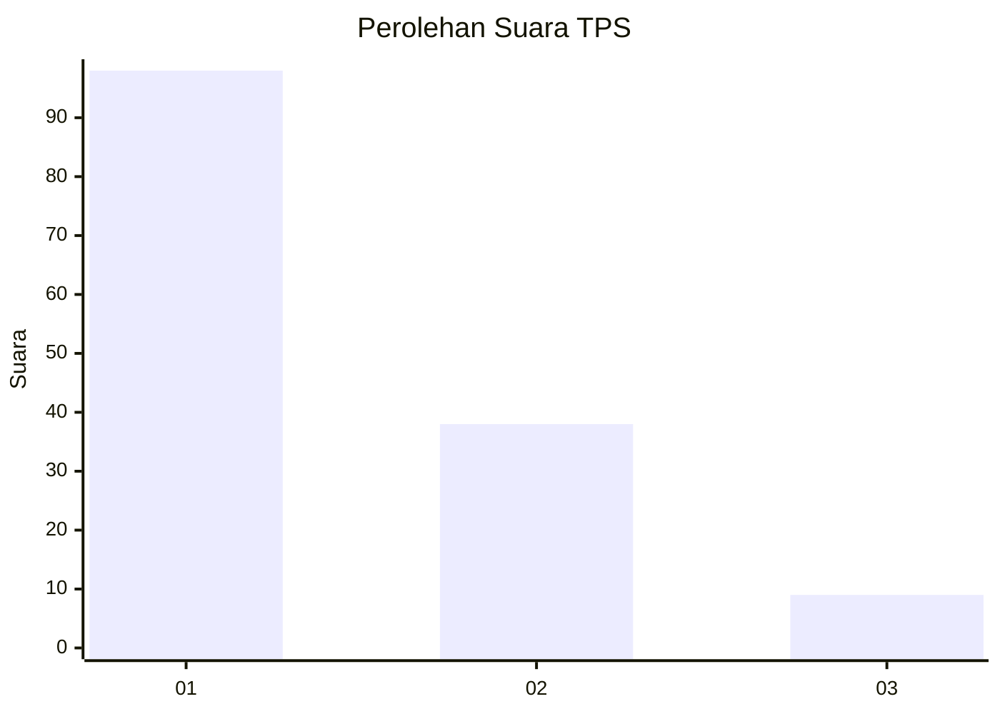
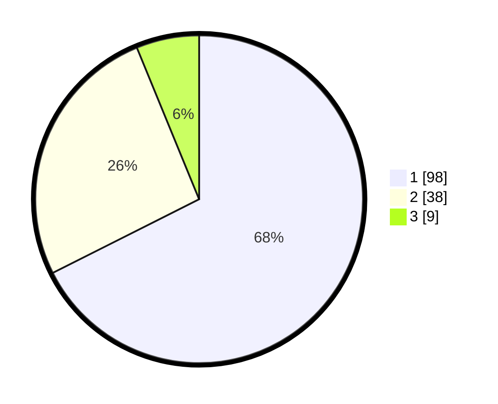

# Hasil

## Grafik

## Tabel

| No. | Nama Paslon    | Suara | Suara (raw) | Persentase |
|:--- |:-------------- | -----:| -----------:| ----------:|
| 1   | ANIES MUHAIMIN | 98    | [98][p-1]   | 67,59      |
| 2   | PRABOWO GIBRAN | 38    | [38][p-2]   | 26,21      |
| 3   | GANJAR MAHFUD  | 9     | [9][p-3]    | 6,21       |

[p-1]: https://github.com/gigit-pemilu/pemilu-2024/blob/main/pilpres/hitung-suara/sub/12-sumatera-utara/sub/07-deli-serdang/sub/26-percut-sei-tuan/sub/2012-bandar-klippa/sub/076-tps/sub/paslon-1.txt
[p-2]: https://github.com/gigit-pemilu/pemilu-2024/blob/main/pilpres/hitung-suara/sub/12-sumatera-utara/sub/07-deli-serdang/sub/26-percut-sei-tuan/sub/2012-bandar-klippa/sub/076-tps/sub/paslon-2.txt
[p-3]: https://github.com/gigit-pemilu/pemilu-2024/blob/main/pilpres/hitung-suara/sub/12-sumatera-utara/sub/07-deli-serdang/sub/26-percut-sei-tuan/sub/2012-bandar-klippa/sub/076-tps/sub/paslon-3.txt

## Foto C Plano

https://sirekap-obj-formc.kpu.go.id/84be/pemilu/ppwp/12/07/26/20/12/1207262012076-20240214-222409--97df6608-16dd-416a-b973-52904161b80a.jpg

https://sirekap-obj-formc.kpu.go.id/84be/pemilu/ppwp/12/07/26/20/12/1207262012076-20240214-222337--dcb85011-ec59-418f-ae7c-5fdff603b336.jpg

https://sirekap-obj-formc.kpu.go.id/84be/pemilu/ppwp/12/07/26/20/12/1207262012076-20240214-222245--cfc00fd2-8d2e-4a5e-a288-d2ed4b4c2c05.jpg

## Metadata

| Key        | Value               |
| ---------- | ------------------- |
| Time Stamp | 2024-02-25 12:00:00 |

