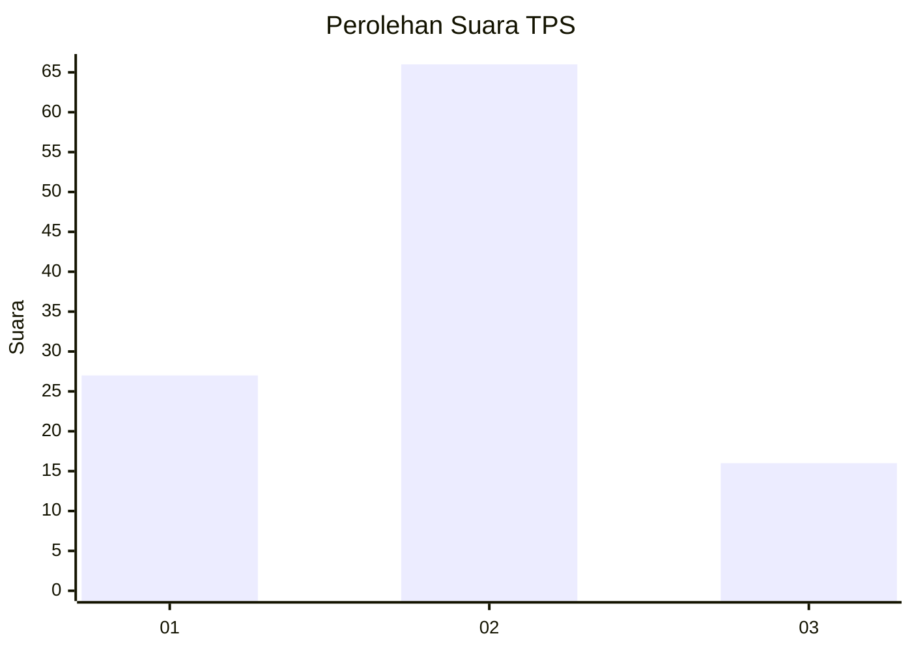
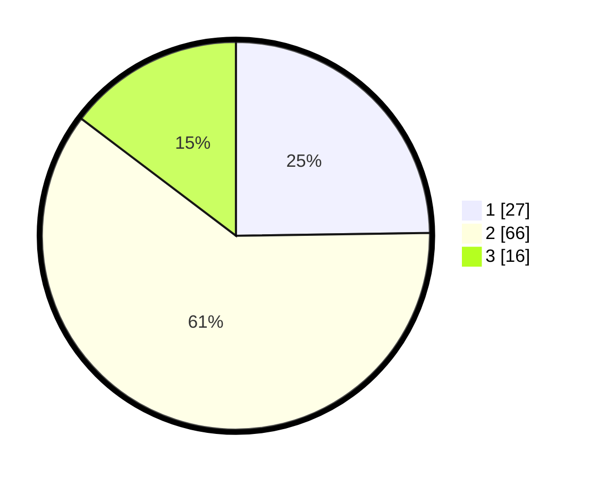

# Hasil

## Grafik

## Tabel

| No. | Nama Paslon    | Suara | Suara (raw) | Persentase |
|:--- |:-------------- | -----:| -----------:| ----------:|
| 1   | ANIES MUHAIMIN | 27    | [27][p-1]   | 24,77      |
| 2   | PRABOWO GIBRAN | 66    | [66][p-2]   | 60,55      |
| 3   | GANJAR MAHFUD  | 16    | [16][p-3]   | 14,68      |

[p-1]: https://github.com/gigit-pemilu/pemilu-2024/blob/main/pilpres/hitung-suara/sub/12-sumatera-utara/sub/07-deli-serdang/sub/26-percut-sei-tuan/sub/2012-bandar-klippa/sub/093-tps/sub/paslon-1.txt
[p-2]: https://github.com/gigit-pemilu/pemilu-2024/blob/main/pilpres/hitung-suara/sub/12-sumatera-utara/sub/07-deli-serdang/sub/26-percut-sei-tuan/sub/2012-bandar-klippa/sub/093-tps/sub/paslon-2.txt
[p-3]: https://github.com/gigit-pemilu/pemilu-2024/blob/main/pilpres/hitung-suara/sub/12-sumatera-utara/sub/07-deli-serdang/sub/26-percut-sei-tuan/sub/2012-bandar-klippa/sub/093-tps/sub/paslon-3.txt

## Foto C Plano

https://sirekap-obj-formc.kpu.go.id/9d6d/pemilu/ppwp/12/07/26/20/12/1207262012093-20240214-224118--7baaf958-e6ff-4f16-9440-14264088eefa.jpg

https://sirekap-obj-formc.kpu.go.id/9d6d/pemilu/ppwp/12/07/26/20/12/1207262012093-20240215-023209--fdfcd611-b13b-4cac-a958-1a7dc3992c9c.jpg

https://sirekap-obj-formc.kpu.go.id/9d6d/pemilu/ppwp/12/07/26/20/12/1207262012093-20240214-225415--cb3d3682-c0aa-43eb-824d-b6d6fda6c578.jpg

## Metadata

| Key        | Value               |
| ---------- | ------------------- |
| Time Stamp | 2024-02-24 22:31:28 |

