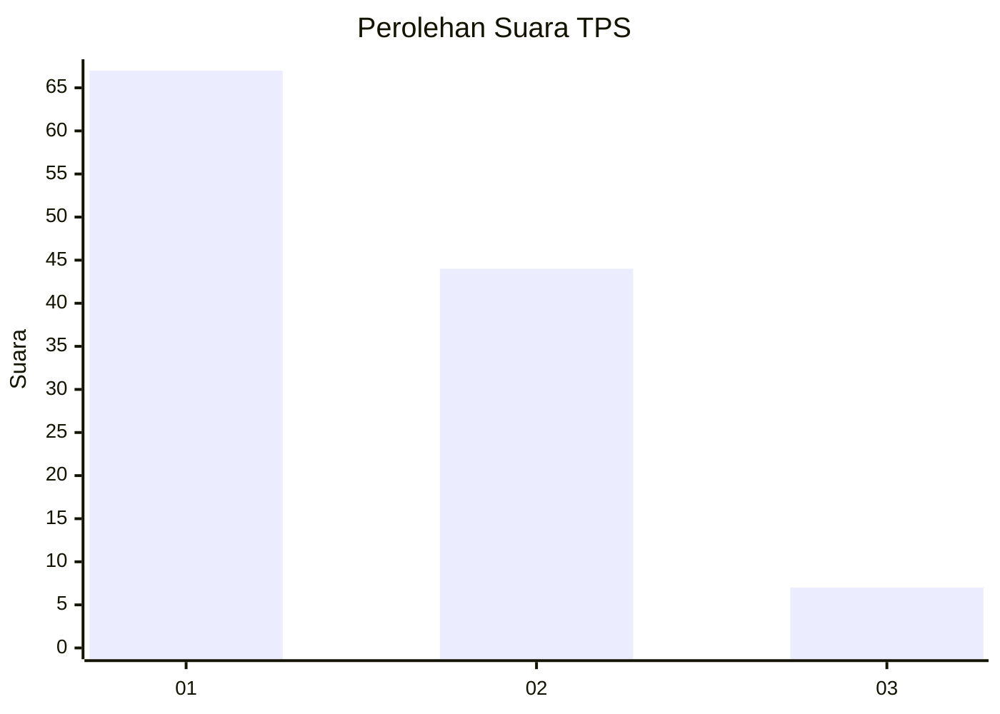
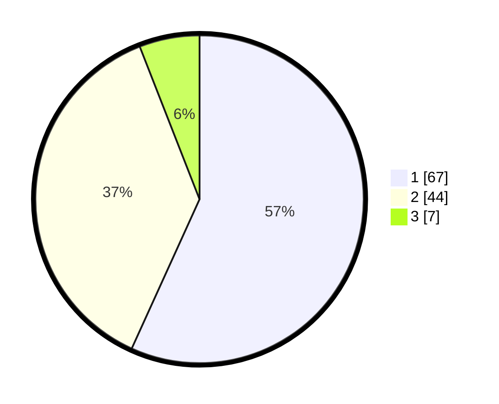

# Hasil

## Grafik

## Tabel

| No. | Nama Paslon    | Suara | Suara (raw) | Persentase |
|:--- |:-------------- | -----:| -----------:| ----------:|
| 1   | ANIES MUHAIMIN | 67    | [67][p-1]   | 56,78      |
| 2   | PRABOWO GIBRAN | 44    | [44][p-2]   | 37,29      |
| 3   | GANJAR MAHFUD  | 7     | [7][p-3]    | 5,93       |

[p-1]: https://github.com/gigit-pemilu/pemilu-2024/blob/main/pilpres/hitung-suara/sub/12-sumatera-utara/sub/07-deli-serdang/sub/26-percut-sei-tuan/sub/2012-bandar-klippa/sub/107-tps/sub/paslon-1.txt
[p-2]: https://github.com/gigit-pemilu/pemilu-2024/blob/main/pilpres/hitung-suara/sub/12-sumatera-utara/sub/07-deli-serdang/sub/26-percut-sei-tuan/sub/2012-bandar-klippa/sub/107-tps/sub/paslon-2.txt
[p-3]: https://github.com/gigit-pemilu/pemilu-2024/blob/main/pilpres/hitung-suara/sub/12-sumatera-utara/sub/07-deli-serdang/sub/26-percut-sei-tuan/sub/2012-bandar-klippa/sub/107-tps/sub/paslon-3.txt

## Foto C Plano

https://sirekap-obj-formc.kpu.go.id/84a2/pemilu/ppwp/12/07/26/20/12/1207262012107-20240214-224736--ace633a6-762c-4f55-901a-3d863cab55a8.jpg

https://sirekap-obj-formc.kpu.go.id/84a2/pemilu/ppwp/12/07/26/20/12/1207262012107-20240214-230054--63c05f37-1199-4393-aac0-2c7aa12a85c6.jpg

https://sirekap-obj-formc.kpu.go.id/84a2/pemilu/ppwp/12/07/26/20/12/1207262012107-20240214-230243--74da4985-21ce-4f9b-a09a-4cdebbe906df.jpg

## Metadata

| Key        | Value               |
| ---------- | ------------------- |
| Time Stamp | 2024-02-24 22:31:28 |

