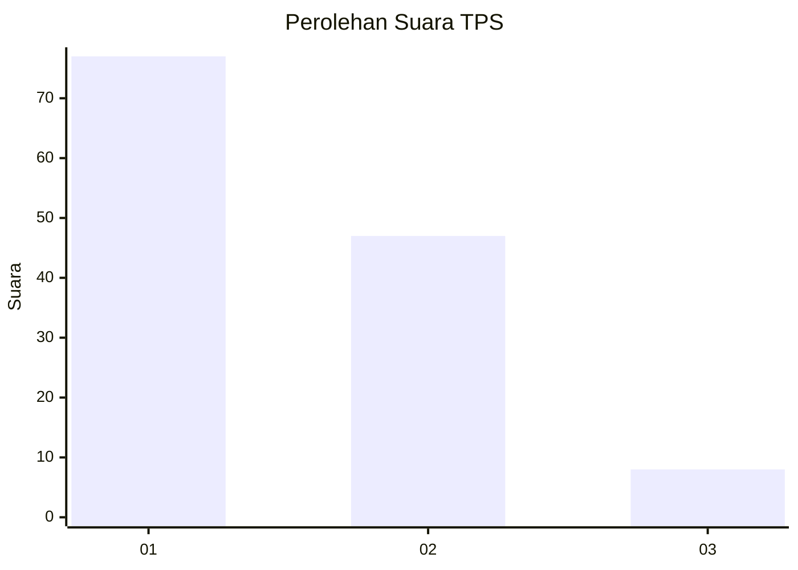
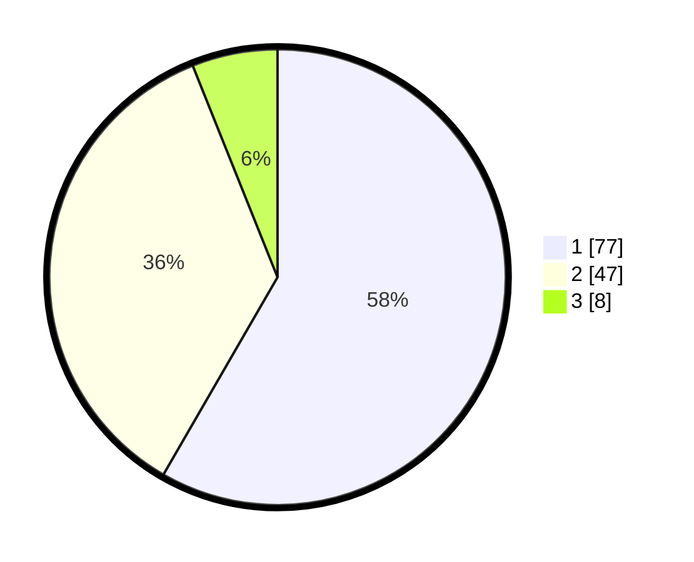

# Hasil

## Grafik

## Tabel

| No. | Nama Paslon    | Suara | Suara (raw) | Persentase |
|:--- |:-------------- | -----:| -----------:| ----------:|
| 1   | ANIES MUHAIMIN | 77    | [77][p-1]   | 58,33      |
| 2   | PRABOWO GIBRAN | 47    | [47][p-2]   | 35,61      |
| 3   | GANJAR MAHFUD  | 8     | [8][p-3]    | 6,06       |

[p-1]: https://github.com/gigit-pemilu/pemilu-2024-12-sumatera-utara/blob/main/pilpres/hitung-suara/sub/12-sumatera-utara/sub/07-deli-serdang/sub/26-percut-sei-tuan/sub/2012-bandar-klippa/sub/108-tps/sub/paslon-1.txt
[p-2]: https://github.com/gigit-pemilu/pemilu-2024-12-sumatera-utara/blob/main/pilpres/hitung-suara/sub/12-sumatera-utara/sub/07-deli-serdang/sub/26-percut-sei-tuan/sub/2012-bandar-klippa/sub/108-tps/sub/paslon-2.txt
[p-3]: https://github.com/gigit-pemilu/pemilu-2024-12-sumatera-utara/blob/main/pilpres/hitung-suara/sub/12-sumatera-utara/sub/07-deli-serdang/sub/26-percut-sei-tuan/sub/2012-bandar-klippa/sub/108-tps/sub/paslon-3.txt

## Foto C Plano

https://sirekap-obj-formc.kpu.go.id/b55b/pemilu/ppwp/12/07/26/20/12/1207262012108-20240214-222543--74d7b923-c5ee-4b3a-bea8-e88475d3d141.jpg

https://sirekap-obj-formc.kpu.go.id/b55b/pemilu/ppwp/12/07/26/20/12/1207262012108-20240214-222703--7666a214-c5a2-4f9b-b30d-335cc20d9a89.jpg

https://sirekap-obj-formc.kpu.go.id/b55b/pemilu/ppwp/12/07/26/20/12/1207262012108-20240214-223541--520dce46-e13d-48a7-b846-362b24b45eb8.jpg

## Metadata

| Key        | Value               |
| ---------- | ------------------- |
| Time Stamp | 2024-02-25 15:00:00 |

