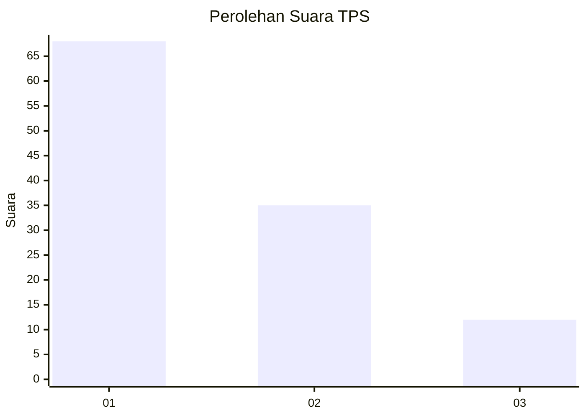
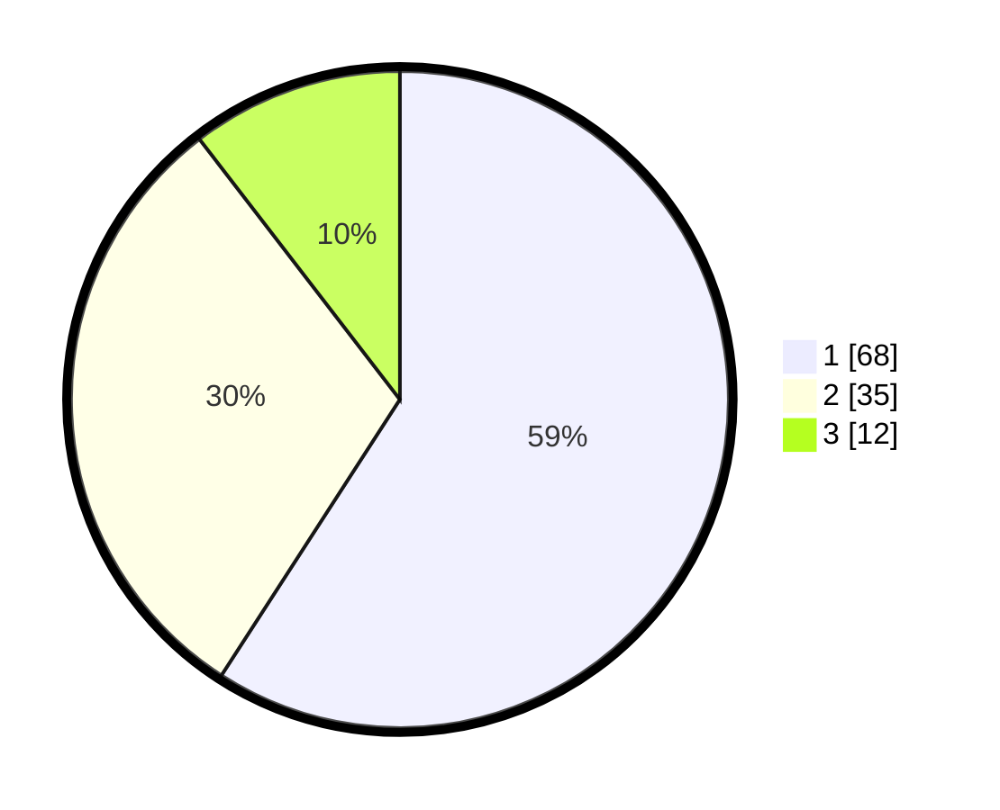

# Hasil

## Grafik

## Tabel

| No. | Nama Paslon    | Suara | Suara (raw) | Persentase |
|:--- |:-------------- | -----:| -----------:| ----------:|
| 1   | ANIES MUHAIMIN | 68    | [68][p-1]   | 59,13      |
| 2   | PRABOWO GIBRAN | 35    | [35][p-2]   | 30,43      |
| 3   | GANJAR MAHFUD  | 12    | [12][p-3]   | 10,43      |

[p-1]: https://github.com/gigit-pemilu/pemilu-2024/blob/main/pilpres/hitung-suara/sub/12-sumatera-utara/sub/07-deli-serdang/sub/26-percut-sei-tuan/sub/2012-bandar-klippa/sub/112-tps/sub/paslon-1.txt
[p-2]: https://github.com/gigit-pemilu/pemilu-2024/blob/main/pilpres/hitung-suara/sub/12-sumatera-utara/sub/07-deli-serdang/sub/26-percut-sei-tuan/sub/2012-bandar-klippa/sub/112-tps/sub/paslon-2.txt
[p-3]: https://github.com/gigit-pemilu/pemilu-2024/blob/main/pilpres/hitung-suara/sub/12-sumatera-utara/sub/07-deli-serdang/sub/26-percut-sei-tuan/sub/2012-bandar-klippa/sub/112-tps/sub/paslon-3.txt

## Foto C Plano

https://sirekap-obj-formc.kpu.go.id/6940/pemilu/ppwp/12/07/26/20/12/1207262012112-20240214-223945--6de6f22e-b6e2-4235-a8ae-7f1eefec6dbd.jpg

https://sirekap-obj-formc.kpu.go.id/6940/pemilu/ppwp/12/07/26/20/12/1207262012112-20240214-224119--da43122e-b577-4454-bdee-083fe3e44a12.jpg

https://sirekap-obj-formc.kpu.go.id/6940/pemilu/ppwp/12/07/26/20/12/1207262012112-20240214-224237--4b6a5015-be6b-4eea-b667-b1a8ef60458a.jpg

## Metadata

| Key        | Value               |
| ---------- | ------------------- |
| Time Stamp | 2024-02-25 18:00:00 |

