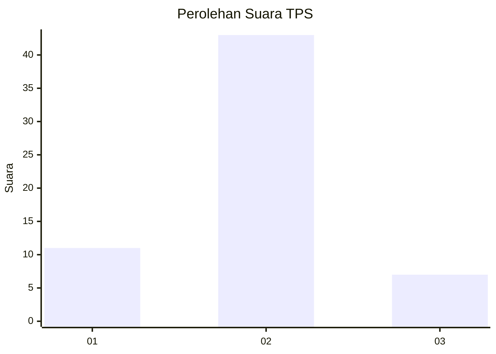
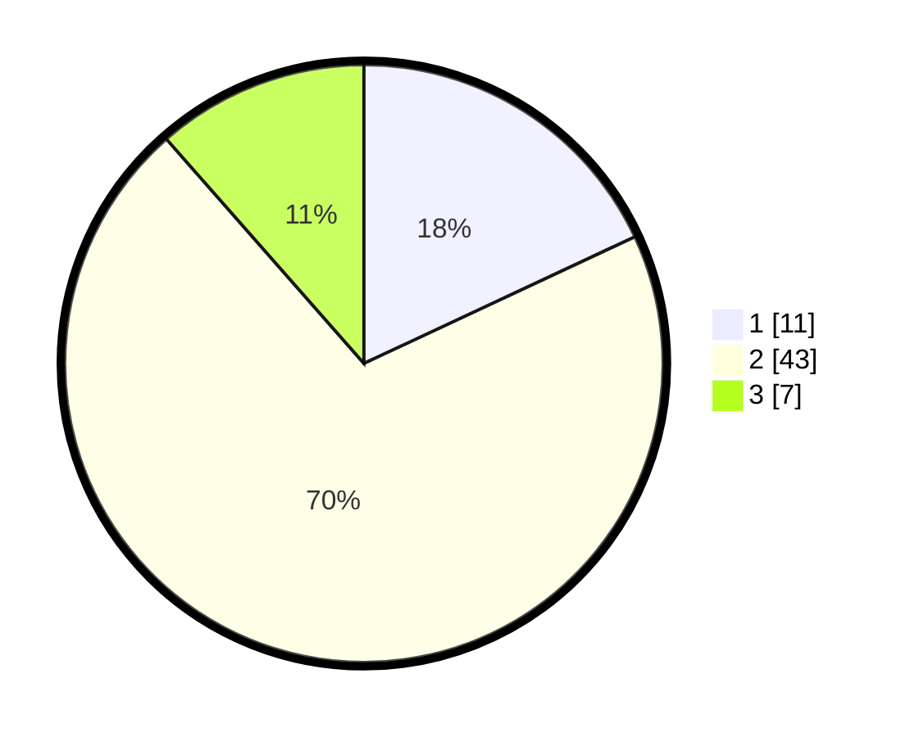

# Hasil

## Grafik

## Tabel

| No. | Nama Paslon    | Suara | Suara (raw) | Persentase |
|:--- |:-------------- | -----:| -----------:| ----------:|
| 1   | ANIES MUHAIMIN | 11    | [11][p-1]   | 18,03      |
| 2   | PRABOWO GIBRAN | 43    | [43][p-2]   | 70,49      |
| 3   | GANJAR MAHFUD  | 7     | [7][p-3]    | 11,48      |

[p-1]: https://github.com/gigit-pemilu/pemilu-2024/blob/main/pilpres/hitung-suara/sub/12-sumatera-utara/sub/07-deli-serdang/sub/26-percut-sei-tuan/sub/2014-tanjung-rejo/sub/038-tps/sub/paslon-1.txt
[p-2]: https://github.com/gigit-pemilu/pemilu-2024/blob/main/pilpres/hitung-suara/sub/12-sumatera-utara/sub/07-deli-serdang/sub/26-percut-sei-tuan/sub/2014-tanjung-rejo/sub/038-tps/sub/paslon-2.txt
[p-3]: https://github.com/gigit-pemilu/pemilu-2024/blob/main/pilpres/hitung-suara/sub/12-sumatera-utara/sub/07-deli-serdang/sub/26-percut-sei-tuan/sub/2014-tanjung-rejo/sub/038-tps/sub/paslon-3.txt

## Foto C Plano

https://sirekap-obj-formc.kpu.go.id/61ae/pemilu/ppwp/12/07/26/20/14/1207262014038-20240214-214714--18f4afe9-322c-484d-b078-6aeaddc990da.jpg

https://sirekap-obj-formc.kpu.go.id/61ae/pemilu/ppwp/12/07/26/20/14/1207262014038-20240214-215004--f19386c9-9641-4dd5-8a04-0b4d5127ae15.jpg

https://sirekap-obj-formc.kpu.go.id/61ae/pemilu/ppwp/12/07/26/20/14/1207262014038-20240214-215157--d400760c-f497-450e-bd50-44d6b300db63.jpg

## Metadata

| Key        | Value               |
| ---------- | ------------------- |
| Time Stamp | 2024-02-25 17:00:00 |

